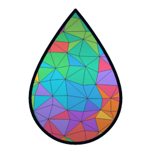

<p align="center">
  
</p>

<h1 align="center">Kóoch</h1>

<p align="center">
  A GPU-driven game engine written in Rust, with meshlet-based rendering and an editor.
</p>

Named after the creator deity of the Tehuelche (Aonikenk) people of Patagonia,
who existed alone in darkness and wept the sea into being. The mark is that
teardrop, tessellated into cluster-coloured meshlets — which is the engine's
own visibility-buffer debug view. See [`docs/brand/`](docs/brand/README.md).

## Documentation

📖 **<https://lobinuxsoft.github.io/kooch/>** — published from `main` on every
change to the book.

Sources live in [`docs/book/`](docs/book/src/SUMMARY.md). To build locally,
pin the versions CI uses — mdBook and its preprocessors talk over a versioned
protocol and a mismatch fails with an unhelpful parse error:

```bash
cargo install mdbook@0.5.2 mdbook-mermaid@0.17.0 mdbook-toc@0.15.3
mdbook serve docs/book/
```

Start with [Introduction](docs/book/src/introduction.md), then either
[Crate Graph](docs/book/src/architecture/crate-graph.md) (for engine
contributors) or [Getting Started](docs/book/src/guide/getting-started.md)
(for engine users).

## Overview

Kóoch is an experimental game engine that pushes the rendering hot loop onto the GPU while keeping gameplay logic and simulation on the CPU. Geometry is drawn with a **Nanite-style meshlet pipeline**: cluster culling, a visibility buffer and a deferred pass, driven by indirect dispatch with no per-frame readback.

An earlier SDF ray-marching renderer was built and then retired; see
[Retired architecture](docs/book/src/architecture/retired/index.md) for what
it did and why it was replaced.

## Features

- **GPU-driven meshlet rendering**: cluster culling, visibility buffer, deferred shading, two-pass Hi-Z occlusion
- **Physically-based lighting**: Cook-Torrance driven by the light components, in real photometric units (lux and lumens), with camera exposure. No shadows yet
- **CPU ECS**: archetype storage, reflection, hierarchy, scene and prefab serialisation
- **Physics**: rigid bodies and colliders via Rapier
- **Multi-Gravity System**: Mario Galaxy-style gravity fields
- **Prefabs**: scenes reference prefabs and store overrides, rather than copying them
- **Audio**: playback through kira
- **Editor**: standalone editor that drives a running project over a local socket, plus an embedded mode
- **Native plugins**: a project is plain Rust, loaded as a `dylib` implementing `KoochPlugin`

## Where work happens

```
┌─────────────────────────────────────────────────────────────────┐
│                         CPU SIDE                                │
├─────────────────────────────────────────────────────────────────┤
│  • Entity management (spawn/despawn, generational IDs)          │
│  • Gameplay logic, written in Rust as components and systems    │
│  • Physics simulation (Rapier)                                  │
│  • Transform hierarchy                                          │
│  • Input processing, audio triggers, asset streaming            │
└──────────────────────────┬──────────────────────────────────────┘
                           │ Uploads once per frame
                           ▼
┌─────────────────────────────────────────────────────────────────┐
│                         GPU SIDE                                │
├─────────────────────────────────────────────────────────────────┤
│  • Meshlet culling (frustum + Hi-Z occlusion, two passes)       │
│  • Visibility buffer rasterisation                              │
│  • Deferred shading pass                                        │
│  • Indirect dispatch — the GPU issues its own draw arguments    │
└─────────────────────────────────────────────────────────────────┘
```

## Architecture

```
kooch/                  # Top-level facade crate (`kooch::*`)
├── src/                       # DefaultPlugins, SceneBootstrapPlugin, prelude
├── crates/
│   ├── kooch_core               # App, Plugin system, Schedule, Resources, GPU
│   ├── kooch_ecs                # Hybrid ECS (CPU gameplay + GPU data, scenes)
│   ├── kooch_ecs_macros         # #[derive(Reflect)], #[derive(Component)]
│   ├── kooch_plugin_api         # Stable ABI for dynamic plugins
│   ├── kooch_window             # Windowing (winit + GPU surface)
│   ├── kooch_input              # Keyboard, mouse, gamepad (gilrs)
│   ├── kooch_audio              # Audio playback (kira)
│   ├── kooch_render             # Meshlet pipeline, Hi-Z, materials, sky
│   ├── kooch_physics            # Rigid bodies and colliders (Rapier)
│   ├── kooch_camera             # Camera components and VirtualCamera
│   ├── kooch_lighting           # Light components
│   ├── kooch_world              # Hierarchical coordinates, streaming
│   ├── kooch_remote             # Local-socket protocol for the editor
│   ├── kooch_gizmos             # Gizmo drawing
│   ├── kooch_gizmos_handles     # Draggable translate/rotate/scale handles
│   ├── kooch_gravity            # Multi-gravity system
│   ├── kooch_editor_core        # Editor as a library
│   └── kooch_editor             # Editor binary (egui)
├── docs/
│   ├── book/                  # mdBook source — see Documentation above
│   └── research/              # wgpu capabilities audit, etc.
├── examples/
└── assets/
    └── shaders/
```

See [Crate Graph](docs/book/src/architecture/crate-graph.md) for the
dependency layering and rationale.

## Tech Stack

| Category | Technology |
|----------|------------|
| Language | Rust (Edition 2024) |
| GPU API | wgpu |
| Windowing | winit |
| Physics | rapier3d |
| Audio | kira |
| Input | gilrs |
| Gameplay code | Plain Rust, loaded as a native plugin |
| Editor UI | egui + egui_dock |

## Status

**Early Development** - Not ready for production use.

## License

All Rights Reserved. See [LICENSE.md](LICENSE.md) for details.
