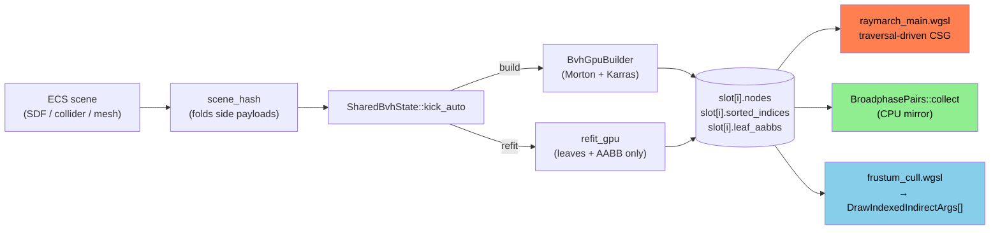
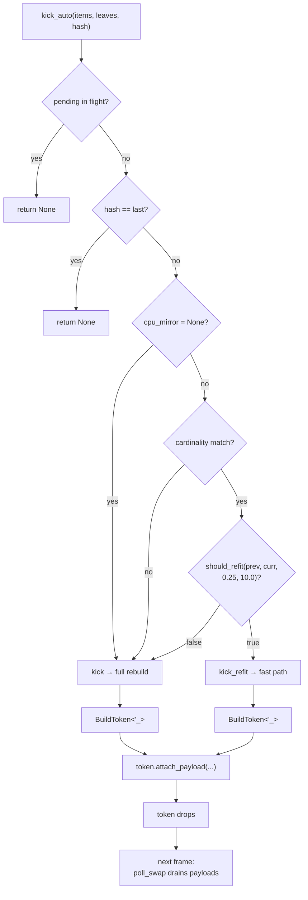

# Multi-consumer BVH

This chapter documents the engine-shared GPU BVH that backs three
consumers in lockstep: the SDF raymarch culling from PR-4, the
physics broadphase from `ome_physics::broadphase`, and the GPU
frustum cull behind the mesh pass. It is the subject of #115 PR-5,
the closing PR of issue #115.

The previous chapter ([BVH-Driven Ray Marching](./bvh-raymarch.md))
introduced the GPU LBVH builder and the two-slot double-buffer that
sidesteps wgpu's read-after-write hazard. PR-5 generalises that
state into `ome_bvh::SharedBvhState` — a single resource the rest of
the engine binds against.

## Why one structure for three consumers

Acceptance criterion 116 of #115 demands: "multiple systems use the
same structure." Independently, each consumer wants the same set of
spatial queries — find leaves overlapping an AABB, a frustum, a ray.
Building three private BVHs over the same scene each frame would
triple the GPU build cost (and, more painfully, the per-frame
readback the CPU mirror requires) without any algorithmic gain.

The shipped architecture builds one BVH per scene-dirty frame, lets
every consumer bind the same `nodes` / `sorted_indices` / `leaf_aabbs`
buffers, and hides the lifecycle behind a single resource. Per-
consumer side-payloads (raymarch's per-instance smoothness, future
collider mass / restitution) live in the consuming crate and ride
the same kick → swap pulse via the
[type-state `BuildToken`](#type-state-buildtoken-enforcing-the-side-payload-invariant).



## The four-buffer slot

`OutputSlot` is the per-side double-buffer the orchestrator rotates.
Each side owns four parallel buffers, all sized for the current
primitive count and grown on demand:

| Buffer            | Owner   | Producer            | Consumed by                                   |
|-------------------|---------|---------------------|-----------------------------------------------|
| `nodes`           | shared  | GPU build / refit   | every consumer (BVH walk)                     |
| `sorted_indices`  | shared  | GPU sort            | raymarch leaf payload lookup, refit topology  |
| `leaf_aabbs`      | shared  | CPU `kick(...)`     | raymarch (gating), frustum cull               |
| side payloads     | private | per-consumer kick   | raymarch fragment shader (RaymarchPayload[])  |

The first three live in `ome_bvh::shared::OutputSlot`. Side payloads
live in the consuming crate (`ome_render::raymarch::bvh::PayloadSlot`
holds `RaymarchPayload[]` at binding 5 of the raymarch pipeline). The
private buffers' double-buffer mirrors the shared one — when
`poll_swap` flips `current_slot`, every parallel double-buffer must
flip alongside it or the renderer reads stale-paired data.

## LeafAabb: per-leaf metadata + flag scheme

Every leaf carries 32 bytes of std430-clean metadata (mirrors the
WGSL `LeafAabb` byte-for-byte; offsets pinned by an `offset_of!`
test):

```rust
#[repr(C)]
pub struct LeafAabb {
    pub aabb_min: [f32; 3],
    pub flags: u32,
    pub aabb_max: [f32; 3],
    pub entity_id: u32,
}
```

The `flags` field is the multi-consumer contract — each consumer
filters by its own bit during traversal:

| Bit  | Constant            | Consumer                                   |
|------|---------------------|--------------------------------------------|
| 0–1  | `ROLE_RAYMARCH_*`   | Raymarch CSG role (ADD / INTERSECT / SUBTRACT) — only meaningful when `IS_RAYMARCH` is set. |
| 2    | `IS_RAYMARCH`       | Leaf participates in the SDF raymarch traversal. |
| 3    | `IS_COLLIDER`       | Physics broadphase (#42). |
| 4    | `IS_VISIBLE_MESH`   | Frustum / occlusion culling (#91). |
| 5    | `IS_LIGHT`          | Reserved for the light culling consumer (#27). Defined here so no future consumer accidentally claims the bit. |
| 6–31 | free                | Future consumers. |

`entity_id` is the ECS entity index broadphase / frustum cull use
to return entity-keyed pair lists and visibility sets. Raymarch
ignores it.

> **Note:** AABBs are inflated by the per-role smooth-blend `k_max`
> so the cull stays conservative under raymarch smooth blends. The
> S7 bench measured an envelope/tight pair-count ratio of 2.086 in a
> synthetic mixed scene (broadphase false-positives bench), justifying
> the per-role tighter AABBs follow-up filed at the close of #115.

## Lifecycle: kick → poll_swap → bind

`SharedBvhState::kick_auto` is the production entry point per frame.
It picks between rebuild and refit using the `should_refit`
heuristic over the previously-mirrored leaf AABBs:



Suppression cases (pending in flight, hash unchanged) return `None`
*before* any state mutates — the consumer's parallel buffers don't
regrow either. This is the lesson from a footgun that earlier drafts
ate: see [Type-state `BuildToken`](#type-state-buildtoken-enforcing-the-side-payload-invariant).

## Type-state `BuildToken`: enforcing the side-payload invariant

Before S3.5 the orchestrator returned `bool` from `kick`. Each
consumer maintained a `pending_payload: Option<...>` field that it
had to keep in lockstep with the orchestrator's `pending`. That
invariant was *implicit* — and held only as long as a single consumer
played by the rules.

The footgun the type-state refactor closed was subtler than the
"forgot to clear pending_payload on failure" scenario: the
**buffer-regrow on suppressed kick**.

> **Note:** Original behaviour: `kick_if_dirty(...)` called
> `payload_slot.ensure_capacity(n)` *before* asking the orchestrator
> whether the kick was committed. If a previous kick was still
> pending, the second call would still grow the payload buffer —
> reallocating the `wgpu::Buffer` Arc — *while* the closure registered
> by the first kick still held a refcounted clone of the **old**
> buffer. On the eventual swap, the closure uploaded the captured
> payload into the orphaned buffer and the renderer kept reading the
> regrown one. Silent stale data, no panic, no warning.

`SharedBvhState::kick` and `kick_refit` now return
`Option<BuildToken<'_>>`. `Some(token)` is the *only* path that
exposes `target_slot` and `n` and admits an `attach_payload(closure)`
registration; `None` means the kick was suppressed and the consumer
mutates nothing. With `ensure_capacity` deferred until *after* the
token arrives, suppressed kicks no longer regrow buffers the
orchestrator will not write to. The invariant is type-enforced
instead of convention-enforced.

```rust
// production raymarch path (BvhState::kick_auto_if_dirty)
let scene_hash = Self::hash_scene(&items, &leaf_aabbs, &payloads);
let Some(mut token) = self.shared.kick_auto(
    device, queue, items, leaf_aabbs, scene_hash, 0.25, 10.0,
) else {
    return false;  // suppressed → nothing to do
};
// from here, kick is guaranteed committed:
//   token.target_slot() and token.n() are stable
//   attach_payload runs on the matching swap, or drops on failure
attach_payload_upload(&mut self.payload_slots, device, &mut token, payloads);
```

On `poll_swap` success every attached uploader fires in registration
order with `(queue, target_slot)`. On failure each uploader is
dropped without running, so the captured payload `Vec` and the
cloned buffer Arc are released cleanly — there is no
"who-clears-up-stale-pending" question.

## CPU mirror: free byte-identical mirror from the build's readback

The GPU build path always reads back the resolved `nodes` array and
the `sorted_indices` permutation — `BvhGpuBuild::poll` needs the
permutation to produce `Bvh::leaves` in Morton order. Pre-S4 the
orchestrator threw both away. S4 captures them in `CpuMirror`, owned
by `SharedBvhState` and refreshed on every successful build / refit.

CPU consumers (today: physics broadphase; tomorrow: debug tooling,
authoring traversals) walk the mirror with `Bvh::for_each_aabb` /
`for_each_sphere` / friends. No second build — the readback was
already paid for.

The byte-level invariant: `cpu_bvh.nodes` is bit-identical to the
GPU's `current_nodes()` buffer after every swap, build *or* refit.
The Karras AABB union is element-wise (`union(min, min) = min`,
`union(max, max) = max`) and order-independent, so the GPU's parallel
multi-dispatch propagation and the CPU's post-order DFS produce the
same `BvhNode` array down to the bit pattern. The S7 sync goldens
in `crates/ome_bvh/src/shared/sync_tests.rs` field-by-field
compare each `BvhNode` post-build *and* post-refit; any divergence
is a CPU↔GPU desync bug, not a precision issue.

## Refit fast path

`kick_refit` rewrites only the leaves and re-propagates internal
AABBs over the **existing** topology. It skips Morton encoding,
the onesweep sort, and Karras' internal-node construction
entirely. For a scene where centres did not move (or moved within
the heuristic threshold), this is the one-pass cost rather than the
full ~5-pass pipeline.

The refit is **fence-only** — a 4-byte staging copy at the end of
the encoder signals "submission completed". No nodes readback per
frame; the production hot loop never pays the `(2N-1)·32 B` cost.
The CPU mirror updates in place via `Bvh::refit_in_place`, which
applies the new leaf AABBs through the stored `sorted_indices`
permutation and re-propagates internals on the CPU. O(N) work, no
GPU traffic.

`should_refit(prev, curr, move_threshold_ratio, change_threshold_pct)`
is the cheap predicate. Defaults from the PR-5 plan: `0.25` and
`10.0` — refit is OK when fewer than 10 % of the AABBs moved their
centre by more than 25 % of their largest extent. Tighter values
land via the S7 bench results once a real workload tells us what
"moderate movement" means in practice.

## Three consumers

### Raymarch (PR-4)

The raymarch fragment shader binds `nodes` + `sorted_indices` +
`leaf_aabbs` + the raymarch-only `RaymarchPayload[]`. Each ray
walks the BVH in a 32-deep stack, gates leaves by `IS_RAYMARCH`,
reads the role bits and per-instance smoothness, and accumulates
per-role distances inline. The traversal *is* the evaluation loop —
there is no separate hit-list pass. Postfix CSG token streams from
#307 do not apply to this path.

### Physics broadphase (S4 of #115 PR-5, #42)

`ome_physics::broadphase::BroadphasePairs::collect(&shared)` walks
the CPU mirror, filters leaves by `IS_COLLIDER`, queries
`Bvh::for_each_aabb` for every collider, and returns canonical
`(low, high)` entity-id pairs deduplicated across the symmetric
query. CPU-first because narrowphase (#40) is still CPU; the
GPU broadphase path is filed for when narrowphase moves to the GPU
and the readback round-trip becomes the constraint instead of the
optimisation.

### Frustum cull (S5 of #115 PR-5, #91)

`ome_render::frustum::FrustumCull` dispatches a compute pass over
the GPU's `leaf_aabbs` buffer and writes one
`DrawIndexedIndirectArgs` per leaf in original input order. Visible
leaves get `instance_count = 1`; culled or non-`IS_VISIBLE_MESH`
leaves get `0`. The mesh pass consumes the buffer via
`draw_indexed_indirect`; the GPU command processor skips zero-
instance entries with no shader work. **Zero CPU readback** per
frame — the camera writes the frustum uniform once per change and
that is the only CPU→GPU traffic.

The shader is the per-leaf parallel positive-vertex slab test
against the 6 frustum planes:

```wgsl
for (var i: u32 = 0u; i < 6u; i = i + 1u) {
    let plane = frustum.planes[i];
    let n = plane.xyz;
    let pv = vec3<f32>(
        select(aabb_min.x, aabb_max.x, n.x >= 0.0),
        select(aabb_min.y, aabb_max.y, n.y >= 0.0),
        select(aabb_min.z, aabb_max.z, n.z >= 0.0),
    );
    if (dot(n, pv) + plane.w < 0.0) { return false; }  // cull
}
return true;
```

The 10k-cube AC test in
`crates/ome_render/src/frustum/tests/cull.rs` runs the same
algorithm on the CPU and asserts byte-perfect agreement on every
one of the 10000 leaves — the GPU cull is the same computation
parallelised, not an approximation.

## Module layout

| Path | Role |
|------|------|
| `ome_bvh::shared::state::SharedBvhState` | orchestrator + counters |
| `ome_bvh::shared::pending::{BuildToken, SwapInfo, Pending}` | type-state lifecycle handles |
| `ome_bvh::shared::mirror::CpuMirror` | CPU mirror struct + `from_build` / `apply_refit` |
| `ome_bvh::shared::heuristic::{should_refit, kick_auto}` | rebuild-vs-refit policy |
| `ome_bvh::shared::slot::OutputSlot` | per-slot stable buffer set |
| `ome_bvh::leaf::LeafAabb` | per-leaf metadata + flag bits |
| `ome_bvh::Bvh::refit_in_place` | CPU refit over an existing topology |
| `ome_render::raymarch::bvh::BvhState` | raymarch consumer wrapper |
| `ome_render::frustum::FrustumCull` | frustum cull GPU compute |
| `ome_physics::broadphase::BroadphasePairs` | CPU broadphase consumer |
| `ome_render/shaders/frustum_cull.wgsl` | the compute shader |

## Out of scope (filed as follow-ups)

- **Tighter per-role AABBs.** The S7 bench measured a synthetic
  envelope/tight pair-count ratio of 2.086 — above the 1.5×
  action threshold. Filed as a priority issue at the close of #115.
- **GPU broadphase.** Stays CPU-first until narrowphase (#40) moves
  to the GPU; the API surface (`BroadphasePairs::collect(&shared)`)
  stays the same, only the body of `from_cpu_mirror` swaps for a
  compute dispatch.
- **Mesh pass GPU-driven integration.** S5 ships the indirect-args
  buffer; wiring the mesh pass to consume it via
  `draw_indexed_indirect` (and to maintain a per-leaf mesh metadata
  buffer once entities ship distinct meshes) is filed separately —
  it depends on the engine's mesh atlas design.
- **Archetype-level dirty marker.** The `u64` `hash_scene` fold is
  conservative; an ECS-side change-detection signal would let kick
  decisions skip the hash computation entirely.
