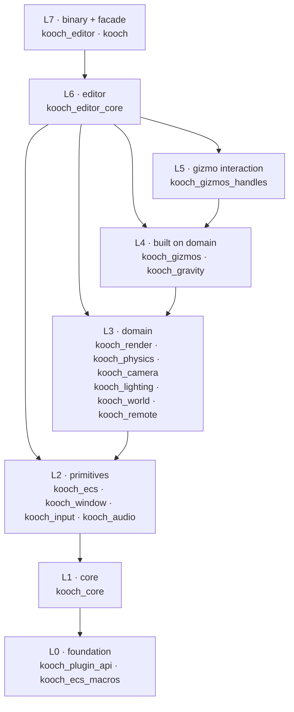

# Crate Graph

Kóoch is a Cargo workspace of 18 internal crates plus one top-level facade
crate. The structure is intentionally fine-grained: each subsystem lives in
its own crate so that downstream crates only depend on what they actually
need. This keeps compile times low when iterating on a single subsystem and
makes the dependency surface auditable at a glance.

## Layers at a glance

The 18 internal crates (plus the top-level `kooch` facade) sit in eight
layers. Each layer may only depend on layers below it.

The layer of a crate is its **longest path to a crate with no internal
dependencies** — derived from `cargo metadata`, not assigned by hand. That
matters: it means a crate moves layer when its dependencies change, whether
or not anyone updates this page.

| Layer | Crates | Role |
|-------|--------|------|
| **L0 · foundation** | `kooch_plugin_api`, `kooch_ecs_macros` | No internal deps. Type vocabulary + proc-macros. |
| **L1 · core** | `kooch_core` | `App`, `Plugin`, `Schedule`, `Resources`, `GpuContext`. |
| **L2 · primitives** | `kooch_ecs`, `kooch_window`, `kooch_input`, `kooch_audio` | ECS, windowing, input, audio. Depend on `kooch_core` only. |
| **L3 · domain** | `kooch_render`, `kooch_physics`, `kooch_camera`, `kooch_lighting`, `kooch_world`, `kooch_remote` | Built on the ECS. GPU work, simulation, scene organisation, remote protocol. |
| **L4 · built on domain** | `kooch_gizmos`, `kooch_gravity` | Gizmos need the renderer; gravity needs the solver. |
| **L5 · gizmo interaction** | `kooch_gizmos_handles` | Draggable handles on top of gizmo drawing. |
| **L6 · editor** | `kooch_editor_core` | Editor logic as a library. Depends on 11 internal crates — the widest surface in the workspace. |
| **L7 · binary + facade** | `kooch_editor`, `kooch` | The editor `main()`, and the facade user projects depend on. |

## Inter-layer flow

The arrow direction reads as *"A depends on B"*. Within a layer, crates
are siblings.

## Detailed dependency table

Per-crate internal dependencies (external deps like `wgpu`, `winit`, etc.
are omitted).

| Crate | Depends on |
|-------|-----------|
| `kooch_plugin_api` | — |
| `kooch_ecs_macros` | — |
| `kooch_core` | `kooch_plugin_api` |
| `kooch_ecs` | `kooch_core`, `kooch_ecs_macros`, `kooch_plugin_api` |
| `kooch_window` | `kooch_core` |
| `kooch_input` | `kooch_core` |
| `kooch_audio` | `kooch_core` |
| `kooch_camera` | `kooch_core`, `kooch_ecs` |
| `kooch_lighting` | `kooch_core`, `kooch_ecs` |
| `kooch_world` | `kooch_core`, `kooch_ecs` |
| `kooch_remote` | `kooch_core`, `kooch_ecs` |
| `kooch_render` | `kooch_core`, `kooch_ecs` |
| `kooch_physics` | `kooch_core`, `kooch_ecs` |
| `kooch_gizmos` | `kooch_core`, `kooch_ecs`, `kooch_render` |
| `kooch_gravity` | `kooch_core`, `kooch_ecs`, `kooch_physics` |
| `kooch_gizmos_handles` | `kooch_gizmos` |
| `kooch_editor_core` | `kooch_camera`, `kooch_core`, `kooch_ecs`, `kooch_gizmos`, `kooch_gizmos_handles`, `kooch_gravity`, `kooch_physics`, `kooch_remote`, `kooch_render`, `kooch_window`, `kooch_world` |
| `kooch_editor` | `kooch_core`, `kooch_ecs`, `kooch_editor_core`, `kooch_render`, `kooch_window`, `kooch_world` |
| `kooch` | `kooch_core`, `kooch_ecs` (always); `kooch_audio`, `kooch_camera`, `kooch_editor_core`, `kooch_gizmos`, `kooch_gravity`, `kooch_input`, `kooch_lighting`, `kooch_physics`, `kooch_plugin_api`, `kooch_remote`, `kooch_render`, `kooch_window`, `kooch_world` (optional, feature-gated) |

## Crate roles

### Foundation (L0)

Crates with **no internal dependencies**. They can be built in isolation and
form the type vocabulary the rest of the engine uses.

| Crate | Role |
|-------|------|
| `kooch_plugin_api` | Stable ABI types for dynamic plugins (loaded via `libloading`), including the `KoochPlugin` trait a project implements. Lives below `kooch_core` so plugins compiled against an old engine can still be probed. |
| `kooch_ecs_macros` | Procedural macros for the ECS: `#[derive(Reflect)]`, `#[derive(Component)]`. Standalone proc-macro crate. |

### Core (L1)

| Crate | Role |
|-------|------|
| `kooch_core` | `App`, `Plugin`, `PluginGroup`, `Stage`, `Schedule`, `Resources`, `Time`, `GpuContext`, event system, asset server, pipeline cache, power profile detection, and `scene_paths` — the file names three crates have to agree on. The minimum any Kóoch binary needs. |

### Primitives (L2)

Small purpose-built crates that depend on `kooch_core` and nothing else.

| Crate | Role |
|-------|------|
| `kooch_ecs` | The ECS itself: archetype storage, `Entity`/`Component` traits, `Query`, `Reflect`, `SceneDocument`/`SceneManager`, hierarchy, transforms, built-in components (Transform, Name, PerspectiveCamera, OrthographicCamera, Mesh, lights, sky, etc). |
| `kooch_window` | Winit integration, `WindowPlugin`, surface configuration, raw event dispatch. |
| `kooch_input` | Gamepad / keyboard / mouse abstraction. |
| `kooch_audio` | Kira-based audio playback. Sits here rather than beside the ECS crates because it does not depend on the ECS: there is no `AudioSource` component yet. |

### Domain (L3)

Crates built directly on the ECS.

| Crate | Role |
|-------|------|
| `kooch_render` | The GPU work: meshlet pipeline (cull, visibility buffer, deferred, Hi-Z), `MeshPassRenderer`, `SkyRenderPass`, `RenderPlugin`, materials. |
| `kooch_physics` | Physics simulation. Rapier is the backend, behind `kooch_physics`'s own types. |
| `kooch_camera` | Camera components and `VirtualCamera` (follow / look-at with damping). |
| `kooch_lighting` | Light components (DirectionalLight, PointLight, SpotLight). Currently authored but not consumed by the renderer. |
| `kooch_world` | Scene/world organisation, chunk streaming and activation. |
| `kooch_remote` | The local-socket protocol that lets the standalone editor drive a running project's ECS. |

### Built on domain (L4)

| Crate | Role |
|-------|------|
| `kooch_gizmos` | Immediate-mode gizmo drawing. Needs `kooch_render` to submit geometry. |
| `kooch_gravity` | Multi-gravity system (Mario Galaxy-style fields). Needs `kooch_physics` to apply forces. |

### Gizmo interaction (L5)

| Crate | Role |
|-------|------|
| `kooch_gizmos_handles` | Draggable translate / rotate / scale / plane handles, with snapping and Local/World modes. Split from `kooch_gizmos` because drawing a gizmo and interacting with one are different problems. |

### Editor (L6)

| Crate | Role |
|-------|------|
| `kooch_editor_core` | All editor logic as a library: panels (hierarchy, inspector, viewport, console, asset browser), undo/redo, project state and manifest, scene and prefab save/load, play/stop, the launch screen. Used by the editor binary AND callable as a plugin from custom hosts. |

### Binary and facade (L7)

| Crate | Role |
|-------|------|
| `kooch_editor` | The editor `main()`. Imports `kooch_editor_core` and runs an `App` with the editor plugins wired. |
| `kooch` | Top-level facade that re-exports the others under one name and defines `DefaultPlugins` (Bevy-style PluginGroup). User project crates depend on `kooch` rather than picking subcrates directly. Cargo features (`window`, `render`, `audio`, `editor`, `dynamic`...) gate which sub-crates pull in. |

## Layering rules

> **Important:** Lower layers must not depend on higher layers. If you find
> yourself wanting `kooch_core` to know about `kooch_render`, you have an
> inversion. Common fixes: introduce a trait at the lower layer and
> implement it at the higher layer, or pass behavior in via a generic /
> closure.

The dependency graph is acyclic by construction. CI does not enforce this
yet — manual review during code review.

## Why so many crates?

Three reasons:

1. **Compile-time isolation.** Iterating on `kooch_render` does not
   recompile `kooch_ecs` or `kooch_window`. Cargo's incremental compilation
   benefits from real crate boundaries far more than from module boundaries
   inside one giant crate.

2. **Feature gating.** The facade can compose user-facing builds (a
   headless server build skips `kooch_render` and `kooch_window`; an editor
   build pulls in `kooch_editor_core`). Single-crate builds cannot do this
   ergonomically.

3. **Reasoning surface.** Knowing that `kooch_world` cannot accidentally
   reach into `kooch_render` because Cargo enforces it makes refactors safer
   than relying on lint rules.

Tradeoff: more `Cargo.toml` files to maintain, more `pub use` re-exports
when types need to cross crate boundaries, slightly higher first-build time.
For an engine in early development the compile-time win outweighs the
ergonomic cost.

## Adding a new crate

1. Create `crates/kooch_yourthing/` with `Cargo.toml` extending
   `workspace.package` fields and `Cargo.toml` `[workspace.dependencies]` for
   external deps.
2. Add it to the `members` array in the root `Cargo.toml`.
3. Add it under `[workspace.dependencies]` so other crates can depend on
   it via `workspace = true`.
4. If it's user-facing, re-export from `kooch::*` and add a feature
   flag to the top-level `Cargo.toml` `[features]` section.
5. Document its role in this page.
