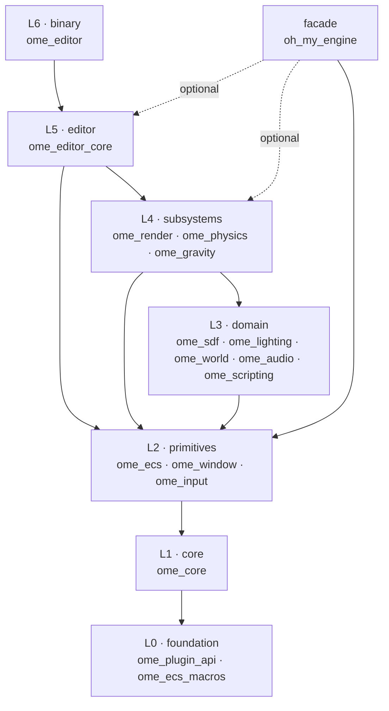

# Crate Graph

OME is a Cargo workspace of 16 internal crates plus one top-level facade
crate. The structure is intentionally fine-grained: each subsystem lives in
its own crate so that downstream crates only depend on what they actually
need. This keeps compile times low when iterating on a single subsystem and
makes the dependency surface auditable at a glance.

## Layers at a glance

The 16 internal crates (plus the top-level `oh_my_engine` facade) sit in
seven layers. Each layer may only depend on layers below it.

| Layer | Crates | Role |
|-------|--------|------|
| **L0 · foundation** | `ome_plugin_api`, `ome_ecs_macros` | No internal deps. Type vocabulary + proc-macros. |
| **L1 · core** | `ome_core` | `App`, `Plugin`, `Schedule`, `Resources`, `GpuContext`. |
| **L2 · primitives** | `ome_ecs`, `ome_window`, `ome_input` | ECS, windowing, input. |
| **L3 · domain** | `ome_sdf`, `ome_lighting`, `ome_world`, `ome_audio`, `ome_scripting` | Domain types (SDFs, lights, audio, scripting), no GPU work. |
| **L4 · subsystems** | `ome_render`, `ome_physics`, `ome_gravity` | GPU-heavy systems built on L0–L3. |
| **L5 · editor** | `ome_editor_core` | Editor logic as a library. |
| **L6 · binary** | `ome_editor` | The editor `main()`. |
| **facade** | `oh_my_engine` | Top-level re-exports + `DefaultPlugins`. User projects depend on this. |

## Inter-layer flow

The arrow direction reads as *"A depends on B"*. Within a layer, crates
are siblings.

## Detailed dependency table

Per-crate internal dependencies (external deps like `wgpu`, `winit`, etc.
are omitted).

| Crate | Depends on |
|-------|-----------|
| `ome_plugin_api` | — |
| `ome_ecs_macros` | — |
| `ome_core` | `ome_plugin_api` |
| `ome_ecs` | `ome_core`, `ome_ecs_macros`, `ome_plugin_api` |
| `ome_window` | `ome_core` |
| `ome_input` | `ome_core` |
| `ome_sdf` | `ome_core`, `ome_ecs` |
| `ome_lighting` | `ome_core`, `ome_ecs` |
| `ome_world` | `ome_core`, `ome_ecs` |
| `ome_audio` | `ome_core`, `ome_ecs` |
| `ome_scripting` | `ome_core`, `ome_ecs` |
| `ome_render` | `ome_core`, `ome_ecs`, `ome_sdf` |
| `ome_physics` | `ome_core`, `ome_ecs`, `ome_sdf` |
| `ome_gravity` | `ome_core`, `ome_ecs`, `ome_sdf` |
| `ome_editor_core` | `ome_core`, `ome_ecs`, `ome_render`, `ome_window` |
| `ome_editor` | `ome_core`, `ome_ecs`, `ome_editor_core`, `ome_window` |
| `oh_my_engine` | `ome_core`, `ome_ecs` (always); `ome_window`, `ome_render`, `ome_editor_core` (feature-gated) |

## Crate roles

### Foundation (L0)

Crates with **no internal dependencies**. They can be built in isolation and
form the type vocabulary the rest of the engine uses.

| Crate | Role |
|-------|------|
| `ome_plugin_api` | Stable ABI types for dynamic plugins (loaded via `libloading`). Lives below `ome_core` so plugins compiled against an old engine can still be probed. |
| `ome_ecs_macros` | Procedural macros for the ECS: `#[derive(Reflect)]`, `#[derive(Component)]`. Standalone proc-macro crate. |

### Core (L1)

| Crate | Role |
|-------|------|
| `ome_core` | `App`, `Plugin`, `PluginGroup`, `Stage`, `Schedule`, `Resources`, `Time`, `GpuContext`, event system, pipeline cache, power profile detection. The minimum any OME binary needs. |

### Primitives (L2)

Small purpose-built crates the rest of the engine builds on.

| Crate | Role |
|-------|------|
| `ome_ecs` | The ECS itself: archetype storage, `Entity`/`Component` traits, `Query`, `Reflect`, `SceneDocument`/`SceneManager`, hierarchy, transforms, built-in components (Transform, Name, PerspectiveCamera, OrthographicCamera, Mesh, SDF primitives, lights, sky, etc). |
| `ome_window` | Winit integration, `WindowPlugin`, surface configuration, raw event dispatch. |
| `ome_input` | Gamepad / keyboard / mouse abstraction. |

### Domain (L3)

Crates that introduce domain types but no rendering or simulation logic.

| Crate | Role |
|-------|------|
| `ome_sdf` | Pure SDF math primitives (sphere, box, capsule, etc.) used by ray-march renderer and physics queries. |
| `ome_lighting` | Light components (DirectionalLight, PointLight, SpotLight). |
| `ome_world` | Scene/world organization helpers. Currently small. |
| `ome_audio` | Kira-based audio playback with spatial support. |
| `ome_scripting` | Rhai-based scripting integration. |

### Subsystems (L4)

| Crate | Role |
|-------|------|
| `ome_render` | The actual GPU work: `RayMarchRenderer`, `MeshPassRenderer`, `SkyRenderPass`, `RenderPlugin` (orchestrator), `RayMarchPlugin` (standalone demo path). |
| `ome_physics` | Physics simulation. |
| `ome_gravity` | Multi-gravity system (Mario-Galaxy style). |

### Editor (L5)

| Crate | Role |
|-------|------|
| `ome_editor_core` | All editor logic as a library: panels (hierarchy, inspector, viewport), undo/redo, project state, scene save/load actions, play/stop. Used by the editor binary AND callable as a plugin from custom hosts. |

### Binary (L6)

| Crate | Role |
|-------|------|
| `ome_editor` | The editor `main()`. Imports `ome_editor_core` and runs an `App` with the editor plugins wired. |

### Facade

| Crate | Role |
|-------|------|
| `oh_my_engine` | Top-level facade that re-exports the others under one name and defines `DefaultPlugins` (Bevy-style PluginGroup). User project crates depend on `oh_my_engine` rather than picking subcrates directly. Cargo features (`window`, `render`, `audio`, `editor`, `dynamic`...) gate which sub-crates pull in. |

## Layering rules

> **Important:** Lower layers must not depend on higher layers. If you find
> yourself wanting `ome_core` to know about `ome_render`, you have an
> inversion. Common fixes: introduce a trait at the lower layer and
> implement it at the higher layer, or pass behavior in via a generic /
> closure.

The dependency graph is acyclic by construction. CI does not enforce this
yet — manual review during code review.

## Why so many crates?

Three reasons:

1. **Compile-time isolation.** Iterating on `ome_render` does not
   recompile `ome_ecs` or `ome_window`. Cargo's incremental compilation
   benefits from real crate boundaries far more than from module boundaries
   inside one giant crate.

2. **Feature gating.** The facade can compose user-facing builds (a
   headless server build skips `ome_render` and `ome_window`; an editor
   build pulls in `ome_editor_core`). Single-crate builds cannot do this
   ergonomically.

3. **Reasoning surface.** Knowing that `ome_world` cannot accidentally
   reach into `ome_render` because Cargo enforces it makes refactors safer
   than relying on lint rules.

Tradeoff: more `Cargo.toml` files to maintain, more `pub use` re-exports
when types need to cross crate boundaries, slightly higher first-build time.
For an engine in early development the compile-time win outweighs the
ergonomic cost.

## Adding a new crate

1. Create `crates/ome_yourthing/` with `Cargo.toml` extending
   `workspace.package` fields and `Cargo.toml` `[workspace.dependencies]` for
   external deps.
2. Add it to the `members` array in the root `Cargo.toml`.
3. Add it under `[workspace.dependencies]` so other crates can depend on
   it via `workspace = true`.
4. If it's user-facing, re-export from `oh_my_engine::*` and add a feature
   flag to the top-level `Cargo.toml` `[features]` section.
5. Document its role in this page.
