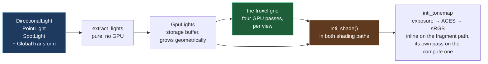
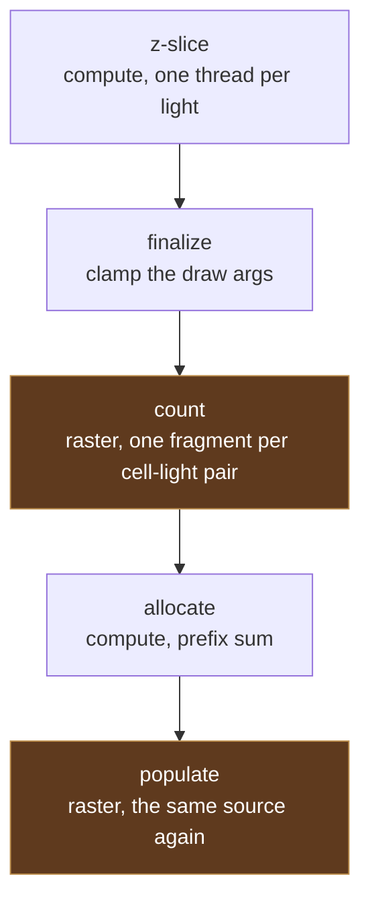

# Lighting — Inti

**Inti** is Kóoch's lighting system, named for the Inca sun.

The name covers the whole thing, not one crate: extraction, the GPU light
record, the shading model, shadows, clustering, light textures, and the
global illumination that is still to come. When something says "the Inti
path" it means the same way "the meshlet path" does.

The crate is still called `kooch_lighting`. Renaming a crate rewrites
every serialised `type_name` in every `.scene` and `.prefab` in every
project — silently, since nothing checks that a type it cannot find used
to exist.

> Until #441, `kooch_lighting/src/lib.rs` was **nine lines**: a doc
> comment promising point, spot, directional and area lights,
> volumetrics and bloom, and an `init()` that logged. The three light
> components existed, the editor drew their gizmos, the Inspector edited
> them, the remote protocol mirrored them — and no render crate read one.
> You could place a light and nothing on screen would change.

## How a light reaches a pixel



**The light component is the source.** Not the sky's sun direction — an
earlier draft of #441 drove shading from `SkyRenderer.sun_direction`,
which would have delivered a lit-looking scene and left the three light
components exactly as inert as they were.

A directional light's direction comes from its **transform's -Z**, never
from a field. A light that ignores its own rotation is a second source of
truth, and the editor's gizmo already draws the arrow from the first one.

A light with no `GlobalTransform` is **skipped**, not defaulted: it has no
direction and no position, and putting it at the origin pointing down
would be an invention that renders.

## The shading model

Cook-Torrance, ported from Bevy 0.19's `pbr_lighting.wgsl` — read from
source, not reconstructed from memory. Which matters, because three of
their fixes are baked in from the start rather than rediscovered later:

| Term | What it is |
|---|---|
| **D** | GGX / Trowbridge-Reitz, in Filament's reassociated form. The naïve expression loses catastrophic f32 precision at low roughness and the highlight breaks into visible blocks |
| **V** | Height-correlated Smith (Heitz 2014), returning `G / (4·NoV·NoL)` combined — so the specular term must not divide again |
| **F** | Plain Schlick, with `f90` derived from `f0`. A near-black dielectric with `f90 = 1` grows a white rim at grazing angles that no real material has |
| **Diffuse** | Burley / Disney. Lambert is flat; this brightens the grazing edge on rough surfaces the way cloth and unfinished wood do |
| **Multiscatter** | Single-scattering GGX loses energy on rough metals — they go grey. Compensated by the split-sum integral's analytic fit |

Two decisions worth stating because they diverge from something:

- **The diffuse is weighted by `(1 - F)`.** Energy the specular layer
  reflected is energy the diffuse layer underneath never receives.
  Bevy's *forward* path still adds the two lobes unweighted, the way
  Filament does; their *path tracer* does the layering. We took the path
  tracer's form, because a mirror is where the difference shows and a
  mirror is not an edge case.
- **Point and spot lights have a `radius`**, so a lamp has a size and
  the highlight it leaves has one too. See below.

### Light size — `radius`

`PointLight::radius` and `SpotLight::radius` are the radius of the
emitting sphere in world units. `0`, the default, is the mathematical
point every light in the engine was before, so an existing scene renders
unchanged.

It is **specular only**. It does not soften the diffuse falloff, and it
does not soften shadows — a soft shadow is a separate technique driven by
the same number, not a consequence of this one.

The technique is Karis 2013's *representative point*: instead of
integrating the BRDF over the sphere, shade against the single point on
the sphere closest to the mirror ray, and widen the roughness to account
for the rest of it. Five things travel together and the highlight is
wrong without any one of them:

| Piece | Why it is not optional |
|---|---|
| The representative direction | The highlight has to move, not only spread |
| A separate `N·L` for the specular layer | The two layers now answer to different directions, so the cosine is applied per layer rather than factored out |
| `(a / a_prime)²` normalization | Spreading a fixed amount of light must not add any — without it `radius` is a brightness knob |
| `mix(a, a_prime, 1-(1-a)⁴)` | Feeding the widened roughness straight to the BRDF makes smooth materials read too rough and too dim. Bevy's own comment names Linearly Transformed Cosines as the real fix and this as the tuned stand-in |
| Sphere visibility, `r²/d²` | At a grazing angle part of the sphere is below the horizon and cannot light the surface at all |

⚠️ The clamp `max(0.0001, dot(offset, R))` in the representative point is
a **fix, not a guard against division by zero**: the approximation is
plainly wrong for a surface inside or touching the light's sphere, and
without the clamp such a surface shows a hard discontinuity. It is
carried from Bevy, who carry it for
[bevyengine/bevy#13318](https://github.com/bevyengine/bevy/issues/13318).

A directional light is excluded by kind, not only by its radius: there
is no distance to a light with no position for the approximation to
correct. A sun's angular size is a shadow problem, not this one.

### Ambient

A hemisphere lerp between a sky colour and a ground colour, authored in
the project's settings asset. It is not cosmetic: with no ambient term a
metal facing away from every light renders pure black — correct for the
model, and indistinguishable from a bug to whoever is looking at it.

**It is a placeholder for a value the scene should compute, not author.**
Ambient light is the sky, and the sky is about to become something the
engine simulates: atmospheric scattering
([#250](https://github.com/lobinuxsoft/kooch/issues/250),
[#248](https://github.com/lobinuxsoft/kooch/issues/248)) already has to
know what colour the air is in every direction, and Bevy's 0.18
atmosphere lights the scene rather than only being drawn behind it. Once
that exists, `ambient_sky_color` stops being two colours someone picked
and becomes the atmosphere sampled — different at noon, at sunset, at
altitude and in orbit, without anyone touching a field.

The authored values stay useful for a scene with no atmosphere: an
interior, a space station, a stylised game that wants flat fill. They
just stop being the default answer.

⚠️ Today it lerps on **world up**, which stops meaning anything on the far
side of a planet. A known limit of the placeholder, and one the
atmosphere fixes on its way past: a per-planet atmosphere knows which way
up is, because up is what it is a sphere around.

## Units, and why the defaults are not physical

Lights carry real photometric units:

| Light | Unit | Default |
|---|---|---|
| `DirectionalLight` | **lux** (illuminance) | 10 000 — `lux::AMBIENT_DAYLIGHT` |
| `PointLight` / `SpotLight` | **lumens** (luminous flux) | 32 000 — `lumens::ROOM_LIGHT_NO_GI` |

The directional default is a physical fact and matches Bevy's. The
punctual default is **forty times a real 9 W bulb**, and that deserves an
explanation rather than a shrug.

An 800 lm bulb three metres away really does deliver about 7 lux. An
office reads 320 lux, and the other 313 are **bounces** — light off the
ceiling, the walls, the desk. Kóoch computes direct light only, so the
physically honest number renders as almost nothing.

Bevy has the same gap and resolved it by defaulting `PointLight` to
`VERY_LARGE_CINEMA_LIGHT`, one million lumens, with the comment *"capable
of registering brightly at Bevy's default exposure level"*. That is a
confession, not a unit. Kóoch's fudge is **named after the compromise** —
`ROOM_LIGHT_NO_GI` — and its own doc comment says it goes back to a real
bulb the day global illumination lands.

`kooch_ecs::light_consts` holds the named values, so an author picks a
situation instead of guessing a magnitude: `lux::OFFICE`,
`lux::OVERCAST_DAY`, `lux::DIRECT_SUNLIGHT`, `lumens::CANDLE`,
`lumens::CAR_HEADLIGHT`.

> **Hover a field in the Inspector** and its doc comment appears as a
> tooltip, units included. `intensity` on a directional light says LUX;
> on a point light it says LUMENS. They are different units with
> different magnitudes and they used to look identical.

## Exposure

Physical light units need an exposure step or every channel clips to
white and the model looks broken rather than unexposed.

`Exposure` carries an EV100, and `PhysicalCamera` is the control worth
using: **aperture, shutter and ISO**. `f/16, 1/125, ISO 100` says
something to anyone who has held a camera; `EV100 = 9.7` says nothing
about which way is brighter or what a step is worth.

| Preset | Settings | EV100 |
|---|---|---|
| `PhysicalCamera::sunny()` | f/16, 1/125 s, ISO 100 | ≈ 15 |
| `PhysicalCamera::default()` | f/2.8, 1/125 s, ISO 100 | ≈ 9.9 |
| `PhysicalCamera::indoor()` | f/1.0, 1/125 s, ISO 100 | ≈ 7 |

The default is a middle setting, not a real situation: bright enough that
a default sun does not clip, dim enough that a punctual light is visible.
It lands near Bevy's 9.7 so a scene authored against their numbers reads
the same here — and note that their 9.7 is **not "sunny 16"** despite
being described that way; sunny 16 is EV 15, and they calibrated theirs
against Blender's implicit exposure.

Tone mapping is an ACES approximation (Narkowicz 2015), then the sRGB
transfer function. Both are provisional and belong to
[#254](https://github.com/lobinuxsoft/kooch/issues/254), which owns the
real tonemapper and the auto exposure that lets a sunlit surface and a
planet's night side coexist in one frame.

### Where the author sets it — `.rendersettings` (#744)

Exposure and ambient used to be `Resources` with defaults and **no way to
change them**: #441 built the control and left it out of reach, which is
this engine's recurring failure committed knowingly. They are now fields
of a **project settings asset** — `aperture_f_stops`, `shutter_speed_s`,
`sensitivity_iso`, `ambient_sky_color`, `ambient_ground_color`,
`ambient_intensity` — edited in the Inspector like any other asset.

It is an asset rather than a panel because the machinery already existed:
a RON loader that registers itself, reflection for the generic editor,
the save-and-refresh path of #728, and the asset browser as its home.
**The evidence that bespoke settings panels do not get built is that this
setting had none for as long as it existed.**

⚠️ **Author settings, not player settings.** This ships with the game and
belongs in version control. What the *player* picks — resolution, volume,
key bindings — is #736 and lives under `~/.config/`. Merged, they would
put an artist's exposure and a volume slider in the same commit.

🔴 The fields are **flat** rather than a nested `PhysicalCamera`, and
every `serde` default is *what the engine already did* — see the render
pipeline page on why an old file silently taking a new default is how
"you broke the whole render" gets reported.

## The GPU record

`GpuLight` is 80 bytes, `#[repr(C)]`, mirroring `IntiLight` in
`inti_pbr.wgsl` byte for byte. Nothing checks that correspondence at
compile time on either side of the boundary — a reordered field reads a
light's range as its intensity and renders something plausible and
wrong — so a test pins the size.

**Array of structs, not struct of arrays**, against the engine's usual
rule, and for a reason that survives scrutiny: every shader invocation
touching light `i` reads *all* of light `i`'s fields within a few
instructions. Splitting into parallel arrays turns one cache line into
six scattered fetches. SoA pays when a pass reads one field across many
records — which is what light **culling** does, positions and ranges
only, and that is exactly how the froxel grid takes its input: a separate
pair of arrays, not a reinterpretation of this one.

It was 64 bytes — one cache line — until `radius` arrived and there was
nowhere left to put it. Growing the record widens **every** light in the
scene, the sun included, which is a bandwidth decision on a handheld and
not a free slot; three padding scalars now ride along to the alignment
`std430` demands, and they are where the next field goes before the cost
is paid again. Bevy's equivalent record is 80 bytes for the same reason,
and they keep directional and rect lights in separate arrays rather than
widening one record for all of them.

Spot cones are stored pre-packed as the multiply-add the shader
evaluates, `saturate(cos_angle · scale + offset)` — one MAD per light per
fragment instead of a subtract and a divide. The authored half-angles are
recoverable from it.

Angles are **half-angles**, measured axis to edge, like Unreal rather
than Unity's single full `spotAngle`. `gizmos/lights.rs` chose that
convention when it drew the cone and wrote down that the lighting work
would either honour it or draw a cone half the width it lights.

## Shadows

Two techniques, and they compose rather than compete because each is
worst where the other is best.

### Cascades, for the scene (#476)

Four cascades fitted to slices of the view frustum, rendered into one
atlas, sampled with **Castaño '13** — nine bilinear taps — under a PCSS
penumbra that widens with the gap between blocker and receiver
(`sun_softness` is the tangent of the sun's angular radius, not a width).

Only the **first active directional light** gets cascades. That is a
statement about *cascades*, not about punctual shadows: a spot casts
through its own perspective map (#777) and a point through a cube (#778),
both below, and both default to `cast_shadows: true`.

The cascade fit is the one thing in the renderer that still asks for a
**bounded** projection — a slice of an unbounded frustum is unbounded.
See [ADR 0002](../../../decisions/0002_infinite_reverse_z.md).

### Contact shadows, for the last few centimetres (#735)

A cascade is correct at range and worst exactly at contact: at the texel
density it can afford, the few centimetres where an object meets the
ground is where its shadow detaches or swims, and that is what makes
things look like they float over a scene rather than stand in it.

A short ray marched through the **depth buffer**, from the shaded point
towards each light that opted in. Screen-space, so it **costs the same at
any world scale** — a ray a few pixels long is a few pixels long whether
the object is a crate or a moon.

The march is `bevy_raymarch.wgsl`: Bevy 0.19's `bevy_pbr::raymarch`
**copied**, licence header intact. Diff it against upstream rather than
reasoning about it. What is this engine's lives in `contact_shadow.wgsl`
(bindings, the four view helpers the port imports) and
`contact_shadow_apply.wgsl` (the call, the debug probe, the lift below) —
the line between the two is a file boundary, not a judgement call.

🔴 **The one thing that could not be copied.** Bevy's march is compiled
only behind `#ifdef DEPTH_PREPASS`, so their ray's origin and their depth
buffer came out of the same rasteriser with the same matrix and agree to
the bit inside the origin's own texel. This engine reconstructs the
origin from the **visibility buffer** by barycentrics — a second
arithmetic path to the same point — and inside that texel the comparison
is decided by the last bit, with the jitter picking which way. It renders
as salt and pepper across every lit surface.

The fix is a **lift**: the ray starts one depth texel off the surface
along the normal, divided by `n·v`. Both factors are derived, not
authored — the texel's world size from `view_proj[1][1]` and the buffer
height, the distance from `near / ndc.z`. The `n·v` term is the
slope-scaled depth bias every shadow map uses: a depth texel is a
*screen* quantity, so it spans more surface the more oblique the surface
is, and the error inside it grows in the same proportion. Clamped at four
texels, because `n·v → 0` at a silhouette and an unbounded lift would
throw the ray clear of the object.

Per light, opt-in (`DirectionalLight::contact_shadows` on by default,
punctual lights off): the cost scales with **light count**, and a scene
has one sun and can have fifty lamps. The whole feature turns off with
`contact_shadow_steps = 0`.

⚠️ Screen-space means an occluder off-screen or behind the camera does
not exist; the ray is clipped to the frustum and reports no hit, so the
shadow fades at the screen edge rather than popping.

⚠️ **The seam is real and is not a bug.** Next to a nine-tap penumbra, a
contact shadow is one ray with a hard hit/miss answer, so the boundary
between pixels that find an occluder and pixels that do not is a
discontinuity in *coverage*. No curve applied to the hit smooths it —
softening Bevy's remap was tried, cost the shadow 30% of its strength for
nothing, and was reverted. Only averaging fixes it, spatially or
temporally, and temporally is #732. Bevy has the same seam and leaves it
to their TAA.

### Seeing what the shadow system did

Three debug views, because "no light reaches this" and "something shadows
this" look identical in a shaded frame and have different fixes.

- **Shadow cascades** — Bevy's flat per-cascade hue, dimmed by
  `inti_sample_cascade`, *the same call the shading pass makes*. Magenta:
  nothing casts. Black: inside no cascade volume.
- **Contact shadows** — red: the march hit on its first step, which is
  the surface occluding itself. Green: a real occluder. Blue: the ray was
  under two pixels long. Grey: marched and found nothing.
- **Single light** — one light, alone, in grey, with its shadow. The one that answers what a shadow *looks like*; the other two answer what the shadow system *did*.

A fourth answers a question about cost rather than about appearance:
**Lights per pixel**, below, for *how many* lights a pixel pays for.

### Single light

Select a light in the World panel and this view shades the scene with
that light and nothing else: no other light, no albedo, no ambient.

Each exclusion answers a different confusion:

| Removed | Because otherwise |
|---|---|
| Every other light | A surface lit by the wrong one still looks lit |
| The material's colour | A dark albedo and no light landing produce the same pixel |
| Ambient | A point in full shadow never renders black, which is the reading the view exists to make unambiguous |

Roughness is *kept* — the width of a highlight is information about the
light, not the paint — and `metallic` is forced off, because a metal
takes its F0 from the albedo this view removes, and a metal shaded white
is a mirror rather than that metal decoloured.

The shadow comes from calling `inti_light_contribution`, the same
function the shading loop sums per light. A view that recomputed the
maths its own way could disagree with the frame, and then it is one more
thing to debug instead of the thing that settles the question.

> ⚠️ **A light that shows no shadow is not necessarily broken.** A spot
> casts since #777 and a point since #778, but both are limited to four
> maps each: past the budget a light keeps lighting the scene and stops
> casting. "Casts nothing" and "the shadow broke" render identically, so
> the editor prints which one it is next to the selector — `shadow_note`
> in `kooch_lighting`.

Magenta means the selection has no slot in the light buffer, and the note
below the selector says which reason:

| Note | What happened |
|---|---|
| `This light is inactive — tick active in the Inspector` | The light exists and is switched off, so it never reached the buffer |
| `Select a light in the World panel` | The selection is not a light |

Those two produce the *same magenta*, and the first smoke of this view
hit it: two lights in the scene were `active: false`, so selecting them
looked exactly like selecting a crate. A view built to stop two causes
from looking alike does not get to ship a third pair of its own.

Which light travels in `IntiFrame.debug_light`, an index into the light
buffer that occupies what used to be that struct's tail padding. There is
no seventh bind group and Inti's is full, so a view needing a binding of
its own was not going to ship.

### Spot lights (#777)

A cascade is an orthographic slice of the camera's frustum and needs
fitting, splitting and stabilising. A spot needs none of it: **the light
is a frustum**, so its shadow view is its own cone and there is one map
with nothing to blend into.

It renders into a layer of the same array the cascades use, behind them,
and its record is the same `GpuCascade` — `inti_shadow_coords` already
divided by `w`, which an orthographic cascade does not need and a
perspective does. That means the bias, the blocker search, the Castano
filter and the border clamp are one implementation, not two.

| Decision | Why |
|---|---|
| FOV is `outer_angle * 2` | The cone's edge is where the light stops. Fitting the half-angle clips the round pool into a square |
| Up vector chosen against the cone | A spot pointing straight down is the most ordinary way to author one, and the case a fixed world-up basis is degenerate for |
| Cone clamped near 90° | `tan` runs away before it gets there and fills the matrix with infinities, which spread into every depth the pass writes |
| `texel_world_size` is an ANGLE per texel | `2·tan(outer)/size·√2`, Bevy's `texel_size`, with **no `range` in it**. The shader multiplies by each fragment's own axial distance to the light. Baking `range` in biases everything as though it sat at the far end of the cone: a 100 m spot over objects five metres away offset them 17 cm and the shadow lifted off — found in the first smoke |
| `MAX_SPOT_SHADOWS = 4` | One layer each, 16 MiB at 2048². A fifth spot still lights the scene with no shadow; dropping the light would be a worse failure |

🔴 **The cull needs its LOD selector configured, and a factor of zero is
not a neutral default.** `CullParams::new` leaves
`lod_error_to_pixel_factor` at `0.0`, which makes every meshlet's
projected error work out to 0 px — always under the threshold, so the
selector keeps **only roots**. A sphere's shadow then comes out as a
wedge. `projection_scale_y`'s doc comment has said so since a rotated
camera hit the same zero: *"a sphere collapses to a blob and a cube to a
spike"*. A spot uses `with_lod` (perspective), a cascade
`with_orthographic_lod`; both apply `SHADOW_LOD_RELAXATION`, because a
shadow is a silhouette and loses detail a lit surface keeps.

🔴 **Slots are handed out inside `extract_lights`, in its walk order**, and
`shadow_casting_spots` reads that same order back. Two walks that
disagreed would light one spot through another's map — geometry from
elsewhere in the room, which reads as a broken shadow pass rather than as
a crossed index.

🔴 **No sun is not no shadows.** A scene lit by a torch and nothing else
still renders its maps. The cascades are then fitted to a stand-in
direction so the pass has something coherent to not draw, and
`FrameShadows::cascades_enabled` stays false — otherwise a directional
light that does *not* cast would sample them and be shadowed by a sun
that is not there.

### Point lights (#778)

A spot light *is* a frustum, so its shadow is the cone itself. A point
light is not a frustum at all — it lights every direction — so it gets
**six 90° faces that tile the sphere**, and the shading model picks one
by the direction to the fragment rather than by a matrix.

That is why `GpuPointShadow` is sixteen bytes and carries **no
`view_proj`**: sampling a cube map takes a direction, and the direction
is a subtraction the shader already does.

| Decision | Why |
|---|---|
| A **separate texture** from the cascade array | Different size, and one texture cannot have two. Sharing would mean six 2048² faces per light — 96 MiB each against 6 MiB at the size a lamp actually needs |
| `DEFAULT_CUBE_SIZE = 512` | 6 MiB per light at `Depth32Float`. Bevy's is 1024; ours is smaller because these render on a handheld and the shadow of a lamp is wanted soft, not detailed |
| `MAX_POINT_SHADOWS = 4` | **Memory**, not the technique. The `max_texture_array_layers` ceiling of 256 would allow 42, and 42 × 6 MiB is a quarter of a gigabyte of depth |
| **Six culls, shared across lights** | A light's six faces are what can overlap on the GPU. Lights then serialise, costing three barriers at the limit against eighteen more survivor arenas idle whenever nothing casts |
| Casting lights ranked **by distance to the camera** | Past the limit a light keeps lighting and stops casting. Which one loses its shadow must not be decided by when it was spawned |

#### The depth is one divide, and that is the whole reconstruction

Bevy sends the lower-right 2×2 of the face projection per light and
computes `depth = zw.x / zw.y`. Expanded with a standard perspective,
`w` collapses to the major axis and `depth` to `m23/major − m22` — and
with the **infinite reverse-Z** projection this engine migrated to
(ADR 0002), `m22 = 0` and `m23 = near`:

```
depth = near / major_axis_magnitude
```

One scalar replaces their four. `depth_is_near_over_the_major_axis`
checks it against the real matrix rather than trusting the algebra,
because being wrong here reads as a bias that cannot be tuned rather
than as a formula that is visibly wrong.

🔴 **`distance_to_light` is `max(|x|, |y|, |z|)`, never `length()`.** The
faces align with the world axes and their frustum planes meet at 45°, so
the largest absolute component *is* the depth. The Euclidean distance
would scale the bias by up to √3 toward the corners of a face — the same
class of mistake as the axial-vs-radial spot bias above, which shipped
and had to be fixed.

🔴 **Cube maps are left-handed and this engine is not.** The Z faces are
stored swapped in `FACE_DIRECTIONS` *and* the sampling direction is
mirrored on Z. Correcting either half on its own puts the shadow of
everything in front of a lamp behind it.

#### The filter is a gaussian, not Castano

The cascades and spots use Castano's thirteen — a 2D gaussian that leans
on bilinear hardware to get nine taps out of four fetches. **That trick
does not exist for a cube map**, so Bevy's cube path (and ours) is eight
explicit taps at the standard D3D MSAA positions, weighted by a gaussian
whose coefficients sum to 1.

A cube map has no uv plane to offset a tap in either, so the offsets move
across the **tangent plane of the sampling direction**, built per pixel
by a branchless orthonormal basis (Duff et al. 2017).

The radius is `INTI_POINT_FILTER_TEXELS` **shadow texels**, where Bevy
uses a fixed 0.003 in direction units: expressing it in texels stops it
silently changing meaning if the face size ever moves.

⚠️ The offset is added to a direction vector whose length is already the
distance to the light, so the texel size is converted to metres **once**,
by the caller. Doing it again inside the filter made the radius grow with
the distance *squared* — which does not look like a wider blur, it looks
like a gradient smeared across the floor.

#### A surface can opt out of receiving them

`MeshRenderer::receive_shadows` clears a bit on the instance, and
`inti_light_contribution` skips the shadow fetch entirely — not a
cheaper fetch, none at all. It covers the cascades, the spot and point
maps and the contact-shadow march, because all four are shadows.

Worth it because that cost is **per pixel and per casting light**: the
same product that makes lighting expensive at all (#780 attacks it from
the other side, by shrinking the set of lights a pixel considers). A
ground plane already in shade, backfaces, emissive surfaces and anything
an author knows will never show a shadow are all paying for a sample
they discard.

🔴 **The field existed long before anything read it.** Unticking it in
the Inspector changed nothing, which is worse than the feature being
absent — the UI made a promise the renderer did not keep. Same shape as
the `cast_shadows` checkbox on a point light before #778.
`a_floor_that_receives_no_shadows_has_none` is what keeps it honest, and
it was verified failing: the same 0.0791 with the flag and without it.

⚠️ Bevy checks two flags before its fetch, one on the mesh and one on
the light (`pbr_functions.wesl`). This is the mesh half. The light half
is `cast_shadows` on `MeshRenderer`, which is **still read by nobody** —
a mesh with it unticked casts anyway.

#### What a cube costs, and when it costs nothing

Six faces is the most expensive shadow the engine draws, and
`cast_shadows` defaults to `true`, so the work has to be **avoided**
rather than paid.

**Culled against the camera's frustum, then limited — in that order.**
Limiting first would spend all four cubes on the nearest lights even when
they are behind the camera, and the one lamp whose shadow anybody can see
would get nothing. The test is the sphere of the light's own `range`, not
its centre: a lamp just off the edge of the screen still shadows pixels
that are on it.

**A cube is redrawn only when something it depends on changed.** The key
is the light's identity, its position, and a hash of every instance in
the frame. Epic measures a cached local shadow map at **0.05 ms against
0.4–0.8 ms invalidated** on a PS5, and a lamp bolted to a wall in a room
where nothing moves should pay the first number.

🔴 That key is **deliberately coarse**: a crate moving across the level
invalidates a lamp that cannot see it. A cube redrawn for nothing costs a
frame's work; a cube *not* redrawn when it should have been is a shadow
frozen in place — silent, and blamed on the light, the material and the
camera long before the thing that skipped the work. Narrowing it means
asking which instances a light's range reaches, which is the cluster
structure (#780) and not this.

⚠️ Two tests render **twice**, because the first frame of a cached cube
is always drawn and a stale cube only appears on the second. Both were
verified to fail against a cache that never invalidates.

**A light past the budget says so**, once per transition rather than per
frame. It keeps lighting the scene without a shadow, which is the right
failure — but an author staring at a lamp with no shadow could not tell
that from a bug.

### The debug views are not in the shader your game runs

`inti_debug.wgsl` is concatenated only by a pipeline that can show a
view. Production concatenates `INTI_DEBUG_STUB`, where
`inti_debug_is_view` returns a literal `false` and the two call sites
fold away.

This is a performance decision, not tidiness. A branch nothing takes is
still code the shader carries: register allocation is worst-case over the
whole entry point, so a cascade sample and a screen-space raymarch parked
behind `if (debug_mode == …)` still raise the VGPR count. VGPR count caps
how many waves stay in flight, and waves in flight is the whole of an
integrated GPU's ability to hide memory latency — which is the budget
this engine is held to.

The debug pipeline is built through a `OnceLock` the first time a view is
selected, so a shipped game never compiles it either. Both variants are
validated by tests, because nothing else compiles the debug one until
somebody opens it.

## Clustering — the froxel grid (#780)

Until this landed, `inti_shade` looped over **every light in the scene
for every pixel on screen**, and a lamp on the other side of the map was
evaluated — falloff, cone, shadow-map sample and all — in every fragment.
The cost was pixels × lights, multiplied, and it was measured as the
frame's largest single term on the OneXFly: `raster + shade` scaled
*worse* than linearly with resolution, because every new pixel paid for
the whole light list again.

The fix is a spatial index. The view frustum is diced into a grid of
cells — "froxels", frustum voxels — and each cell is given the list of
lights whose volume reaches it. A fragment looks up its own cell and
walks that list.

### The grid is not a light structure

Reflection probes, irradiance volumes and decals are bound to a region of
space in exactly the same way, and each cell's record reserves a range
for all five types from the start. It is also the structure virtual
shadow maps (#477) mark pages with, and the one volumetric fog (#731)
integrates through. **It gets built once.** Growing a second grid for
each of those is the failure mode this shape exists to avoid.

### Four passes, and why one of them is a rasterizer



The two middle passes are **draws, not dispatches**, and that is the part
most descriptions of clustering get wrong. The grid is WxHxD; the pass
runs on a WxH viewport and draws each (light, slice) pair as a quad
covering the cells that light can reach. One fragment invocation is then
exactly one (cell, light) pair — scheduled by the hardware that exists to
schedule quads. Colour writes are off; the output is storage buffers.

It runs twice because the lists are tightly packed: the counting pass is
what makes the offsets computable, and the offsets are what the populate
pass writes into. 🔴 **Both runs must reach the same verdict for every
pair.** They are the same source compiled twice for that reason — a
disagreement would overflow one cell's run into its neighbour's, and
nothing downstream could detect it.

### Slices are logarithmic

```text
slice = ln(-view_z) * factor.x - factor.y + 1
```

Cells are distributed the way depth precision falls off rather than by
metres: thin near the camera, thick far away. Slice 0 is everything
nearer than `ClusterSettings::first_slice`.

⚠️ **The grid needs a far plane and the camera does not have one.** Kóoch
projects with an infinite reversed-Z frustum (ADR 0002). Bevy reads back
the furthest light the GPU saw and resizes next frame; that is a readback
in the hot path. Here it is a setting — `ClusterSettings::far`, 200 m by
default. A light further out lands in the last slice with everything else
behind it, so that cell holds more lights than it should. Nothing renders
wrong; it just stops saving work out there.

### Directional lights are not in it

They reach every cell, so a cell listing them would say nothing. They are
the **leading entries** of the light buffer and the shader walks them
linearly — which is why `ExtractedLights::directional_count` is a prefix
and not a subset.

### Seeing what a pixel pays — `Lights per pixel` (#817)

Clustering makes cost a property of **where the pixel is**. That is the
whole point of the grid, and it is also why no pass timing can explain a
slow frame any more: `raster + shade` is one number for the screen, and
on the OneXFly it grew from 5.27 ms to 34.92 ms between a still camera
and a moving one without saying which pixels did it.

The debug view paints the count each fragment actually walks, read at
the point where it is paid — the same `point_count + spot_count` that
bounds the loop in `inti_clustered_lights`, plus the directional lights,
which the grid does not cluster because they reach every cell.

| colour | meaning |
|---|---|
| black | no light reaches this pixel at all |
| blue | few |
| green | half the top of scale |
| red | the top of scale, or more |

**The top of scale is a control, not a constant.** It is the one number
that decides whether the picture says anything: at 16 a hundred-light
stress scene is flat red, and the same frame at 40 separates into
froxels. Raise it until the image stops being flat — that value is
roughly what the busiest froxel carries. It rides in the frame uniform
(`LightsHot`), so moving it costs no recompile.

Fixed *during* a comparison, though: two screenshots taken at different
tops mean nothing next to each other.

🔴 **A whole screen at full red means the frame is not clustering.**
`inti.clustered == 0` evaluates every light for every pixel, which is
what the frame cost before #780 and what a path with no camera matrices
still does. The view does not special-case it, because a scene that
quietly stopped clustering should look alarming.

### A light in the cell is not a light on the pixel (#835)

The cell is **conservative by design**: `cluster_raster.wgsl` accepts any
light whose bounding sphere touches the cell's AABB, because a cell that
excluded a light reaching one of its pixels would drop light from the
image. A cell is also much larger than a pixel — at 1080p the default
grid is 17x9x24, so one cell covers roughly 113x120 pixels and a slab of
depth besides.

Both of those are correct, and together they mean a fragment's list
contains lights that do not reach *it*. Measured in #820: the busiest
cell carries ~40 lights where ~14 reach the pixel.

So the shading loop asks a second time, at the pixel, where the answer
is already in a register:

```wgsl
let reach = max(max(s.irradiance.x, s.irradiance.y), s.irradiance.z) * n_dot_l;
if (reach <= 0.0) {
    return vec3<f32>(0.0);
}
```

🔴 **Zero here is exact, not small.** `inti_distance_attenuation` windows
with `saturate(1.0 - factor * factor)`, which reaches zero *at* the range
rather than approaching it — the same property that makes the editor's
wire sphere the truth about where a light stops. So the cut returns the
value the rest of the function would have computed: both BRDF layers, the
shadow cube and the contact march, all multiplied by an irradiance of
zero. No pixel changes, which is what `tests/light_reach.rs` pins
byte-for-byte.

What it removes is the work in between, and that work is not small: at
the default of 16 contact-shadow steps, the ~26 unreachable lights in a
busy cell were spending 416 depth taps per pixel to produce nothing.

⚠️ This is **not** a fix for the cell being loose. The cell is supposed
to be loose. Tightening the grid — more slices, smaller tiles — trades
against the cost of building it, and the measurement that would justify
it is a different one.

A cut at a *threshold* rather than at zero is the next question, and it
is a different kind of change: visible, tunable, and needing its own
measurement. That is what the section below is.

### ❌ What does not work: cutting the list by count (#826)

Recorded because it is the obvious next idea and it is wrong.

If a cell carries ~40 lights and ~14 reach the pixel, sampling *k* of
them stochastically and weighting the result looks like the standard
answer — RIS, in the shape ReSTIR made famous. It was built, measured and
removed, and 1139 lines went with it.

**It is incompatible with the grid's continuity property.** A light joins
a cell exactly when its contribution reaches zero, which is what makes
the boundary between two cells invisible. Choose *k* of *n* per froxel
and the froxel becomes visible: neighbouring cells pick different subsets
of the same lights, and the picture breaks into flickering blocks the
size of a cell — 75×80 px at 1080p, repainted every frame.

The histogram says the same thing arithmetically. Over a hundred-light
scene:

| lights kept | share of the froxel's irradiance |
|---|---|
| top 2 | 60.8 % |
| top 6 | 95 % |
| top 8 | 93 % *of the worst froxel* |

**There is no small *k*.** Getting to 95 % takes six of the fourteen that
reach the pixel, and the two the ordering drops are exactly the ones a
neighbouring cell keeps.

⚠️ A related hypothesis died with it: that the workgroup memory the
sampler used was costing occupancy. Removing it freed 9.88 KB of LDS and
moved a settled handheld frame from 40.7 ms to 40.5 — inside the noise.
**The shading dispatch is not misconfigured. It is doing real work.**

The direction that survives is not fewer lights, it is cheaper lights —
which is the section below — and a smaller reach per light (#835 above).

### What each light costs — `specular_floor` (#821)

Clustering bounds *how many* lights a pixel walks. It cannot make any of
them cheaper, and every one of them pays the full model: GGX `D`,
height-correlated Smith `V`, Schlick `F`, the multiscatter fit, and the
representative point when the light has a radius. With ~15 lights
reaching a pixel, that is fifteen of those.

A light whose irradiance at a point is a fraction of the frame's
exposure leaves a highlight nobody can see, and pays the expensive half
to produce it. `SpecularFloor` is the irradiance below which it shades
**diffuse only**:

```sh
KOOCH_SPECULAR_FLOOR=2000 ./your-game
```

**0.0 is the default and keeps every light on the full model**, so a
project that never sets it renders exactly as before.

⚠️ Fresnel is substituted at normal incidence rather than dropped. `f`
weights the diffuse layer — `diffuse = (1 - f) · …` — so a skipped
specular that also skipped `f` would *brighten* the surface. A missing
highlight is invisible; an over-lit dielectric is not.

🔴 **The editor cannot measure this and the environment variable is not
a convenience.** On a desktop GPU the whole raster pass is 0.12 ms and
switching every specular layer off moves it by 0.001 ms — there is no
bottleneck there to remove. The frame this exists for is a game on the
handheld, launched over SSH, with no editor in the process. A knob that
lives only in a panel cannot be swept on the machine whose numbers
decide anything, which is the same lesson `KOOCH_CLUSTERING` already
carried.

### Turning it off

`KOOCH_CLUSTERING=off`, or `ClusterSettings { enabled: false, .. }` in
`Resources`. The image is identical and the cost is the linear walk this
replaced. It exists to be the A/B: same camera, same scene, one capture
each, is the only honest way to say what the grid bought.

## What a page pool would hold — the census (#866)

Before there is a page pool there is a number, and #866 says so:
*"the first task in this issue is a measurement, not an allocation"*.
`cargo run --example measure_shadow_pages -- <scene>` is that
measurement. It walks the froxel grid, marks every page each cell would
need from each light that reaches it, and prints what the distinct pages
would cost.

```bash
cargo run --example measure_shadow_pages --features lighting -- \
    ../roll-a-ball/assets/scenes/many_lights.scene
```

The walk lives in `kooch_render::shadow::pages` and runs on the CPU on
purpose. The marking pass it previews belongs on the GPU — that is
#477 — but here it only counts, so it needs no device and can be a test.
It also becomes the **oracle** that pass is checked against, the position
`ClusterGrid::z_slice` already holds against `cluster_z_slice` in WGSL.

### The configuration it measures, and where it comes from

Read off [the UE 5.8 Virtual Shadow Maps
documentation](https://dev.epicgames.com/documentation/en-us/unreal-engine/virtual-shadow-maps-in-unreal-engine)
directly, not quoted from this project's own issues:

| | Unreal | in `pages.rs` |
|---|---|---|
| virtual resolution | *"16k x 16k pixels"* | `PageConfig::virtual_size` |
| page | *"tiles (or Pages) that are 128x128 each"* | `PageConfig::page` |
| level selection | *"appropriate mip levels are picked by projecting the size of the screen pixels into shadow map space"* | `level_for` |
| spot | *"a single 16k VSM with a mip chain rather than clipmaps"* | `CensusKind::Spot` |
| point | *"a cube map of 16k VSMs, one for each face"* | `CensusKind::Point` |
| directional | *"clipmap levels 6 through 22"*, finest 64 cm from the camera, broadest ~40 km, every level at full 16k | `ClipmapConfig::default` |
| **marking** | ***"depth buffer analysis is used as the primary method of marking pages that are needed to render"*** | `CensusFrame::surfaces` |
| **the budget** | `r.Shadow.Virtual.MaxPhysicalPages`, **4096** by default; 6144 for open worlds; 8192 thrashes | `POOL_PAGES` |

🔴 **The pool is one budget for the whole scene** — every light, the sun
included, allocates out of it — and overflow is not graceful: Epic's
page-pool overflow shows as checkerboard corruption or missing shadows.
At `Depth32Float` those 4096 pages are **256 MiB**, which is *more* than
this engine's 152 MiB of fixed allocations. The pool is not inherently
smaller. It is **adaptive**, and that is a different property.

### What it measured, 2026-08-20

`many_lights.scene` at 1280x720 — a hundred point lights, a sun, a floor
and sixteen Suzannes — in exactly that configuration. The run reports two
walks of the same grid: **volume** marks every cell of the frustum,
**surfaces** marks only the cells a mesh passes through.

| | cells | volume | surfaces | MiB | saved |
|---|---|---|---|---|---|
| the sun | 131 | 15 770 | **118** | 7.4 | **133.6x** |
| a hundred local lights | 131 | 8 386 | 6 798 | 424.9 | 1.2x |
| everything | 131 | 24 156 | 6 916 | 432.2 | 3.5x |
| the screen's floor — one texel per pixel, perfectly packed | — | — | 57 | 3.6 | |
| today's fixed allocations, for five casting lights | — | — | — | 152.0 | |
| Unreal's default pool | — | — | 4 096 | 256.0 | |
| Unreal's open-world pool | — | — | 6 144 | 384.0 | |

🔴 **The marking input is the decision, and the sun is where it shows.**
Marked from froxel volumes the sun's clipmap residents 15 770 pages —
277x the theoretical floor. Marked from the cells that actually contain
geometry it residents **118**, about *twice* that floor. A froxel is a
box of mostly empty air, and a page allocated for air is a page no
shadow ever reads. Epic says the same thing in one sentence: *"depth
buffer analysis is used as the primary method of marking pages"*.

So #866's own opening move — *read it off the froxel grid that already
runs* — is what the measurement refutes. The froxel grid answers *which
lights reach which region of space*, which is the right input for
**shading** and the wrong one for **page allocation**.

Two further sweeps are kept in the run because both were predictions
about the volume walk and both **refuted** the mechanism they tested,
which is what leaves that walk's count standing as an area rather than
an artefact of how the grid is diced: 32x thinner slices moved it 31 %,
and over a 20x range of cell counts it moved 25 % — while the surface
filter moves it 133x.

🔴 **Neither page size nor virtual size is the decision.** Across
64/128/256-texel pages the bill is flat within 2 % — 424 to 432 MiB —
because a smaller page is simply more pages. Across 4k/8k/16k virtual
maps residency is *identical* (6 916 pages each time), because the
virtual size is only the chain's ceiling and the level chosen for a cell
is the one whose texels match the screen.

### What it says about the engine as it stands

🎯 **For the content that ships today — five casting lights — the pool
is 14.1 MiB against 152.** Eleven times less, same image. That is the
whole promise of *memory that follows the screen instead of the sum of
every light type's worst case*, and it holds.

⚠️ **But local lights barely benefit from better marking: 1.2x.** A point
light's `range` already bounds it to the cells near geometry, so there
is little air left to stop paying for. A hundred casting local lights
cost **424.9 MiB** — 6 916 pages, which is **past Epic's open-world
recommendation of 6 144 and into the band they say thrashes**. That the
census lands there is the best evidence its magnitude is right; it is
also the answer. The pool replaces a cap of *four slots* with a cap of
*memory*, and on a handheld that is still a cap. **The next lever is the
density target, not the marking.**

### What the census does not model

- **Coarse pages.** Epic marks some low-resolution pages unconditionally
  *"to ensure that at least low-resolution shadow data is available"* for
  systems that sample at arbitrary locations — volumetric fog above all,
  which is #731 here. That is an additive constant this walk omits.
- **Occlusion.** A cell with geometry is an upper bound on a cell with
  *visible* geometry: a cell behind a wall still marks. The real
  depth-driven pass sits between the surfaces column and the floor.
- **Off-screen casters.** The walk covers the camera's frustum, so it
  counts what has to be *marked*. Geometry off-screen still has to
  *rasterise* into those pages; marking and casting are separate
  questions and only the first is measured.
- **Invalidation.** Epic's rules are harsh — *"any light movement or
  rotation will invalidate all cached pages"*, and moving geometry
  invalidates the pages its bounds overlap from the light's view — and
  none of that is a residency question, so none of it is here.

### The marking pass, on the GPU

The census is a model. `KOOCH_PAGE_MARKING=1` runs the thing it models:
one compute dispatch over the depth buffer, in
`kooch_render::shadow::pages::mark` and `page_mark.wgsl`.

**Where the controls are.** *Performance → Debug → Mark shadow pages*,
beside the froxel grid's own A/B: a checkbox, the sampling rate, and the
readout — pages, MiB, samples, sample/light pairs, and what share of
Unreal's 4096-page pool that is. The environment variables are only the
**defaults**, for the comparison that gets made on a handheld over SSH
against a build nobody wants to make twice:

```bash
KOOCH_PAGE_MARKING=1 kooch_editor        # every pixel
KOOCH_PAGE_MARKING=1 KOOCH_PAGE_MARKING_RATE=4 kooch_editor
```

🔴 **In the Performance panel and not in `.rendersettings`, deliberately.**
#477 is explicit that nothing on the shadow side should grow a *public*
setting — one written into the project and therefore promised to every
project — before the pool's shape is decided. This is a diagnostic the
editor drives, so it lives where the editor's other diagnostics do.

🔴 **The count is for EVERY light the grid holds**, not the handful with
a shadow slot today — and that is the measurement rather than an
oversight. A virtual shadow map exists *for many lights*; the Chalmers
paper is titled *"Efficient Virtual Shadow Maps for Many Lights"*.
Counting only the four that fit today's cube slots would be measuring
the cap the feature is meant to remove.

⚠️ **The resolution is part of the reading, not context around it.** The
editor renders two views at two sizes, so the panel shows two different
numbers a frame apart, and a page count without its resolution is not a
number — this project has already had to retract a table that mixed
1080p with 720p.

🎯 **The cross-check that the light side is right**: pairs divided by
samples is the grid's own lights-per-pixel. Measured in the editor on
`many_lights.scene`, 993 608 pairs over 51 180 samples is **19.4 lights
per sample**, against the ~20 per cell the froxel grid reports for
itself.

It also logs `shadow pages marked` with the same numbers whenever the
count changes — on change and not per frame, for the same reason the
point-shadow warning is a flag rather than a count.

🔴 **The depth says WHERE a surface is; the froxel grid says WHICH lights
reach it, and neither is sufficient.** Marking from the grid's cells
alone claims pages for ground no surface occupies — 133x, measured
above. Marking from depth alone would walk every light per pixel, which
is the loop the grid exists to remove. Epic states the first half and
the Chalmers papers the second.

⚠️ `KOOCH_PAGE_MARKING_RATE` is not free accuracy in either direction. A
coarser rate is fewer threads **and** a wider pixel footprint, so the
level chosen comes out coarser and the count lower. 1 is the honest
reading and the expensive one.

### Seeing it — *Paint pages over the scene*

The count says how many; the view says **where**. It colours every pixel
by the shadow page it reads:

- **Hue is the level** — where the frame spends detail. A band of colour
  is a level boundary.
- **Brightness is the page identity**, hashed, so neighbouring pages
  differ and the tiling is visible. A page covering a quarter of the
  screen is a page too coarse for it; a mosaic too fine to resolve is
  detail nobody sees.

The **sun's** page wins where there is a sun. A pixel is lit by many
lights, and painting the last one walked would make the view depend on
the light list's order.

🔴 Painting forces the sampling rate to 1. At any coarser rate the view
is a grid of dots over an unpainted frame, which reads as a broken pass
rather than as a coarse sample.

🔴 **It paints the view's FINAL colour target, not the radiance one**,
and that is two problems solved at once. The radiance target lives
inside the R64 stage where this pass cannot reach it; the final one is
`Rgba8Unorm` at the view's **output** size and already tonemapped, so
the palette needs no exposure divided out of it and nothing downstream
can overwrite it.

⚠️ **The depth buffer is at the RENDER size and the target at the OUTPUT
size**, and they differ whenever `render_scale` is below 100. One thread
then owns a block of output pixels rather than one, and it fills the
whole block — writing a single pixel would leave a grid of dots over an
unpainted frame.

🔴 **It is an instrument, not a feature.** Nothing reads what it writes,
and it is off unless asked for — a measurement that runs whether or not
anyone wanted it is a cost nobody attributed. Its job is to disagree
with the census: every arithmetic decision in the shader has a twin in
`pages.rs`, and if the two counts diverge, one of them is wrong.

⚠️ They are not expected to match exactly. The census marks per **froxel
cell** and the pass marks per **pixel**, so the pass is the finer
instrument and the census the cheaper one. What would be a finding is a
divergence too large to explain by that — an order of magnitude, or a
count that moves the wrong way when the scene changes.

### How fine a page has to be — `shadow_density` (#929)

The census found exactly one knob that moves the bill, and it is not page
size or virtual size. It is **how many shadow texels a screen pixel is
allowed to ask for**.

The level chosen for a page is a `log2`, so the setting is a power of two
or it lies about what it did: a coarser texel is a level coarser in
**both** axes, and half the density is a **quarter** of the pages.

| `shadow_density` | Texel per pixel | Pages |
|---|---|---|
| 100 | one | the measurement |
| 50 | half | a quarter |
| 25 | a quarter | a sixteenth |

⚠️ Below 100 a shadow's edge is softer than the surface it falls on,
which reads as blur rather than as a lower setting. 50 is where it starts
to show.

## The page pool and its table (#866)

Marking answers *which pages this frame needs*. The pool answers *where
each of them lives* — and the two run in the **same dispatch**.

### The allocation is free because marking already did the hard part

`mark_bit` returns whether the calling thread is the one that flipped a
page's bit from 0 to 1. That is a **unique** thread per page, established
by an `atomicOr` that had to happen anyway. Claiming a physical slot
there is one `atomicAdd` on a rare branch: no second pass, and nothing
walks the virtual space.

The alternative — sweep the mark bitmap afterwards and allocate what is
set — is a dispatch over the *virtual* space. See the next section for
how large that is.

### 🔴 The table is FLAT, and the number that used to forbid it is dead

The lookup runs **per pixel per light** in the shading pass, and prior
art is unanimous that it must be one indexed read: Chalmers (*"quite
fast because they only require a single texture lookup"*), Stephano's
sparse VSM (`pageTable[ivec2(floor(uv * numPagesXY))]`), UE 5.8
(`CalcPageOffset` is flat arithmetic over 21 845 entries per map). The
first table here hashed instead — open addressing with tombstones —
and the measurement that killed it, on `many_lights` at 1096 frames:
**shading 10.4 ms against 0.884 ms for the entire shadow track**, on a
walk of up to 5 chain levels × up to 32 probes, per pixel per light.

The hash had existed for a real reason. With 128-texel pages over a
16384 virtual map, a mip chain per cube face and a 17-level clipmap,
one light addressed **278 528** pages; a hundred lights and a sun,
**28 409 856** — a flat `u32` table was **108 MiB, 42 % of the pool it
would index**, describing pages that are 99.99 % empty. Two decisions
shrank the space by a factor of ~58 and made flat affordable:

- **`LOCAL_MAX_TEXELS` caps a lamp's chain** three levels below the
  sun's — a factor of 64 in the pages one lamp can address, and the
  texel it gives up at four metres is two millimetres.
- **The address space stops *paying* for the capped levels.** A lamp's
  chain is addressed from `local_level_floor` up, so its stride is
  **2 046 pages instead of 131 070**, and the sun's clipmap sits at the
  tail of the view's span. 101 lights and a sun now address ~485 000
  pages — a few MiB of table at `PAGE_CELL` words per entry.

This is Epic's own shape: UE5 stays flat by never handing a distant
light a full virtual space (`VSM_MAX_SINGLE_PAGE_SHADOW_MAPS` is 8192
maps of *one* entry each).

### The entry index IS the page id

- **The first word is `slot + 1`,** so `PAGE_ABSENT` is 0 and an empty
  table is a zeroed buffer. Eviction stores 0 — **no tombstones**,
  because nothing probes past an entry any more, and the sweep pass
  that kept the hash's holes in check is deleted outright.
- **The insert is a plain store,** not a compare-exchange: only the
  thread that flipped a page's mark bit inserts, and marking already
  guaranteed there is exactly one.
- **Light slots are padded** (`padded_lights`, steps of 64) so adding a
  light does not shift the sun's region or the next view's base — the
  layout, and every resident page with it, survives scene edits until
  the count crosses a step.
- **The reader is one load per level tried.** The sun's walk starts at
  its containment level and typically resolves on the first; a lamp's
  starts at the floor and has at most five levels to try, each a
  single indexed load where the hash paid a probe run.

`page_table.wgsl` holds the id arithmetic and the atlas layout, and is
concatenated into every pass that touches the table, so the writer and
the reader cannot drift apart.

### Overflow has a name here because it has none on screen

`PoolCounts::overflow` counts pages the frame needed and the pool could
not seat. They render unshadowed. Epic's own pool overflow shows up as
checkerboard corruption or missing shadows — a failure nobody recognises
by sight — so the panel names it instead.

The panel also cross-checks `claims` against `resident`. Both count the
same 0→1 transitions by two different mechanisms, and a disagreement
means one of them is broken.

### The camera is part of the key, and the pool is sliced

One editor frame draws the same world from two cameras. A clipmap is
centred on **its** camera, so the same world position is a different page
in each — and a table keyed without the camera hands the second one the
pages the first marked. The measured symptom was exact: shadows in one
viewport and none in the other.

So a page id carries the camera above everything else:

```
page = view * view_span + light * stride + <chain offset>
```

which is UE5's `VirtualShadowMapId` written as a multiply instead of a
table per id — and with a flat table the multiply is the address.

Three things follow, and none of them is optional:

- **The table is aged by a pass, not wiped by `clear_buffer`.**
  `age_view` walks only this camera's contiguous run of entries and
  evicts what went unrequested past `max_age`. It has to be per camera
  because the raster is **fused with the shading** — a camera samples
  an atlas a frame old, so wiping the whole table at the top of a frame
  leaves whichever camera marks second reading what the first just
  erased.
- **The pool is sliced, not shared,** and the atlas is an **array with a
  layer per camera**. A layer is an attachment a camera clears on its
  own; the alternatives — a scissor, a stencil, a clearing draw — all
  partition one surface and all of them are a rule somebody has to keep.
  The budget does not multiply: a layer is `pages / views` rounded up to
  a square, so two viewports cost what one did.
- **The uniform has a slice per camera.** `Queue::write_buffer` is not
  ordered against the encoder, so writing one range twice in a frame
  hands *both* passes the second value — the engine shipped that bug once
  already. A camera writing its own range cannot be overwritten.

### What is deliberately not built yet

- ⚠️ **Caching across frames**, which is the optimisation virtual shadow
  maps exist for — and the prior art is clear that it is the *mechanism*,
  not a refinement. UE5 keeps a page alive while
  `PhysicalPageRequestedAge <= MaxPageAgeSinceLastRequest` and allocates
  by popping an **LRU** list; when that list is empty it simply writes
  nothing and the sampler falls back to a coarser level. There is no
  priority by light, by level or by distance anywhere in it. Our pool is
  refilled from scratch every frame, so a static shadow is re-rasterised
  every frame, and allocation is first-come — which means *whichever
  thread the GPU scheduled first*.
- 🔴 **Priority inside a slice.** Allocation is still first-come, which
  on a GPU means *whichever thread the scheduler ran first*. What it no
  longer does is spend the pool on pages nothing draws: a local light's
  page is marked — the census is what says what a hundred casting lights
  would cost — but only the sun's pages claim a physical slot, because
  only the sun is rasterised. Before that split, local pages held 991 of
  each camera's 1024 slots and the sun was left 33.

## Rasterising into the pages — the depth raster (#866)

Four passes, and their shape *is* the feature.

| Pass | Threads | What it produces |
|---|---|---|
| **Cull** | per clipmap level for the sun; ONE hierarchical set of dispatches for every lamp (#939) | which meshlets survive — at that level's texel density for the sun, at a perspective error metric from each light's own position for lamps |
| **Compact** | one per table entry | the resident pages, dense and bucketed by level — the sun's clipmap levels first, then one bucket per lamp slot |
| **Expand** | pages × survivors, dispatched indirectly | `(page, meshlet)` pairs |
| **Draw** | one `draw_indirect` over every pair | depth in the atlas |

### One hierarchical cull for every lamp (#939)

A lamp does **not** borrow the sun's survivor lists. Those are LODs
picked for orthographic boxes centred on the *camera*: borrowed, a close
lamp's casters fell outside the fine levels' box and its shadow vanished
as the light approached, while a coarse bucket handed root meshlets and
drew a sphere's shadow as a faceted lump.

What replaced the borrowing is Olsson et al. 2014 (§3.4/§5.2) adapted to
the meshlet pool — four dispatches shared by **all** lamps, once per
frame (a lamp's cull is view-independent, so the editor's second camera
reuses the first one's survivors):

1. **Pairs** — light sphere against instance bounds sphere, over
   `lights × instances`. The hierarchy: instances a light cannot reach
   never enter the meshlet domain.
2. **Args** — sizes the meshlet-domain dispatches from the GPU-side
   pair count.
3. **Error** — the group-coherent LOD reduction (#465), every lamp at
   once: the arena is indexed `[slot × group_capacity + group]`, so
   sibling meshlets of one lamp still converge one slot and casters
   never tear at LOD seams.
4. **Cull** — group-coherent cut + range + backface cone, perspective
   error measured from the light's position. Survivors land in fixed
   per-lamp slices of one shared arena (`LAMP_SURVIVORS` each, counts
   written uncapped so overflow is a number, not a silence), and the
   counts land directly in the raster's `visible_counts` — no copy, no
   per-lamp bind group, no CPU loop.

One survivor list serves all six faces and every chain level of a lamp
because a perspective error metric already scales with distance. The cap
is `LAMP_CULLS = 64`; its honest ceiling is the group-error arena,
`LAMP_CULLS × group_capacity × 4 B`. Slots are buffer order — ranking
casting lights (the classic path's `assign_point_slots`) is #939's named
follow-up.

### Cached pages are effectively free (#477/#866)

The pool always persisted its *slots*; since this change it keeps the
*content*. Every table entry carries a **content stamp** — the
generation its atlas depth was drawn under — and the compaction skips
any resident page whose stamp still matches: not listed, not expanded,
not drawn. The whole-layer depth clear is gone; the pass loads the
layer and wipes only the dirty pages' rects with one quad each.

Three things turn a generation over, and nothing else redraws a page:

| Source | Granularity |
|---|---|
| The sun's snapped centre stepping, its direction, or the eye moving **along** its axis (the depth origin rides the eye) | per clipmap level |
| A lamp's position, direction, range, kind or cone changing | per lamp — UE5 invalidates the same way |
| A caster moving — its old **and** new bounds arrive as spheres and `cs_invalidate` zeroes the stamps of every page they reach | per page for the sun; per lamp for local lights (the #866 refinement is per cell) |

A moved-caster list past its buffer, or a pair-list overflow observed
by the panel's readback, bumps a scene generation folded into every
hash: everything redraws once, which is coarse and never stale. The
panel prints `rastered · cached ·` side by side — UE5's rule of thumb
is dirty under 5% of residents in a typical frame.

### One render pass for the whole clipmap

The atlas is a single depth attachment and every page is a sub-rect of
it. `page_clip` places a page's own clip space inside its rect, so 1681
pages are **one** `begin_render_pass` and **one** `draw_indirect` rather
than 1681 of each. The hardware depth test does winner-takes-all exactly
as it does for a cascade.

🔴 **That is why this pipeline has a fragment shader where
`shadow_depth.wgsl` has none.** A triangle wider than its page keeps
rasterising past the rect and into the neighbouring page, which belongs
to another level — a caster would appear in a shadow map it was never
meant to be in, at the wrong scale, and nothing about the result would
say why. A scissor would fix it and cannot: scissor is pass state and the
page changes per instance. So the fragment shader `discard`s outside the
rect, and the cost is early-Z. That is the price of one pass instead of
one per page.

### The pair list is the whole trick

A shadow page is a 128-texel view of the world and a scene has thousands
of meshlets. Rasterising every meshlet into every page is the cost
virtual shadow maps exist to avoid; rasterising a meshlet once, into the
pages it actually touches, is what makes 1681 pages affordable. The
expansion is where *actually touches* is decided, and it is one sphere
against one box.

The pair carries the cull's own packed `(instance << 16 | meshlet)`, so
it is self-describing — the draw never learns which level produced it,
which is what lets every level share one indirect draw.

### 🔴 The sun only, and the seam is not arbitrary

A cull is **per view**, and a view is where the LOD is chosen. The sun's
clipmap is **17** views. A hundred local lights with six faces and an
eight-level chain each are **4848**, and the LOD selector is a two-pass
reduction over the meshlet DAG that cannot simply be inlined per page.

Local pages are marked and allocated today, counted as `local` in the
panel, and not drawn. Drawing them needs the cull itself moved onto the
GPU as one multi-view dispatch. That is the next machine, not a bigger
version of this one — and reporting the count is what keeps a pool that
looks full from being read as a pool that is full for the reason someone
assumed.

### What it costs

The pool defaults to **2048 pages = 128 MiB**, half of Epic's 4096, and
the comparison that decided it is this engine's own: **152 MiB of fixed
shadow allocations stand today for four casting lights.** The pool is
less than that, adapts to the frame, and caps by memory rather than by a
count of slots. `KOOCH_SHADOW_POOL_PAGES` raises it.

⚠️ **Nothing is cached across frames.** The table is emptied every frame,
so a static shadow is re-rasterised every frame — and caching is the
optimisation virtual shadow maps exist for. Epic measures a cached local
shadow map at 0.05 ms against 0.4–0.8 ms invalidated. It needs an
eviction policy and an invalidation rule, and neither can be designed
before anything renders.

⚠️ **Nothing samples the atlas yet.** That is #477, and it is what turns
this into shadows on screen.

## Sampling a page — where the shadow finally appears (#477)

`inti_shadow` takes one branch: if the page uniform's sun flag is set,
the sun's shadow comes from the pool and the cascades are not consulted
at all.

🔴 **It replaces the cascades rather than blending with them.** Two
techniques over one surface disagree at their own boundaries, and the
disagreement reads as a seam that belongs to neither.

### It walks levels instead of recomputing which one was marked

The marking pass chose a level from the screen's pixel density, which
needs the camera's focal length and the render size. Reproducing that
arithmetic in the shading pass would be a **third** copy of it, free to
drift by a rounding step — and a level off by one is a lookup that
*misses*, which reads as a shadow that disappears rather than as a
shadow at the wrong scale.

So the reader starts at the coarsest level that could contain the point
and walks outward, taking the first resident page. **Any** resident page
containing the point holds correct depth, whatever level marked it: the
stored value is a distance along the sun's axis and does not depend on
how finely the page was diced. Typically the first level tried hits,
and each try is one indexed load.

That walk is also what absorbs the frame of latency below.

### ⚠️ The pages sampled this frame were filled the previous one

The raster and the shading here are **one fused fragment shader**, so
there is no depth buffer to mark from until shading is over. Marking and
the page raster therefore run at the end of the frame, and what the next
frame samples is what this one left.

The failure mode is the right one: a page that appears suddenly — a fast
camera turn, an object entering frame — is **lit** for one frame rather
than wrong. `inti_page_shadow` returns lit when no page in the chain is
resident, because a point nobody marked is a point the frame never
looked at, and guessing dark there would put shadow where no data exists.

### The filter is clamped inside the page, and that is not optional

Taps are `textureLoad`, never a sampler. A hardware filter has no way to
be told where a page ends, and the texels past that border belong to
another clipmap level: not a softer edge, **a shadow from somewhere
else**. The 2×2 taps are clamped to the page's own rect.

That is also why the atlas is `Depth32Float` read as a plain texture
rather than through the comparison sampler the cascades use.

### 🔴 A setting only exists if the frame can reach it

`virtual_shadows` shipped **inert**, and the way it was found is worth
more than the fix.

The frame read the author's asset — `resources.get::<RenderSettings>()`
— and took a fallback when it was absent. `RenderSettings` is **never**
inserted as a `Resources` value: `apply` publishes derived structs like
`ShadowSettings` instead. So the lookup returned `None` in every build,
the fallback turned the pages off, and the environment override sat
behind an early return that fired first.

It compiled, it ran, it logged nothing, and it never rendered a page.

What caught it was a profile: two handheld captures, one with the pages
forced on and one without, came back **identical scope for scope** —
`Device::create_bind_group` at 55.0 calls a frame in both. Seventeen
clipmap culls cannot cost nothing.

Two tests stand where it was. One checks that the field arrives; the
other, `the_frame_never_asks_for_render_settings`, walks the crate's
source and fails on any `get::<RenderSettings>` outside the settings
module — the bug's **class**, because the behavioural test only covers
the field somebody remembered.

### Where the settings live

Everything that was a panel diagnostic in #866 is now a project setting,
in a `Shadows: virtual pages` group beside `Shadows: sun cascades` and
`Shadows: contact` — one run per technique, adjacent, so what belongs to
which is never in doubt.

| Setting | What it decides |
|---|---|
| `virtual_shadows` | pages instead of cascades. **Off by default** — every scene in the project was authored against the cascades |
| `shadow_density` | texels per screen pixel; the page count falls with its square |
| `shadow_pool_pages` | the memory budget, 1024–6144 pages |
| `virtual_shadow_debug` | paints the page each pixel reads |

🔴 **The marking rate is gone.** While marking was an instrument, a
coarser rate traded accuracy for threads. It decides which pages *exist*
now, so one sample in sixteen is fifteen pixels whose shadow was never
rasterised. It is pinned at one per pixel.

`KOOCH_PAGE_MARKING=1` survives as a **force** on top of the setting, not
as its default — the comparison it exists for is made on a handheld, over
SSH, against a build nobody wants to make twice.

## What Inti does not do yet

- **Nothing but lights is clustered.** The grid reserves a range per cell
  for reflection probes, irradiance volumes and decals, and none of those
  exist yet. The ranges are empty and cost nothing to walk.
- **The index list grows a frame late.** How long it needs to be is a
  property of how the scene is lit, which only the GPU knows, so it comes
  back asynchronously. A frame that overflows renders its later cells
  under-lit rather than reading past the end of the buffer, and the next
  frame has the bigger buffer.
- **Four spot maps and four point cubes**, both memory limits rather than
  limits of the technique. Past them a light keeps lighting and stops
  casting, ranked by distance to the camera.
- **No environment map**, no IBL, no area lights, no volumetrics, no
  bloom. The crate's original doc comment promised the last three. It now
  promises what it has.
- **No global illumination** ([#450](https://github.com/lobinuxsoft/kooch/issues/450)),
  which is why the punctual default is forty times a real bulb. That
  number goes back to physics the day GI lands, and not before.
