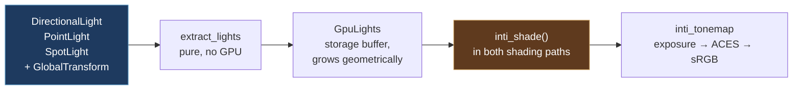

# Lighting — Inti

**Inti** is Kóoch's lighting system, named for the Inca sun.

The name covers the whole thing, not one crate: extraction, the GPU light
record, the shading model, shadows when they land, clustering, light
textures, global illumination. When something says "the Inti path" it
means the same way "the meshlet path" does.

The crate is still called `kooch_lighting`. Renaming a crate rewrites
every serialised `type_name` in every `.scene` and `.prefab` in every
project — silently, since nothing checks that a type it cannot find used
to exist.

> Until #441, `kooch_lighting/src/lib.rs` was **nine lines**: a doc
> comment promising point, spot, directional and area lights,
> volumetrics and bloom, and an `init()` that logged. The three light
> components existed, the editor drew their gizmos, the Inspector edited
> them, the remote protocol mirrored them — and no render crate read one.
> You could place a light and nothing on screen would change.

## How a light reaches a pixel

**The light component is the source.** Not the sky's sun direction — an
earlier draft of #441 drove shading from `SkyRenderer.sun_direction`,
which would have delivered a lit-looking scene and left the three light
components exactly as inert as they were.

A directional light's direction comes from its **transform's -Z**, never
from a field. A light that ignores its own rotation is a second source of
truth, and the editor's gizmo already draws the arrow from the first one.

A light with no `GlobalTransform` is **skipped**, not defaulted: it has no
direction and no position, and putting it at the origin pointing down
would be an invention that renders.

## The shading model

Cook-Torrance, ported from Bevy 0.19's `pbr_lighting.wgsl` — read from
source, not reconstructed from memory. Which matters, because three of
their fixes are baked in from the start rather than rediscovered later:

| Term | What it is |
|---|---|
| **D** | GGX / Trowbridge-Reitz, in Filament's reassociated form. The naïve expression loses catastrophic f32 precision at low roughness and the highlight breaks into visible blocks |
| **V** | Height-correlated Smith (Heitz 2014), returning `G / (4·NoV·NoL)` combined — so the specular term must not divide again |
| **F** | Plain Schlick, with `f90` derived from `f0`. A near-black dielectric with `f90 = 1` grows a white rim at grazing angles that no real material has |
| **Diffuse** | Burley / Disney. Lambert is flat; this brightens the grazing edge on rough surfaces the way cloth and unfinished wood do |
| **Multiscatter** | Single-scattering GGX loses energy on rough metals — they go grey. Compensated by the split-sum integral's analytic fit |

Two decisions worth stating because they diverge from something:

- **The diffuse is weighted by `(1 - F)`.** Energy the specular layer
  reflected is energy the diffuse layer underneath never receives.
  Bevy's *forward* path still adds the two lobes unweighted, the way
  Filament does; their *path tracer* does the layering. We took the path
  tracer's form, because a mirror is where the difference shows and a
  mirror is not an edge case.
- **Point lights have no radius yet**, so there is no sphere-light
  `a_prime` to get wrong. Bevy got it wrong and fixed it in 0.18: they
  applied base roughness where the solid angle demanded a widened one,
  and highlights stayed sharp and far too bright with distance. The trap
  is recorded in the shader against the day `PointLight` grows a radius.

### Ambient

A hemisphere lerp between a sky colour and a ground colour, authored in
the project's settings asset. It is not cosmetic: with no ambient term a
metal facing away from every light renders pure black — correct for the
model, and indistinguishable from a bug to whoever is looking at it.

**It is a placeholder for a value the scene should compute, not author.**
Ambient light is the sky, and the sky is about to become something the
engine simulates: atmospheric scattering
([#250](https://github.com/lobinuxsoft/kooch/issues/250),
[#248](https://github.com/lobinuxsoft/kooch/issues/248)) already has to
know what colour the air is in every direction, and Bevy's 0.18
atmosphere lights the scene rather than only being drawn behind it. Once
that exists, `ambient_sky_color` stops being two colours someone picked
and becomes the atmosphere sampled — different at noon, at sunset, at
altitude and in orbit, without anyone touching a field.

The authored values stay useful for a scene with no atmosphere: an
interior, a space station, a stylised game that wants flat fill. They
just stop being the default answer.

⚠️ Today it lerps on **world up**, which stops meaning anything on the far
side of a planet. A known limit of the placeholder, and one the
atmosphere fixes on its way past: a per-planet atmosphere knows which way
up is, because up is what it is a sphere around.

## Units, and why the defaults are not physical

Lights carry real photometric units:

| Light | Unit | Default |
|---|---|---|
| `DirectionalLight` | **lux** (illuminance) | 10 000 — `lux::AMBIENT_DAYLIGHT` |
| `PointLight` / `SpotLight` | **lumens** (luminous flux) | 32 000 — `lumens::ROOM_LIGHT_NO_GI` |

The directional default is a physical fact and matches Bevy's. The
punctual default is **forty times a real 9 W bulb**, and that deserves an
explanation rather than a shrug.

An 800 lm bulb three metres away really does deliver about 7 lux. An
office reads 320 lux, and the other 313 are **bounces** — light off the
ceiling, the walls, the desk. Kóoch computes direct light only, so the
physically honest number renders as almost nothing.

Bevy has the same gap and resolved it by defaulting `PointLight` to
`VERY_LARGE_CINEMA_LIGHT`, one million lumens, with the comment *"capable
of registering brightly at Bevy's default exposure level"*. That is a
confession, not a unit. Kóoch's fudge is **named after the compromise** —
`ROOM_LIGHT_NO_GI` — and its own doc comment says it goes back to a real
bulb the day global illumination lands.

`kooch_ecs::light_consts` holds the named values, so an author picks a
situation instead of guessing a magnitude: `lux::OFFICE`,
`lux::OVERCAST_DAY`, `lux::DIRECT_SUNLIGHT`, `lumens::CANDLE`,
`lumens::CAR_HEADLIGHT`.

> **Hover a field in the Inspector** and its doc comment appears as a
> tooltip, units included. `intensity` on a directional light says LUX;
> on a point light it says LUMENS. They are different units with
> different magnitudes and they used to look identical.

## Exposure

Physical light units need an exposure step or every channel clips to
white and the model looks broken rather than unexposed.

`Exposure` carries an EV100, and `PhysicalCamera` is the control worth
using: **aperture, shutter and ISO**. `f/16, 1/125, ISO 100` says
something to anyone who has held a camera; `EV100 = 9.7` says nothing
about which way is brighter or what a step is worth.

| Preset | Settings | EV100 |
|---|---|---|
| `PhysicalCamera::sunny()` | f/16, 1/125 s, ISO 100 | ≈ 15 |
| `PhysicalCamera::default()` | f/2.8, 1/125 s, ISO 100 | ≈ 9.9 |
| `PhysicalCamera::indoor()` | f/1.0, 1/125 s, ISO 100 | ≈ 7 |

The default is a middle setting, not a real situation: bright enough that
a default sun does not clip, dim enough that a punctual light is visible.
It lands near Bevy's 9.7 so a scene authored against their numbers reads
the same here — and note that their 9.7 is **not "sunny 16"** despite
being described that way; sunny 16 is EV 15, and they calibrated theirs
against Blender's implicit exposure.

Tone mapping is an ACES approximation (Narkowicz 2015), then the sRGB
transfer function. Both are provisional and belong to
[#254](https://github.com/lobinuxsoft/kooch/issues/254), which owns the
real tonemapper and the auto exposure that lets a sunlit surface and a
planet's night side coexist in one frame.

> ⚠️ `Exposure` and `AmbientLight` are `Resources` that **no editor
> surface reaches**. The control exists and is not in your hands yet.

## The GPU record

`GpuLight` is 64 bytes, `#[repr(C)]`, mirroring `IntiLight` in
`inti_pbr.wgsl` byte for byte. Nothing checks that correspondence at
compile time on either side of the boundary — a reordered field reads a
light's range as its intensity and renders something plausible and
wrong — so a test pins the size.

**Array of structs, not struct of arrays**, against the engine's usual
rule, and for a reason that survives scrutiny: every shader invocation
touching light `i` reads *all* of light `i`'s fields within a few
instructions. Splitting into parallel arrays turns one cache line into
six scattered fetches. SoA pays when a pass reads one field across many
records — which is what light **culling** does, positions and ranges
only, so when clustering lands its input is a separate pair of arrays,
not a reinterpretation of this one.

Spot cones are stored pre-packed as the multiply-add the shader
evaluates, `saturate(cos_angle · scale + offset)` — one MAD per light per
fragment instead of a subtract and a divide. The authored half-angles are
recoverable from it.

Angles are **half-angles**, measured axis to edge, like Unreal rather
than Unity's single full `spotAngle`. `gizmos/lights.rs` chose that
convention when it drew the cone and wrote down that the lighting work
would either honour it or draw a cone half the width it lights.

## Shadows

Two techniques, and they compose rather than compete because each is
worst where the other is best.

### Cascades, for the scene (#476)

Four cascades fitted to slices of the view frustum, rendered into one
atlas, sampled with **Castaño '13** — nine bilinear taps — under a PCSS
penumbra that widens with the gap between blocker and receiver
(`sun_softness` is the tangent of the sun's angular radius, not a width).

Only the **first active directional light** casts. A punctual light needs
a cube map or a projected map, and neither exists yet.

The cascade fit is the one thing in the renderer that still asks for a
**bounded** projection — a slice of an unbounded frustum is unbounded.
See [ADR 0002](../../../decisions/0002_infinite_reverse_z.md).

### Contact shadows, for the last few centimetres (#735)

A cascade is correct at range and worst exactly at contact: at the texel
density it can afford, the few centimetres where an object meets the
ground is where its shadow detaches or swims, and that is what makes
things look like they float over a scene rather than stand in it.

A short ray marched through the **depth buffer**, from the shaded point
towards each light that opted in. Screen-space, so it **costs the same at
any world scale** — a ray a few pixels long is a few pixels long whether
the object is a crate or a moon.

The march is `bevy_raymarch.wgsl`: Bevy 0.19's `bevy_pbr::raymarch`
**copied**, licence header intact. Diff it against upstream rather than
reasoning about it. What is this engine's lives in `contact_shadow.wgsl`
(bindings, the four view helpers the port imports) and
`contact_shadow_apply.wgsl` (the call, the debug probe, the lift below) —
the line between the two is a file boundary, not a judgement call.

🔴 **The one thing that could not be copied.** Bevy's march is compiled
only behind `#ifdef DEPTH_PREPASS`, so their ray's origin and their depth
buffer came out of the same rasteriser with the same matrix and agree to
the bit inside the origin's own texel. This engine reconstructs the
origin from the **visibility buffer** by barycentrics — a second
arithmetic path to the same point — and inside that texel the comparison
is decided by the last bit, with the jitter picking which way. It renders
as salt and pepper across every lit surface.

The fix is a **lift**: the ray starts one depth texel off the surface
along the normal, divided by `n·v`. Both factors are derived, not
authored — the texel's world size from `view_proj[1][1]` and the buffer
height, the distance from `near / ndc.z`. The `n·v` term is the
slope-scaled depth bias every shadow map uses: a depth texel is a
*screen* quantity, so it spans more surface the more oblique the surface
is, and the error inside it grows in the same proportion. Clamped at four
texels, because `n·v → 0` at a silhouette and an unbounded lift would
throw the ray clear of the object.

Per light, opt-in (`DirectionalLight::contact_shadows` on by default,
punctual lights off): the cost scales with **light count**, and a scene
has one sun and can have fifty lamps. The whole feature turns off with
`contact_shadow_steps = 0`.

⚠️ Screen-space means an occluder off-screen or behind the camera does
not exist; the ray is clipped to the frustum and reports no hit, so the
shadow fades at the screen edge rather than popping.

⚠️ **The seam is real and is not a bug.** Next to a nine-tap penumbra, a
contact shadow is one ray with a hard hit/miss answer, so the boundary
between pixels that find an occluder and pixels that do not is a
discontinuity in *coverage*. No curve applied to the hit smooths it —
softening Bevy's remap was tried, cost the shadow 30% of its strength for
nothing, and was reverted. Only averaging fixes it, spatially or
temporally, and temporally is #732. Bevy has the same seam and leaves it
to their TAA.

### Seeing what the shadow system did

Three debug views, because "no light reaches this" and "something shadows
this" look identical in a shaded frame and have different fixes.

- **Shadow cascades** — Bevy's flat per-cascade hue, dimmed by
  `inti_sample_cascade`, *the same call the shading pass makes*. Magenta:
  nothing casts. Black: inside no cascade volume.
- **Contact shadows** — red: the march hit on its first step, which is
  the surface occluding itself. Green: a real occluder. Blue: the ray was
  under two pixels long. Grey: marched and found nothing.
- **Single light** — one light, alone, in grey, with its shadow.

### Single light

Select a light in the World panel and this view shades the scene with
that light and nothing else: no other light, no albedo, no ambient.

Each exclusion answers a different confusion:

| Removed | Because otherwise |
|---|---|
| Every other light | A surface lit by the wrong one still looks lit |
| The material's colour | A dark albedo and no light landing produce the same pixel |
| Ambient | A point in full shadow never renders black, which is the reading the view exists to make unambiguous |

Roughness is *kept* — the width of a highlight is information about the
light, not the paint — and `metallic` is forced off, because a metal
takes its F0 from the albedo this view removes, and a metal shaded white
is a mirror rather than that metal decoloured.

The shadow comes from calling `inti_light_contribution`, the same
function the shading loop sums per light. A view that recomputed the
maths its own way could disagree with the frame, and then it is one more
thing to debug instead of the thing that settles the question.

> ⚠️ **A point or spot light usually shows no shadow, and that is
> correct.** Only a directional light has a shadow map; contact shadows
> are opt-in and off by default on punctual lights. "Casts nothing" and
> "the shadow broke" render identically, so the editor prints which one
> it is next to the selector — `shadow_note` in `kooch_lighting`.

Which light travels in `IntiFrame.debug_light`, an index into the light
buffer that occupies what used to be that struct's tail padding. There is
no seventh bind group and Inti's is full, so a view needing a binding of
its own was not going to ship.

### The debug views are not in the shader your game runs

`inti_debug.wgsl` is concatenated only by a pipeline that can show a
view. Production concatenates `INTI_DEBUG_STUB`, where
`inti_debug_is_view` returns a literal `false` and the two call sites
fold away.

This is a performance decision, not tidiness. A branch nothing takes is
still code the shader carries: register allocation is worst-case over the
whole entry point, so a cascade sample and a screen-space raymarch parked
behind `if (debug_mode == …)` still raise the VGPR count. VGPR count caps
how many waves stay in flight, and waves in flight is the whole of an
integrated GPU's ability to hide memory latency — which is the budget
this engine is held to.

The debug pipeline is built through a `OnceLock` the first time a view is
selected, so a shipped game never compiles it either. Both variants are
validated by tests, because nothing else compiles the debug one until
somebody opens it.

## What Inti does not do yet

- **No punctual shadows.** Point and spot lights carry `cast_shadows`
  and nothing reads it; a contact shadow is currently the only shadow
  they cast, which grounds an object without occluding it from anything
  else in the room.
- **No clustering.** The shader loops over every light for every pixel.
  `extract_lights` warns past 256 and never clips — silently dropping a
  scene's lights is worse than rendering it slowly. Bevy moved theirs to
  the GPU and measured ~20× on their `many_lights` benchmark. A universe
  has stars.
- **No environment map**, no IBL, no area lights, no volumetrics, no
  bloom. The crate's original doc comment promised the last three. It now
  promises what it has.
