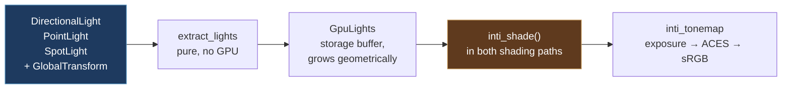

# Lighting — Inti

**Inti** is Kóoch's lighting system, named for the Inca sun.

The name covers the whole thing, not one crate: extraction, the GPU light
record, the shading model, shadows when they land, clustering, light
textures, global illumination. When something says "the Inti path" it
means the same way "the meshlet path" does.

The crate is still called `kooch_lighting`. Renaming a crate rewrites
every serialised `type_name` in every `.scene` and `.prefab` in every
project — silently, since nothing checks that a type it cannot find used
to exist.

> Until #441, `kooch_lighting/src/lib.rs` was **nine lines**: a doc
> comment promising point, spot, directional and area lights,
> volumetrics and bloom, and an `init()` that logged. The three light
> components existed, the editor drew their gizmos, the Inspector edited
> them, the remote protocol mirrored them — and no render crate read one.
> You could place a light and nothing on screen would change.

## How a light reaches a pixel

**The light component is the source.** Not the sky's sun direction — an
earlier draft of #441 drove shading from `SkyRenderer.sun_direction`,
which would have delivered a lit-looking scene and left the three light
components exactly as inert as they were.

A directional light's direction comes from its **transform's -Z**, never
from a field. A light that ignores its own rotation is a second source of
truth, and the editor's gizmo already draws the arrow from the first one.

A light with no `GlobalTransform` is **skipped**, not defaulted: it has no
direction and no position, and putting it at the origin pointing down
would be an invention that renders.

## The shading model

Cook-Torrance, ported from Bevy 0.19's `pbr_lighting.wgsl` — read from
source, not reconstructed from memory. Which matters, because three of
their fixes are baked in from the start rather than rediscovered later:

| Term | What it is |
|---|---|
| **D** | GGX / Trowbridge-Reitz, in Filament's reassociated form. The naïve expression loses catastrophic f32 precision at low roughness and the highlight breaks into visible blocks |
| **V** | Height-correlated Smith (Heitz 2014), returning `G / (4·NoV·NoL)` combined — so the specular term must not divide again |
| **F** | Plain Schlick, with `f90` derived from `f0`. A near-black dielectric with `f90 = 1` grows a white rim at grazing angles that no real material has |
| **Diffuse** | Burley / Disney. Lambert is flat; this brightens the grazing edge on rough surfaces the way cloth and unfinished wood do |
| **Multiscatter** | Single-scattering GGX loses energy on rough metals — they go grey. Compensated by the split-sum integral's analytic fit |

Two decisions worth stating because they diverge from something:

- **The diffuse is weighted by `(1 - F)`.** Energy the specular layer
  reflected is energy the diffuse layer underneath never receives.
  Bevy's *forward* path still adds the two lobes unweighted, the way
  Filament does; their *path tracer* does the layering. We took the path
  tracer's form, because a mirror is where the difference shows and a
  mirror is not an edge case.
- **Point lights have no radius yet**, so there is no sphere-light
  `a_prime` to get wrong. Bevy got it wrong and fixed it in 0.18: they
  applied base roughness where the solid angle demanded a widened one,
  and highlights stayed sharp and far too bright with distance. The trap
  is recorded in the shader against the day `PointLight` grows a radius.

### Ambient

A hemisphere lerp between a sky colour and a ground colour, authored in
the project's settings asset. It is not cosmetic: with no ambient term a
metal facing away from every light renders pure black — correct for the
model, and indistinguishable from a bug to whoever is looking at it.

**It is a placeholder for a value the scene should compute, not author.**
Ambient light is the sky, and the sky is about to become something the
engine simulates: atmospheric scattering
([#250](https://github.com/lobinuxsoft/kooch/issues/250),
[#248](https://github.com/lobinuxsoft/kooch/issues/248)) already has to
know what colour the air is in every direction, and Bevy's 0.18
atmosphere lights the scene rather than only being drawn behind it. Once
that exists, `ambient_sky_color` stops being two colours someone picked
and becomes the atmosphere sampled — different at noon, at sunset, at
altitude and in orbit, without anyone touching a field.

The authored values stay useful for a scene with no atmosphere: an
interior, a space station, a stylised game that wants flat fill. They
just stop being the default answer.

⚠️ Today it lerps on **world up**, which stops meaning anything on the far
side of a planet. A known limit of the placeholder, and one the
atmosphere fixes on its way past: a per-planet atmosphere knows which way
up is, because up is what it is a sphere around.

## Units, and why the defaults are not physical

Lights carry real photometric units:

| Light | Unit | Default |
|---|---|---|
| `DirectionalLight` | **lux** (illuminance) | 10 000 — `lux::AMBIENT_DAYLIGHT` |
| `PointLight` / `SpotLight` | **lumens** (luminous flux) | 32 000 — `lumens::ROOM_LIGHT_NO_GI` |

The directional default is a physical fact and matches Bevy's. The
punctual default is **forty times a real 9 W bulb**, and that deserves an
explanation rather than a shrug.

An 800 lm bulb three metres away really does deliver about 7 lux. An
office reads 320 lux, and the other 313 are **bounces** — light off the
ceiling, the walls, the desk. Kóoch computes direct light only, so the
physically honest number renders as almost nothing.

Bevy has the same gap and resolved it by defaulting `PointLight` to
`VERY_LARGE_CINEMA_LIGHT`, one million lumens, with the comment *"capable
of registering brightly at Bevy's default exposure level"*. That is a
confession, not a unit. Kóoch's fudge is **named after the compromise** —
`ROOM_LIGHT_NO_GI` — and its own doc comment says it goes back to a real
bulb the day global illumination lands.

`kooch_ecs::light_consts` holds the named values, so an author picks a
situation instead of guessing a magnitude: `lux::OFFICE`,
`lux::OVERCAST_DAY`, `lux::DIRECT_SUNLIGHT`, `lumens::CANDLE`,
`lumens::CAR_HEADLIGHT`.

> **Hover a field in the Inspector** and its doc comment appears as a
> tooltip, units included. `intensity` on a directional light says LUX;
> on a point light it says LUMENS. They are different units with
> different magnitudes and they used to look identical.

## Exposure

Physical light units need an exposure step or every channel clips to
white and the model looks broken rather than unexposed.

`Exposure` carries an EV100, and `PhysicalCamera` is the control worth
using: **aperture, shutter and ISO**. `f/16, 1/125, ISO 100` says
something to anyone who has held a camera; `EV100 = 9.7` says nothing
about which way is brighter or what a step is worth.

| Preset | Settings | EV100 |
|---|---|---|
| `PhysicalCamera::sunny()` | f/16, 1/125 s, ISO 100 | ≈ 15 |
| `PhysicalCamera::default()` | f/2.8, 1/125 s, ISO 100 | ≈ 9.9 |
| `PhysicalCamera::indoor()` | f/1.0, 1/125 s, ISO 100 | ≈ 7 |

The default is a middle setting, not a real situation: bright enough that
a default sun does not clip, dim enough that a punctual light is visible.
It lands near Bevy's 9.7 so a scene authored against their numbers reads
the same here — and note that their 9.7 is **not "sunny 16"** despite
being described that way; sunny 16 is EV 15, and they calibrated theirs
against Blender's implicit exposure.

Tone mapping is an ACES approximation (Narkowicz 2015), then the sRGB
transfer function. Both are provisional and belong to
[#254](https://github.com/lobinuxsoft/kooch/issues/254), which owns the
real tonemapper and the auto exposure that lets a sunlit surface and a
planet's night side coexist in one frame.

> ⚠️ `Exposure` and `AmbientLight` are `Resources` that **no editor
> surface reaches**. The control exists and is not in your hands yet.

## The GPU record

`GpuLight` is 64 bytes, `#[repr(C)]`, mirroring `IntiLight` in
`inti_pbr.wgsl` byte for byte. Nothing checks that correspondence at
compile time on either side of the boundary — a reordered field reads a
light's range as its intensity and renders something plausible and
wrong — so a test pins the size.

**Array of structs, not struct of arrays**, against the engine's usual
rule, and for a reason that survives scrutiny: every shader invocation
touching light `i` reads *all* of light `i`'s fields within a few
instructions. Splitting into parallel arrays turns one cache line into
six scattered fetches. SoA pays when a pass reads one field across many
records — which is what light **culling** does, positions and ranges
only, so when clustering lands its input is a separate pair of arrays,
not a reinterpretation of this one.

Spot cones are stored pre-packed as the multiply-add the shader
evaluates, `saturate(cos_angle · scale + offset)` — one MAD per light per
fragment instead of a subtract and a divide. The authored half-angles are
recoverable from it.

Angles are **half-angles**, measured axis to edge, like Unreal rather
than Unity's single full `spotAngle`. `gizmos/lights.rs` chose that
convention when it drew the cone and wrote down that the lighting work
would either honour it or draw a cone half the width it lights.

## What Inti does not do yet

- **No shadows.** Lit-with-no-shadows is an honest intermediate state and
  already looks far better than a normal painted as colour, but nothing
  tells you where anything is touching.
- **No clustering.** The shader loops over every light for every pixel.
  `extract_lights` warns past 256 and never clips — silently dropping a
  scene's lights is worse than rendering it slowly. Bevy moved theirs to
  the GPU and measured ~20× on their `many_lights` benchmark. A universe
  has stars.
- **No environment map**, no IBL, no area lights, no volumetrics, no
  bloom. The crate's original doc comment promised the last three. It now
  promises what it has.
