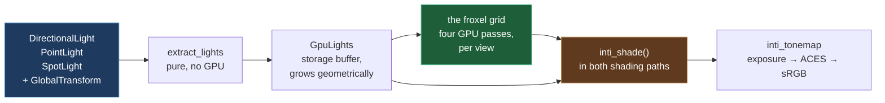
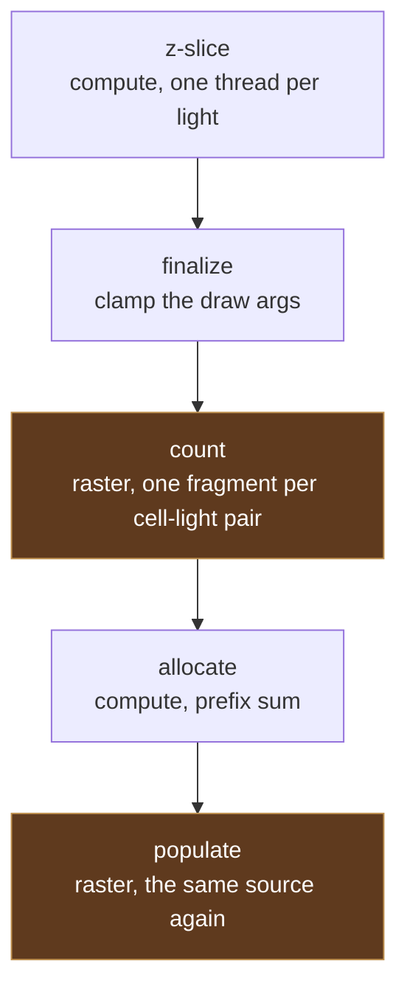

# Lighting — Inti

**Inti** is Kóoch's lighting system, named for the Inca sun.

The name covers the whole thing, not one crate: extraction, the GPU light
record, the shading model, shadows when they land, clustering, light
textures, global illumination. When something says "the Inti path" it
means the same way "the meshlet path" does.

The crate is still called `kooch_lighting`. Renaming a crate rewrites
every serialised `type_name` in every `.scene` and `.prefab` in every
project — silently, since nothing checks that a type it cannot find used
to exist.

> Until #441, `kooch_lighting/src/lib.rs` was **nine lines**: a doc
> comment promising point, spot, directional and area lights,
> volumetrics and bloom, and an `init()` that logged. The three light
> components existed, the editor drew their gizmos, the Inspector edited
> them, the remote protocol mirrored them — and no render crate read one.
> You could place a light and nothing on screen would change.

## How a light reaches a pixel



**The light component is the source.** Not the sky's sun direction — an
earlier draft of #441 drove shading from `SkyRenderer.sun_direction`,
which would have delivered a lit-looking scene and left the three light
components exactly as inert as they were.

A directional light's direction comes from its **transform's -Z**, never
from a field. A light that ignores its own rotation is a second source of
truth, and the editor's gizmo already draws the arrow from the first one.

A light with no `GlobalTransform` is **skipped**, not defaulted: it has no
direction and no position, and putting it at the origin pointing down
would be an invention that renders.

## The shading model

Cook-Torrance, ported from Bevy 0.19's `pbr_lighting.wgsl` — read from
source, not reconstructed from memory. Which matters, because three of
their fixes are baked in from the start rather than rediscovered later:

| Term | What it is |
|---|---|
| **D** | GGX / Trowbridge-Reitz, in Filament's reassociated form. The naïve expression loses catastrophic f32 precision at low roughness and the highlight breaks into visible blocks |
| **V** | Height-correlated Smith (Heitz 2014), returning `G / (4·NoV·NoL)` combined — so the specular term must not divide again |
| **F** | Plain Schlick, with `f90` derived from `f0`. A near-black dielectric with `f90 = 1` grows a white rim at grazing angles that no real material has |
| **Diffuse** | Burley / Disney. Lambert is flat; this brightens the grazing edge on rough surfaces the way cloth and unfinished wood do |
| **Multiscatter** | Single-scattering GGX loses energy on rough metals — they go grey. Compensated by the split-sum integral's analytic fit |

Two decisions worth stating because they diverge from something:

- **The diffuse is weighted by `(1 - F)`.** Energy the specular layer
  reflected is energy the diffuse layer underneath never receives.
  Bevy's *forward* path still adds the two lobes unweighted, the way
  Filament does; their *path tracer* does the layering. We took the path
  tracer's form, because a mirror is where the difference shows and a
  mirror is not an edge case.
- **Point and spot lights have a `radius`**, so a lamp has a size and
  the highlight it leaves has one too. See below.

### Light size — `radius`

`PointLight::radius` and `SpotLight::radius` are the radius of the
emitting sphere in world units. `0`, the default, is the mathematical
point every light in the engine was before, so an existing scene renders
unchanged.

It is **specular only**. It does not soften the diffuse falloff, and it
does not soften shadows — a soft shadow is a separate technique driven by
the same number, not a consequence of this one.

The technique is Karis 2013's *representative point*: instead of
integrating the BRDF over the sphere, shade against the single point on
the sphere closest to the mirror ray, and widen the roughness to account
for the rest of it. Five things travel together and the highlight is
wrong without any one of them:

| Piece | Why it is not optional |
|---|---|
| The representative direction | The highlight has to move, not only spread |
| A separate `N·L` for the specular layer | The two layers now answer to different directions, so the cosine is applied per layer rather than factored out |
| `(a / a_prime)²` normalization | Spreading a fixed amount of light must not add any — without it `radius` is a brightness knob |
| `mix(a, a_prime, 1-(1-a)⁴)` | Feeding the widened roughness straight to the BRDF makes smooth materials read too rough and too dim. Bevy's own comment names Linearly Transformed Cosines as the real fix and this as the tuned stand-in |
| Sphere visibility, `r²/d²` | At a grazing angle part of the sphere is below the horizon and cannot light the surface at all |

⚠️ The clamp `max(0.0001, dot(offset, R))` in the representative point is
a **fix, not a guard against division by zero**: the approximation is
plainly wrong for a surface inside or touching the light's sphere, and
without the clamp such a surface shows a hard discontinuity. It is
carried from Bevy, who carry it for
[bevyengine/bevy#13318](https://github.com/bevyengine/bevy/issues/13318).

A directional light is excluded by kind, not only by its radius: there
is no distance to a light with no position for the approximation to
correct. A sun's angular size is a shadow problem, not this one.

### Ambient

A hemisphere lerp between a sky colour and a ground colour, authored in
the project's settings asset. It is not cosmetic: with no ambient term a
metal facing away from every light renders pure black — correct for the
model, and indistinguishable from a bug to whoever is looking at it.

**It is a placeholder for a value the scene should compute, not author.**
Ambient light is the sky, and the sky is about to become something the
engine simulates: atmospheric scattering
([#250](https://github.com/lobinuxsoft/kooch/issues/250),
[#248](https://github.com/lobinuxsoft/kooch/issues/248)) already has to
know what colour the air is in every direction, and Bevy's 0.18
atmosphere lights the scene rather than only being drawn behind it. Once
that exists, `ambient_sky_color` stops being two colours someone picked
and becomes the atmosphere sampled — different at noon, at sunset, at
altitude and in orbit, without anyone touching a field.

The authored values stay useful for a scene with no atmosphere: an
interior, a space station, a stylised game that wants flat fill. They
just stop being the default answer.

⚠️ Today it lerps on **world up**, which stops meaning anything on the far
side of a planet. A known limit of the placeholder, and one the
atmosphere fixes on its way past: a per-planet atmosphere knows which way
up is, because up is what it is a sphere around.

## Units, and why the defaults are not physical

Lights carry real photometric units:

| Light | Unit | Default |
|---|---|---|
| `DirectionalLight` | **lux** (illuminance) | 10 000 — `lux::AMBIENT_DAYLIGHT` |
| `PointLight` / `SpotLight` | **lumens** (luminous flux) | 32 000 — `lumens::ROOM_LIGHT_NO_GI` |

The directional default is a physical fact and matches Bevy's. The
punctual default is **forty times a real 9 W bulb**, and that deserves an
explanation rather than a shrug.

An 800 lm bulb three metres away really does deliver about 7 lux. An
office reads 320 lux, and the other 313 are **bounces** — light off the
ceiling, the walls, the desk. Kóoch computes direct light only, so the
physically honest number renders as almost nothing.

Bevy has the same gap and resolved it by defaulting `PointLight` to
`VERY_LARGE_CINEMA_LIGHT`, one million lumens, with the comment *"capable
of registering brightly at Bevy's default exposure level"*. That is a
confession, not a unit. Kóoch's fudge is **named after the compromise** —
`ROOM_LIGHT_NO_GI` — and its own doc comment says it goes back to a real
bulb the day global illumination lands.

`kooch_ecs::light_consts` holds the named values, so an author picks a
situation instead of guessing a magnitude: `lux::OFFICE`,
`lux::OVERCAST_DAY`, `lux::DIRECT_SUNLIGHT`, `lumens::CANDLE`,
`lumens::CAR_HEADLIGHT`.

> **Hover a field in the Inspector** and its doc comment appears as a
> tooltip, units included. `intensity` on a directional light says LUX;
> on a point light it says LUMENS. They are different units with
> different magnitudes and they used to look identical.

## Exposure

Physical light units need an exposure step or every channel clips to
white and the model looks broken rather than unexposed.

`Exposure` carries an EV100, and `PhysicalCamera` is the control worth
using: **aperture, shutter and ISO**. `f/16, 1/125, ISO 100` says
something to anyone who has held a camera; `EV100 = 9.7` says nothing
about which way is brighter or what a step is worth.

| Preset | Settings | EV100 |
|---|---|---|
| `PhysicalCamera::sunny()` | f/16, 1/125 s, ISO 100 | ≈ 15 |
| `PhysicalCamera::default()` | f/2.8, 1/125 s, ISO 100 | ≈ 9.9 |
| `PhysicalCamera::indoor()` | f/1.0, 1/125 s, ISO 100 | ≈ 7 |

The default is a middle setting, not a real situation: bright enough that
a default sun does not clip, dim enough that a punctual light is visible.
It lands near Bevy's 9.7 so a scene authored against their numbers reads
the same here — and note that their 9.7 is **not "sunny 16"** despite
being described that way; sunny 16 is EV 15, and they calibrated theirs
against Blender's implicit exposure.

Tone mapping is an ACES approximation (Narkowicz 2015), then the sRGB
transfer function. Both are provisional and belong to
[#254](https://github.com/lobinuxsoft/kooch/issues/254), which owns the
real tonemapper and the auto exposure that lets a sunlit surface and a
planet's night side coexist in one frame.

> ⚠️ `Exposure` and `AmbientLight` are `Resources` that **no editor
> surface reaches**. The control exists and is not in your hands yet.

## The GPU record

`GpuLight` is 80 bytes, `#[repr(C)]`, mirroring `IntiLight` in
`inti_pbr.wgsl` byte for byte. Nothing checks that correspondence at
compile time on either side of the boundary — a reordered field reads a
light's range as its intensity and renders something plausible and
wrong — so a test pins the size.

**Array of structs, not struct of arrays**, against the engine's usual
rule, and for a reason that survives scrutiny: every shader invocation
touching light `i` reads *all* of light `i`'s fields within a few
instructions. Splitting into parallel arrays turns one cache line into
six scattered fetches. SoA pays when a pass reads one field across many
records — which is what light **culling** does, positions and ranges
only, so when clustering lands its input is a separate pair of arrays,
not a reinterpretation of this one.

It was 64 bytes — one cache line — until `radius` arrived and there was
nowhere left to put it. Growing the record widens **every** light in the
scene, the sun included, which is a bandwidth decision on a handheld and
not a free slot; three padding scalars now ride along to the alignment
`std430` demands, and they are where the next field goes before the cost
is paid again. Bevy's equivalent record is 80 bytes for the same reason,
and they keep directional and rect lights in separate arrays rather than
widening one record for all of them.

Spot cones are stored pre-packed as the multiply-add the shader
evaluates, `saturate(cos_angle · scale + offset)` — one MAD per light per
fragment instead of a subtract and a divide. The authored half-angles are
recoverable from it.

Angles are **half-angles**, measured axis to edge, like Unreal rather
than Unity's single full `spotAngle`. `gizmos/lights.rs` chose that
convention when it drew the cone and wrote down that the lighting work
would either honour it or draw a cone half the width it lights.

## Shadows

Two techniques, and they compose rather than compete because each is
worst where the other is best.

### Cascades, for the scene (#476)

Four cascades fitted to slices of the view frustum, rendered into one
atlas, sampled with **Castaño '13** — nine bilinear taps — under a PCSS
penumbra that widens with the gap between blocker and receiver
(`sun_softness` is the tangent of the sun's angular radius, not a width).

Only the **first active directional light** casts. A punctual light needs
a cube map or a projected map, and neither exists yet.

The cascade fit is the one thing in the renderer that still asks for a
**bounded** projection — a slice of an unbounded frustum is unbounded.
See [ADR 0002](../../../decisions/0002_infinite_reverse_z.md).

### Contact shadows, for the last few centimetres (#735)

A cascade is correct at range and worst exactly at contact: at the texel
density it can afford, the few centimetres where an object meets the
ground is where its shadow detaches or swims, and that is what makes
things look like they float over a scene rather than stand in it.

A short ray marched through the **depth buffer**, from the shaded point
towards each light that opted in. Screen-space, so it **costs the same at
any world scale** — a ray a few pixels long is a few pixels long whether
the object is a crate or a moon.

The march is `bevy_raymarch.wgsl`: Bevy 0.19's `bevy_pbr::raymarch`
**copied**, licence header intact. Diff it against upstream rather than
reasoning about it. What is this engine's lives in `contact_shadow.wgsl`
(bindings, the four view helpers the port imports) and
`contact_shadow_apply.wgsl` (the call, the debug probe, the lift below) —
the line between the two is a file boundary, not a judgement call.

🔴 **The one thing that could not be copied.** Bevy's march is compiled
only behind `#ifdef DEPTH_PREPASS`, so their ray's origin and their depth
buffer came out of the same rasteriser with the same matrix and agree to
the bit inside the origin's own texel. This engine reconstructs the
origin from the **visibility buffer** by barycentrics — a second
arithmetic path to the same point — and inside that texel the comparison
is decided by the last bit, with the jitter picking which way. It renders
as salt and pepper across every lit surface.

The fix is a **lift**: the ray starts one depth texel off the surface
along the normal, divided by `n·v`. Both factors are derived, not
authored — the texel's world size from `view_proj[1][1]` and the buffer
height, the distance from `near / ndc.z`. The `n·v` term is the
slope-scaled depth bias every shadow map uses: a depth texel is a
*screen* quantity, so it spans more surface the more oblique the surface
is, and the error inside it grows in the same proportion. Clamped at four
texels, because `n·v → 0` at a silhouette and an unbounded lift would
throw the ray clear of the object.

Per light, opt-in (`DirectionalLight::contact_shadows` on by default,
punctual lights off): the cost scales with **light count**, and a scene
has one sun and can have fifty lamps. The whole feature turns off with
`contact_shadow_steps = 0`.

⚠️ Screen-space means an occluder off-screen or behind the camera does
not exist; the ray is clipped to the frustum and reports no hit, so the
shadow fades at the screen edge rather than popping.

⚠️ **The seam is real and is not a bug.** Next to a nine-tap penumbra, a
contact shadow is one ray with a hard hit/miss answer, so the boundary
between pixels that find an occluder and pixels that do not is a
discontinuity in *coverage*. No curve applied to the hit smooths it —
softening Bevy's remap was tried, cost the shadow 30% of its strength for
nothing, and was reverted. Only averaging fixes it, spatially or
temporally, and temporally is #732. Bevy has the same seam and leaves it
to their TAA.

### Seeing what the shadow system did

Three debug views, because "no light reaches this" and "something shadows
this" look identical in a shaded frame and have different fixes.

- **Shadow cascades** — Bevy's flat per-cascade hue, dimmed by
  `inti_sample_cascade`, *the same call the shading pass makes*. Magenta:
  nothing casts. Black: inside no cascade volume.
- **Contact shadows** — red: the march hit on its first step, which is
  the surface occluding itself. Green: a real occluder. Blue: the ray was
  under two pixels long. Grey: marched and found nothing.
- **Single light** — one light, alone, in grey, with its shadow. The one that answers what a shadow *looks like*; the other two answer what the shadow system *did*.

### Single light

Select a light in the World panel and this view shades the scene with
that light and nothing else: no other light, no albedo, no ambient.

Each exclusion answers a different confusion:

| Removed | Because otherwise |
|---|---|
| Every other light | A surface lit by the wrong one still looks lit |
| The material's colour | A dark albedo and no light landing produce the same pixel |
| Ambient | A point in full shadow never renders black, which is the reading the view exists to make unambiguous |

Roughness is *kept* — the width of a highlight is information about the
light, not the paint — and `metallic` is forced off, because a metal
takes its F0 from the albedo this view removes, and a metal shaded white
is a mirror rather than that metal decoloured.

The shadow comes from calling `inti_light_contribution`, the same
function the shading loop sums per light. A view that recomputed the
maths its own way could disagree with the frame, and then it is one more
thing to debug instead of the thing that settles the question.

> ⚠️ **A point light shows no shadow, and that is correct.** It would
> need a cube map (#778). Contact shadows are the only occlusion it can
> have and they are off by default. "Casts nothing" and "the shadow
> broke" render identically, so the editor prints which one it is next
> to the selector — `shadow_note` in `kooch_lighting`. A **spot** casts
> since #777 and a **point** since #778.

Magenta means the selection has no slot in the light buffer, and the note
below the selector says which reason:

| Note | What happened |
|---|---|
| `This light is inactive — tick active in the Inspector` | The light exists and is switched off, so it never reached the buffer |
| `Select a light in the World panel` | The selection is not a light |

Those two produce the *same magenta*, and the first smoke of this view
hit it: two lights in the scene were `active: false`, so selecting them
looked exactly like selecting a crate. A view built to stop two causes
from looking alike does not get to ship a third pair of its own.

Which light travels in `IntiFrame.debug_light`, an index into the light
buffer that occupies what used to be that struct's tail padding. There is
no seventh bind group and Inti's is full, so a view needing a binding of
its own was not going to ship.

### Spot lights (#777)

A cascade is an orthographic slice of the camera's frustum and needs
fitting, splitting and stabilising. A spot needs none of it: **the light
is a frustum**, so its shadow view is its own cone and there is one map
with nothing to blend into.

It renders into a layer of the same array the cascades use, behind them,
and its record is the same `GpuCascade` — `inti_shadow_coords` already
divided by `w`, which an orthographic cascade does not need and a
perspective does. That means the bias, the blocker search, the Castano
filter and the border clamp are one implementation, not two.

| Decision | Why |
|---|---|
| FOV is `outer_angle * 2` | The cone's edge is where the light stops. Fitting the half-angle clips the round pool into a square |
| Up vector chosen against the cone | A spot pointing straight down is the most ordinary way to author one, and the case a fixed world-up basis is degenerate for |
| Cone clamped near 90° | `tan` runs away before it gets there and fills the matrix with infinities, which spread into every depth the pass writes |
| `texel_world_size` is an ANGLE per texel | `2·tan(outer)/size·√2`, Bevy's `texel_size`, with **no `range` in it**. The shader multiplies by each fragment's own axial distance to the light. Baking `range` in biases everything as though it sat at the far end of the cone: a 100 m spot over objects five metres away offset them 17 cm and the shadow lifted off — found in the first smoke |
| `MAX_SPOT_SHADOWS = 4` | One layer each, 16 MiB at 2048². A fifth spot still lights the scene with no shadow; dropping the light would be a worse failure |

🔴 **The cull needs its LOD selector configured, and a factor of zero is
not a neutral default.** `CullParams::new` leaves
`lod_error_to_pixel_factor` at `0.0`, which makes every meshlet's
projected error work out to 0 px — always under the threshold, so the
selector keeps **only roots**. A sphere's shadow then comes out as a
wedge. `projection_scale_y`'s doc comment has said so since a rotated
camera hit the same zero: *"a sphere collapses to a blob and a cube to a
spike"*. A spot uses `with_lod` (perspective), a cascade
`with_orthographic_lod`; both apply `SHADOW_LOD_RELAXATION`, because a
shadow is a silhouette and loses detail a lit surface keeps.

🔴 **Slots are handed out inside `extract_lights`, in its walk order**, and
`shadow_casting_spots` reads that same order back. Two walks that
disagreed would light one spot through another's map — geometry from
elsewhere in the room, which reads as a broken shadow pass rather than as
a crossed index.

🔴 **No sun is not no shadows.** A scene lit by a torch and nothing else
still renders its maps. The cascades are then fitted to a stand-in
direction so the pass has something coherent to not draw, and
`FrameShadows::cascades_enabled` stays false — otherwise a directional
light that does *not* cast would sample them and be shadowed by a sun
that is not there.

### Point lights (#778)

A spot light *is* a frustum, so its shadow is the cone itself. A point
light is not a frustum at all — it lights every direction — so it gets
**six 90° faces that tile the sphere**, and the shading model picks one
by the direction to the fragment rather than by a matrix.

That is why `GpuPointShadow` is sixteen bytes and carries **no
`view_proj`**: sampling a cube map takes a direction, and the direction
is a subtraction the shader already does.

| Decision | Why |
|---|---|
| A **separate texture** from the cascade array | Different size, and one texture cannot have two. Sharing would mean six 2048² faces per light — 96 MiB each against 6 MiB at the size a lamp actually needs |
| `DEFAULT_CUBE_SIZE = 512` | 6 MiB per light at `Depth32Float`. Bevy's is 1024; ours is smaller because these render on a handheld and the shadow of a lamp is wanted soft, not detailed |
| `MAX_POINT_SHADOWS = 4` | **Memory**, not the technique. The `max_texture_array_layers` ceiling of 256 would allow 42, and 42 × 6 MiB is a quarter of a gigabyte of depth |
| **Six culls, shared across lights** | A light's six faces are what can overlap on the GPU. Lights then serialise, costing three barriers at the limit against eighteen more survivor arenas idle whenever nothing casts |
| Casting lights ranked **by distance to the camera** | Past the limit a light keeps lighting and stops casting. Which one loses its shadow must not be decided by when it was spawned |

#### The depth is one divide, and that is the whole reconstruction

Bevy sends the lower-right 2×2 of the face projection per light and
computes `depth = zw.x / zw.y`. Expanded with a standard perspective,
`w` collapses to the major axis and `depth` to `m23/major − m22` — and
with the **infinite reverse-Z** projection this engine migrated to
(ADR 0002), `m22 = 0` and `m23 = near`:

```
depth = near / major_axis_magnitude
```

One scalar replaces their four. `depth_is_near_over_the_major_axis`
checks it against the real matrix rather than trusting the algebra,
because being wrong here reads as a bias that cannot be tuned rather
than as a formula that is visibly wrong.

🔴 **`distance_to_light` is `max(|x|, |y|, |z|)`, never `length()`.** The
faces align with the world axes and their frustum planes meet at 45°, so
the largest absolute component *is* the depth. The Euclidean distance
would scale the bias by up to √3 toward the corners of a face — the same
class of mistake as the axial-vs-radial spot bias above, which shipped
and had to be fixed.

🔴 **Cube maps are left-handed and this engine is not.** The Z faces are
stored swapped in `FACE_DIRECTIONS` *and* the sampling direction is
mirrored on Z. Correcting either half on its own puts the shadow of
everything in front of a lamp behind it.

#### The filter is a gaussian, not Castano

The cascades and spots use Castano's thirteen — a 2D gaussian that leans
on bilinear hardware to get nine taps out of four fetches. **That trick
does not exist for a cube map**, so Bevy's cube path (and ours) is eight
explicit taps at the standard D3D MSAA positions, weighted by a gaussian
whose coefficients sum to 1.

A cube map has no uv plane to offset a tap in either, so the offsets move
across the **tangent plane of the sampling direction**, built per pixel
by a branchless orthonormal basis (Duff et al. 2017).

The radius is `INTI_POINT_FILTER_TEXELS` **shadow texels**, where Bevy
uses a fixed 0.003 in direction units: expressing it in texels stops it
silently changing meaning if the face size ever moves.

⚠️ The offset is added to a direction vector whose length is already the
distance to the light, so the texel size is converted to metres **once**,
by the caller. Doing it again inside the filter made the radius grow with
the distance *squared* — which does not look like a wider blur, it looks
like a gradient smeared across the floor.

#### A surface can opt out of receiving them

`MeshRenderer::receive_shadows` clears a bit on the instance, and
`inti_light_contribution` skips the shadow fetch entirely — not a
cheaper fetch, none at all. It covers the cascades, the spot and point
maps and the contact-shadow march, because all four are shadows.

Worth it because that cost is **per pixel and per casting light**: the
same product that makes lighting expensive at all (#780 attacks it from
the other side, by shrinking the set of lights a pixel considers). A
ground plane already in shade, backfaces, emissive surfaces and anything
an author knows will never show a shadow are all paying for a sample
they discard.

🔴 **The field existed long before anything read it.** Unticking it in
the Inspector changed nothing, which is worse than the feature being
absent — the UI made a promise the renderer did not keep. Same shape as
the `cast_shadows` checkbox on a point light before #778.
`a_floor_that_receives_no_shadows_has_none` is what keeps it honest, and
it was verified failing: the same 0.0791 with the flag and without it.

⚠️ Bevy checks two flags before its fetch, one on the mesh and one on
the light (`pbr_functions.wesl`). This is the mesh half. The light half
is `cast_shadows` on `MeshRenderer`, which is **still read by nobody** —
a mesh with it unticked casts anyway.

#### What a cube costs, and when it costs nothing

Six faces is the most expensive shadow the engine draws, and
`cast_shadows` defaults to `true`, so the work has to be **avoided**
rather than paid.

**Culled against the camera's frustum, then limited — in that order.**
Limiting first would spend all four cubes on the nearest lights even when
they are behind the camera, and the one lamp whose shadow anybody can see
would get nothing. The test is the sphere of the light's own `range`, not
its centre: a lamp just off the edge of the screen still shadows pixels
that are on it.

**A cube is redrawn only when something it depends on changed.** The key
is the light's identity, its position, and a hash of every instance in
the frame. Epic measures a cached local shadow map at **0.05 ms against
0.4–0.8 ms invalidated** on a PS5, and a lamp bolted to a wall in a room
where nothing moves should pay the first number.

🔴 That key is **deliberately coarse**: a crate moving across the level
invalidates a lamp that cannot see it. A cube redrawn for nothing costs a
frame's work; a cube *not* redrawn when it should have been is a shadow
frozen in place — silent, and blamed on the light, the material and the
camera long before the thing that skipped the work. Narrowing it means
asking which instances a light's range reaches, which is the cluster
structure (#780) and not this.

⚠️ Two tests render **twice**, because the first frame of a cached cube
is always drawn and a stale cube only appears on the second. Both were
verified to fail against a cache that never invalidates.

**A light past the budget says so**, once per transition rather than per
frame. It keeps lighting the scene without a shadow, which is the right
failure — but an author staring at a lamp with no shadow could not tell
that from a bug.

### The debug views are not in the shader your game runs

`inti_debug.wgsl` is concatenated only by a pipeline that can show a
view. Production concatenates `INTI_DEBUG_STUB`, where
`inti_debug_is_view` returns a literal `false` and the two call sites
fold away.

This is a performance decision, not tidiness. A branch nothing takes is
still code the shader carries: register allocation is worst-case over the
whole entry point, so a cascade sample and a screen-space raymarch parked
behind `if (debug_mode == …)` still raise the VGPR count. VGPR count caps
how many waves stay in flight, and waves in flight is the whole of an
integrated GPU's ability to hide memory latency — which is the budget
this engine is held to.

The debug pipeline is built through a `OnceLock` the first time a view is
selected, so a shipped game never compiles it either. Both variants are
validated by tests, because nothing else compiles the debug one until
somebody opens it.

## Clustering — the froxel grid (#780)

Until this landed, `inti_shade` looped over **every light in the scene
for every pixel on screen**, and a lamp on the other side of the map was
evaluated — falloff, cone, shadow-map sample and all — in every fragment.
The cost was pixels × lights, multiplied, and it was measured as the
frame's largest single term on the OneXFly: `raster + shade` scaled
*worse* than linearly with resolution, because every new pixel paid for
the whole light list again.

The fix is a spatial index. The view frustum is diced into a grid of
cells — "froxels", frustum voxels — and each cell is given the list of
lights whose volume reaches it. A fragment looks up its own cell and
walks that list.

### The grid is not a light structure

Reflection probes, irradiance volumes and decals are bound to a region of
space in exactly the same way, and each cell's record reserves a range
for all five types from the start. It is also the structure virtual
shadow maps (#477) mark pages with, and the one volumetric fog (#731)
integrates through. **It gets built once.** Growing a second grid for
each of those is the failure mode this shape exists to avoid.

### Four passes, and why one of them is a rasterizer



The two middle passes are **draws, not dispatches**, and that is the part
most descriptions of clustering get wrong. The grid is WxHxD; the pass
runs on a WxH viewport and draws each (light, slice) pair as a quad
covering the cells that light can reach. One fragment invocation is then
exactly one (cell, light) pair — scheduled by the hardware that exists to
schedule quads. Colour writes are off; the output is storage buffers.

It runs twice because the lists are tightly packed: the counting pass is
what makes the offsets computable, and the offsets are what the populate
pass writes into. 🔴 **Both runs must reach the same verdict for every
pair.** They are the same source compiled twice for that reason — a
disagreement would overflow one cell's run into its neighbour's, and
nothing downstream could detect it.

### Slices are logarithmic

```text
slice = ln(-view_z) * factor.x - factor.y + 1
```

Cells are distributed the way depth precision falls off rather than by
metres: thin near the camera, thick far away. Slice 0 is everything
nearer than `ClusterSettings::first_slice`.

⚠️ **The grid needs a far plane and the camera does not have one.** Kóoch
projects with an infinite reversed-Z frustum (ADR 0002). Bevy reads back
the furthest light the GPU saw and resizes next frame; that is a readback
in the hot path. Here it is a setting — `ClusterSettings::far`, 200 m by
default. A light further out lands in the last slice with everything else
behind it, so that cell holds more lights than it should. Nothing renders
wrong; it just stops saving work out there.

### Directional lights are not in it

They reach every cell, so a cell listing them would say nothing. They are
the **leading entries** of the light buffer and the shader walks them
linearly — which is why `ExtractedLights::directional_count` is a prefix
and not a subset.

### Turning it off

`KOOCH_CLUSTERING=off`, or `ClusterSettings { enabled: false, .. }` in
`Resources`. The image is identical and the cost is the linear walk this
replaced. It exists to be the A/B: same camera, same scene, one capture
each, is the only honest way to say what the grid bought.

## What Inti does not do yet

- **Nothing but lights is clustered.** The grid reserves a range per cell
  for reflection probes, irradiance volumes and decals, and none of those
  exist yet. The ranges are empty and cost nothing to walk.
- **The index list grows a frame late.** How long it needs to be is a
  property of how the scene is lit, which only the GPU knows, so it comes
  back asynchronously. A frame that overflows renders its later cells
  under-lit rather than reading past the end of the buffer, and the next
  frame has the bigger buffer.
- **No environment map**, no IBL, no area lights, no volumetrics, no
  bloom. The crate's original doc comment promised the last three. It now
  promises what it has.
