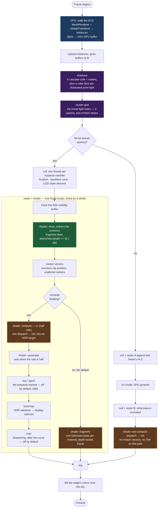

# Render Pipeline

Kóoch renders through a **GPU-driven meshlet pipeline**, Nanite-style: the
CPU uploads a flat array of instances and dispatches, and every decision
about *what to draw* — frustum, backface, occlusion, level of detail — is
taken on the GPU by a compute shader reading that array.

The CPU never walks a scene graph deciding what is visible. That is the
whole point, and it is what "GPU-driven" means here.

> This page describes what the code does today. Where something is
> missing the page says so and links the issue.

## A frame is a list of views

`MeshletRenderStage` owns one geometry pool and a `SlotMap<ViewId,
MeshletView>`. Each view has its own render targets, its own cull state
and its own camera; the pool, the instance buffer and the pipelines are
shared.

That split is deliberate and was not always true. Cull state is per view
**by definition** — what survives a frustum test depends on where the
camera is — and sharing it across views produces an over-cull that only
appears once a second view exists, or once shadow cascades do, where it
reads as "the shadows are wrong" rather than as a shared-state bug.

Two views run today: the editor's **View** panel and its **Game** panel.

**Shadow cascades did not become views**, which was the plan when this
page was written. They record inside the stage instead, against the
unjittered camera and with their own bounded projection, because a
cascade shares the pool and the instance buffer but wants none of a
view's render targets. Virtual-shadow-map pages
([#477](https://github.com/lobinuxsoft/kooch/issues/477)) may still be
the case that makes a view the right shape.

Each view records **and submits** its own command encoder. Several
per-frame buffers are shared across views on exactly that basis: a write
followed by a submit is ordered on the queue, so view B's camera cannot
reach view A's pass.

## The frame, pass by pass

Which path runs depends on one capability: 64-bit texture atomics. The
device either has `TEXTURE_INT64_ATOMIC` + `SHADER_INT64` +
`SHADER_INT64_ATOMIC_MIN_MAX` or it does not.

The node labels below are the **GPU scope names a capture prints**, so a
flamegraph and this diagram can be read side by side. Anything not named
here does not have a timer on it.



Two of those run **before** anything is drawn, and the order is not
arbitrary: shading samples the shadow atlas and reads the froxel grid, so
both have to be filled first. They are separately scoped because a shadow
pass that costs four culls and four rasters was, until #785, hiding
inside whatever number the frame reported.

The R64 path's `raster + shade` is **one fused scope** covering
everything from the clear to the sharpening. Its children — motion
vectors, the shade dispatch, the upsample, the temporal resolve, the
tonemap, RCAS — are timed individually inside it, which is how a capture
answers *which half of the fused pass is the cost*.

### Cull

One compute thread per (instance × meshlet). Each thread tests its own
meshlet and, if it survives, appends its `(instance_id, meshlet_id)` to a
`visible_meshlets` buffer with an atomic bump. The draw that follows is
`draw_indirect` off a count the GPU wrote — the CPU never learns how many
meshlets survived, and does not need to.

Tests, in order: **frustum** against the meshlet's AABB, **backface** via
its normal cone, and **LOD chain descent** — a meshlet is drawn when its
own screen-projected error falls under the target and its parent's does
not.

> 🔴 The LOD selector read the projection scale from a single matrix
> element for a long time. That element is `f × (camera up · world up)`,
> so it is correct for a level camera, smaller for a tilted one, and
> **zero at 90° of roll or looking straight down** — which switched the
> selector off entirely. It now takes the norm of the row that produces
> `clip.y`. Any non-level view had been losing detail since continuous
> LOD shipped, degrading smoothly enough to read as "that is how the
> model looks".

### Visibility buffer

Instead of shading during rasterisation, the raster pass writes only
*which triangle covered this pixel*. Shading happens afterwards, once per
pixel, for the triangle that won.

**R64 path.** The fragment shader does one
`textureAtomicMax((depth << 32) | ids)` into an `R64Uint` storage
texture. Depth in the high bits means the atomic max resolves depth and
identity in a single operation — no depth buffer, no z-fighting between
coplanar meshlets, no ordering.

**R32 path.** Without 64-bit atomics the same idea runs in two passes
against a Hi-Z pyramid built with single-pass-downsample: pass A draws
what was visible last frame, the pyramid is rebuilt from that depth, and
pass B recovers whatever pass A wrongly occluded. Metal has no
`atomic_uint64`, so this path is not legacy — it is the Apple path.

### Shading

Both paths reconstruct the surface the same way, through
`surface_reconstruct.wgsl`: perspective-correct barycentrics from the
triangle's three world-space positions, giving world position, normal,
uv, tangent and **analytical uv derivatives** — the automatic ones are
wrong here, because neighbouring fragments in a 2×2 quad may come from
different triangles.

Only the visibility-buffer *read* differs between the paths. That was not
true until #441: the R32 path averaged the triangle's three vertex
normals and never computed a world position at all, which was invisible
while shading was a function of the normal alone and would have lit the
centroid of every triangle the moment a point light needed a distance.

- **R64, fragment — the default.** One fullscreen pass *per material*,
  depth-testing `Equal` against a target holding each pixel's material
  id. The depth test is the per-material cull, in hardware, with
  early-Z. Each pass binds its own textures.
- **R64, compute — opt-in.** One dispatch for the whole screen, into an
  HDR target. Turned on per project (`compute_shading`) or per run
  (`KOOCH_COMPUTE_SHADING`), and it is what half-rate shading and the
  reduced-rate upsample require.
- **R32** shades with one compute dispatch. **No texture sampling**: a
  compute shader has no implicit derivatives, and `textureSampleGrad` is
  a fragment-stage call. Scalars only.

> 🔴 **"Per material" means per material in the PROJECT, not in the
> frame.** `MaterialPipeline::shading_slots` is `0..next_slot` and
> `sync_from_resources` registers every `Material` the `AssetDatabase`
> knows about, so dropping an unused `.ron` into the project's folder
> adds a full-screen sweep to every frame. A tile that owns none of a
> slot's pixels does no reconstruction and writes nothing, but it does
> not leave for free: every thread still reads the R64 vbuf, chases
> `visible_meshlets` and then `instances` off that read, and waits on
> three unconditional barriers.
>
> `KOOCH_SHADING_PAD=<n>` appends `n` sweeps whose `material_id` matches
> no instance. The frame is bit-identical — every store in
> `material_pbr_compute.wgsl` is inside the branch that never fires — so
> the only thing an A/B across it measures is what an idle sweep costs.
>
> **Measured on the OneXFly at 1920x1080, 2026-08-20: 178 µs a sweep**
> (1.98 µs on a desktop 9070 XT at 1280x720). A sweep is a fixed dispatch
> cost plus per-pixel work, so quote the resolution with the number. `roll-a-ball` has three materials and pays 0.71 ms a
> frame — 22 % of its own shading pass. A game with twenty pays 3.7 ms.
> Use a pad in the hundreds when measuring: four extra sweeps sit under
> the device's own run-to-run drift.

> 🔴 **A `serde` default is not a recommendation — it is what an old file
> silently becomes.** `compute_shading`, `shading_rate` and `temporal_aa`
> all default to what the engine already did — fragment path, full rate,
> no history — because an earlier version defaulted two of them to *on*
> and every existing project changed shading path and gained a temporal
> resolve in the same build. Two variables at once is not a change
> anybody can bisect, and the first report was "you broke the whole
> render".

### The window, and everything being live

`window_mode` sits beside `vsync` in the Presentation group: **0
windowed, 1 borderless, 2 fullscreen, 3 exclusive**.

| mode | what it is | changes the output resolution? |
|---|---|---|
| Windowed | a decorated window at the project's size | no |
| Borderless | the same size, no title bar — still a **window** | no |
| Fullscreen | the monitor, at the monitor's **current** mode | no |
| Exclusive | asks the display to **change mode** | **yes** |

🔴 **Exclusive does not work everywhere, and the engine says so rather
than letting it fail quietly.** Windows and X11 implement it; winit
ignores it on Wayland and its own source says so twice —
`warn!("`Fullscreen::Exclusive` is ignored on Wayland")`, which leaves
the window exactly as it was and reads as the setting being broken. So
`window_mode::effective` degrades the request to fullscreen before it
reaches winit, with a warning naming both modes.

### The resolution, and what the monitor reports

Two resources carry it, both live:

- **`Resolution { width, height, refresh_mhz }`** — what the game asks
  for. In windowed and borderless it is the window's inner size, applied
  through `request_inner_size`; in exclusive it is the display mode to
  switch to. `refresh_mhz: 0` means *"the best this size can do"*.
- **`DisplayModes { modes, exclusive }`** — what the platform will
  actually do, published once the window exists. The list comes from the
  **player's** monitor rather than from a constant, and `exclusive` is
  false under Wayland. A game's options menu is built from this: a
  resolution dropdown that changes nothing is worse than none.

🔴 **In exclusive, the size has to match a mode exactly.** Substituting a
nearby resolution would change what the player sees without saying so,
so the fallback is borderless fullscreen at the monitor's own size, with
a warning. Among modes of the right size the engine takes the one closest
to the refresh asked for, or the highest when none was.

⚠️ `request_inner_size` is a **request**. Wayland answers with a
configure event rather than a return value, which the engine already
handles: `WindowResized` → `GpuContext::resize` → the render targets.

⚠️ The **environment override** `KOOCH_WINDOW_MODE=windowed|borderless|
fullscreen|exclusive` is applied when the window is created; the
**asset's** value lands a few frames later, because the settings asset
needs the asset server, which needs the GPU, which needs the window.

⚠️ None of this reaches a handheld under gamescope. The compositor hands
the game a surface at the resolution **it** was configured for and scales
the result; the knob that decides there is outside the process.

**Every setting in the file is live**, which is what makes a game's own
options menu possible:

| setting | how it lands |
|---|---|
| exposure, ambient, shadows, contact shadows | resources read per frame |
| `compute_shading`, `shading_rate`, `upscale`, `sharpening` | applied per frame on the stage |
| `render_scale` | next frame — `render_frame_system` calls `resize` once a frame and it early-returns unless the size or the scale moved |
| `anisotropy` | rebuilds one sampler when the number changes |
| `vsync` | reconfigures the surface when the mode differs |
| `window_mode` | `set_fullscreen` / `set_decorations` when the window is not already like that |

Each of those is guarded on "is it already what was asked for", because
every one of them is a reallocation of something — a swapchain, a
sampler, a set of render targets — and applying it unconditionally would
rebuild it once a frame.

### 🟢 What a handheld ships with

Measured on the OneXFly at 10 W, settled, 1920x1080, 2026-08-20:
**13.92 ms median, GPU 9.7 ms**, against a 13.9 ms budget.

```ron
compute_shading: true,   // the tiled path; half rate needs it
shading_rate: 2,         // Half — one sample per 2x2 quad
upscale: 2,              // SGSR 2
render_scale: 50,        // Performance — 50 % (2x)
```

🔴 **Cap the frame rate, and not only for the battery.** At 1280x720 the
same frame costs **3.9 ms of GPU capped at 72 fps and 13.2 ms uncapped**
on this part. Capped, the GPU is idle 68 % of the time, so it never
reaches its power cap and holds ~1210 MHz; uncapped it throttles and
every pass takes three times longer. Rendering 144 frames to display 72
pays for the same work three times — and the cap fixes the pacing too:
max frame 15.25 ms against 47.09.

⚠️ The capped run was also at a higher TDP than the uncapped one, so the
3.4× is the cap and the power together. `gpu_busy_percent` reading 32 %
argues the cap is most of it — a part idle two thirds of the time is not
power-limited — but the run that separates them has not been taken.

🔴 **The upscaler is the largest single choice on that list.** Same
scene, same build, same session: `upscale: 3` (FSR 3.1) costs **11.355
ms** and `upscale: 2` (SGSR 2) costs **2.062** — a 23.36 ms frame against
a 13.92 ms one. FSR 3.1 is not broken; it is a desktop technique, and its
own dropdown entry says so.

### DLSS (#536)

`upscale: 4` is NVIDIA's, and it is the only technique here a build can
**lack**. The other three are shaders this engine owns; DLSS is a neural
network shipped as a binary blob, reached by linking NVIDIA's SDK.

Three things follow, and all three are visible from a project:

1. 🔴 **It is a compile-time feature.** `dlss_wgpu`'s build script links
   `libnvsdk_ngx` statically and runs bindgen over NVIDIA's headers, so
   a binary either linked it or did not. Turn it on by adding `dlss` to
   a build preset's **Extra cargo features**; the editor supplies
   `DLSS_SDK` and `VULKAN_SDK` and refuses to start cargo when the SDK
   is not installed.
2. 🔴 **It moves the whole build to Vulkan.** `dlss_wgpu` is Vulkan-only,
   and on Windows wgpu picks D3D12 by default. Enabling DLSS therefore
   moves *every* Windows player onto Vulkan, not only the ones with an
   NVIDIA card. That is a decision about the whole build, which is why it
   is a feature rather than a setting.
3. 🟢 **Asking for it is always safe.** A build without the feature, or a
   machine without an NVIDIA card, resolves with the engine's own TAA at
   full resolution and says so once in the log. The `.rendersettings`
   file is left alone: `upscale: 4` is what the project wants, and the
   machine that can honour it should still see it.

**Getting the SDK.** Settings → the DLSS button clones
[NVIDIA/DLSS](https://github.com/NVIDIA/DLSS) at the pinned tag after you
accept NVIDIA's terms, into `~/.local/share/kooch/sdk/dlss/<version>/`.
The engine never mirrors it — hosting a copy is the "stand-alone
product" the licence forbids.

**Shipping it.** A build with the feature gains two files beside the
executable, copied by the packager rather than by you:

| file | why |
|---|---|
| `libnvidia-ngx-dlss.so.<ver>` / `nvngx_dlss.dll` | NGX `dlopen`s it from the application's own directory. Nothing links it, so there is no `rpath` to get right |
| `DLSS_NOTICES.pdf` | Section 9.5 of NVIDIA's Programming Guide, which anyone distributing the blob must include. Copied because a licence file nobody remembered is a licence breach |

⚠️ **Unmeasured.** DLSS has a number on no device in this repository yet.
It is a desktop option with an NVIDIA card; the handheld's default stays
SGSR 2 at **2.062 ms**, and a vendor backend that does not beat ours by a
number does not get to be a default.

**Dropping the output resolution buys more than any of these**, because
`render_scale` is a percentage *of the output*: a smaller window shrinks
the render target with it and everything `render_scale` does not touch —
the resolve's output, the tonemap, the blit.

⚠️ These are a recommendation, not defaults. `RenderSettings::default()`
stays what the engine did before any of them existed, for the reason the
callout above gives: a serde default is what an old file silently
becomes.

Then [Inti](./lighting.md) — Cook-Torrance driven by the scene's lights.

### After the shade: rate, history, and the tonemap

Three passes sit between Inti and the sky, and all three exist on the R64
path only.

- **Half-rate shading.** `KOOCH_SHADING_RATE=half` shades a quarter of
  the pixels and `shade: upsample` puts them back on screen. The scope
  renames itself — `shade: compute (half rate)` — so a capture answers
  *which rate produced this* without anyone trusting a log line. The
  cheap half of the frame stays full-rate: the visibility buffer, the
  depth, the motion vectors.
- **`motion vectors`.** Each pixel's previous clip position, from the
  camera's *unjittered* matrix. The jittered one goes to everything else
  — cull, Hi-Z, raster, every reconstruction that reads the buffer the
  raster wrote — and the pair being separable is the whole reason the
  vectors are not wrong by a sub-pixel offset every frame.
- **`taa`, and it is off by default.** The resolve exists and works;
  turning it on is #481's remaining half. Debug views bypass it, because
  averaging a false-colour legend across frames is not a legend any more.
- **`rcas`, and it is off by default.** Robust Contrast Adaptive
  Sharpening, one full-screen pass, `sharpening` in `.rendersettings`.
  🔴 It runs **after** the tonemap, unlike everything else in this list:
  RCAS is adaptive because it solves for the filter weight at which the
  signal would clip out of `{0, 1}`, and handed radiance in the hundreds
  that limiter stops limiting. When it runs, the tonemap resolves into
  its texture instead of into the window. Reconstruction is soft by
  construction — a resolve builds each output pixel from samples that
  landed *near* it — so at a `render_scale` below 100 this is not polish.
- **`tonemap`.** Shading writes **HDR radiance** into a linear target and
  the tonemap converts it at the end, because TAA has to run on linear
  radiance. The operator is *concatenated* from Inti rather than
  reimplemented — two copies of a curve that must agree to within one
  255th is how a parity test starts failing for a reason nobody can find.

> 🔴 Everything that compresses range — the resolve, the tonemap, any
> firefly clamp — needs the **exposure applied first**. Radiance in this
> engine is in the hundreds, and `c / (max(c) + 1)` on those numbers
> posterises into flat bands that read as a broken toon shader rather
> than as a missing divide.

### Sky and composite

The sky is a fullscreen pass: procedural gradient plus volumetric clouds
(3D value noise FBM, Beer–Lambert transmittance, Henyey–Greenstein
phase, in-scattering toward the sun). It draws first, and the meshlet
stage's colour is blitted over it — `alpha = 0` is the background
sentinel, so pixels no meshlet covered keep the sky.

> ⚠️ `GpuContext` deliberately selects a **non-sRGB** surface format, on
> the reasoning that "most renderers handle gamma correction in the
> shader". Inti does. **The sky pass does not.** If the two disagree on
> brightness, that is the sky's half of a decision taken long ago and
> never finished.

## Debug views

`MeshletDebugMode` is a `Resource` the editor sets per frame; the shaders
branch on a single `u32`. `Off` is the production path.

| Mode | Shows |
|---|---|
| `MeshletIds` / `InstanceIds` | Cluster boundaries; per-entity coverage |
| `TriangleDensity` | Triangles drawn per pixel — calibrates `target_error_pixels`. Anything brighter than green is sub-pixel triangle territory |
| `Overdraw` | Visibility-buffer atomic writes per pixel |
| `FrustumRejected` / `BackfaceRejected` / `HiZRejected` | What each cull stage discarded |
| `CullPassthrough` | Everything that survived every stage |
| `OnlyLod0` / `OnlyRoots` | The two extremes of the LOD chain, in isolation |
| `Normals` | The world-space normal as colour |
| `ShadowCascades` / `ContactShadows` | What each shadow mechanism saw — see [Inti](./lighting.md) |
| `SingleLight` | The selected light, alone, in grey, with its shadow |
| `LightsPerPixel` | How many lights the pixel actually evaluated. Cost becomes a property of *where the pixel is*, which no pass timing can show — `raster + shade` is one number for the whole screen. 🔴 A flat maximum means the frame is **not clustering**: every light, every pixel |
| `PointShadowFactor` | One point light's cube map answering for itself — no BRDF, no cosine, no exposure, no second light. Magenta: no casting lamp. Blue: past its `range`. Grey ramp: the factor |
| `PointCubeFaces` | The cube map itself, six faces in a 3×2 grid (+X, −X, +Y, −Y, +Z, −Z). Dark blue is *nothing recorded*, which is what an occluder culled out of the map looks like |

The last three exist because *"the shadow is not there"* is four faults
wearing one pixel — no lamp near this point casts, the point is past the
lamp's reach, the cube says lit because the occluder never reached the
map, or the cube says dark and the other lamps fill it back in. Four
fixes, one colour in a shaded frame.

`Normals` deserves a note: until #441 it *was* the shading model. The
renderer computed `normal * 0.5 + 0.5` and multiplied by albedo, which is
why a scene with lights and a scene without them rendered identically.
It survives as a debug view because it is a genuinely useful look at the
geometry — it just stopped being what you get by default.

The atomic-counter modes need `TEXTURE_ATOMIC`; the editor's dropdown
hides what the adapter cannot run rather than offering a mode that
silently falls back.

The Inti-side views — `Normals`, `ShadowCascades`, `ContactShadows`,
`SingleLight` — are **not compiled into the shader a game runs**. They
live in `inti_debug.wgsl`, which only the editor's second pipeline
concatenates; production takes `INTI_DEBUG_STUB` instead and the call
sites fold to `if (false)`. The reasoning, and why an untaken branch is
not free, is in [Inti](./lighting.md#the-debug-views-are-not-in-the-shader-your-game-runs).

## Depth: reversed-Z, and no far plane

The camera's projection is `perspective_infinite_rh_reverse_z`. Near maps
to `ndc.z = 1`; infinity approaches `0` without reaching it. Depth
attachments clear to `0.0` and compare `Greater`.

The property worth knowing, because half the renderer leans on it:

```text
ndc.z == near / distance
```

Exactly. Any shader recovers metres from the depth buffer with one
divide and no extra uniform — which is why the contact-shadow march can
take `thickness` and `length` in world units and have them mean the same
thing in every scene. With a finite far plane it takes two coefficients
plumbed to every consumer, and the first one that forgets ships a
parameter documented in metres that does not measure metres.

Two things follow, and both are load-bearing:

- **The far plane is gone from culling too.** That row of the projection
  degenerates to a zero-length normal; `extract_frustum_planes` returns
  `[0,0,0,0]` for it and the cull shader walks five planes.
- **Unprojecting uses the NEAR plane.** `ndc.z = 0` is infinity now and
  unprojects to `w = 0`. Anything that builds a ray from a cursor takes
  `ndc.z = 1` — same ray through the eye, always finite.

The bounded `perspective_rh_reverse_z` survives for shadow cascades: a
slice of an unbounded frustum is unbounded. Rationale and the full list
of what this touched: [ADR 0002](../../../decisions/0002_infinite_reverse_z.md).

## Limits worth knowing

- 🔴 **65 536 instances.** The visibility buffer packs
  `(instance_id << 16) | meshlet_id`. A chunk of vegetation exhausts
  this. Bevy removed their equivalent limit in 0.17 with BVH culling.
- 🔴 **Six bind groups, six used.** The two-pass shading pipeline uses
  every group `TARGET_MAX_BIND_GROUPS` allows. Shadow maps have to go
  *inside* Inti's group — which is where they belong anyway, since a
  shadow map without its light is not a thing any shader wants. Raising
  the target to 8 would work on desktop and drop a baseline Vulkan only
  guarantees at 4.
- **Skinned meshes cull against their bind pose**
  ([#453](https://github.com/lobinuxsoft/kooch/issues/453)), so an
  animation that reaches outside the rest volume culls a character who
  is on screen.
- **The R32 path has no motion vectors and no history**, so no TAA and no
  temporal upscaling there. Jitter on that path is a wobble and nothing
  else, which is why it is not applied.
- **TAA ships off** ([#481](https://github.com/lobinuxsoft/kooch/issues/481)).
  The resolve is built and the vectors feed it; what is missing is the
  half that turns it on by default without softening a still image.

## Not in the pipeline yet

Shadows, contact shadows and clustered shading used to be listed here.
Cascades ([#476](https://github.com/lobinuxsoft/kooch/issues/476)) and
contact shadows ([#735](https://github.com/lobinuxsoft/kooch/issues/735))
shipped, and the froxel grid
([#780](https://github.com/lobinuxsoft/kooch/issues/780)) runs every
frame — the passes in the diagram above are what replaced those bullets.
What is genuinely still absent:

- **Virtual shadow maps** ([#477](https://github.com/lobinuxsoft/kooch/issues/477)).
  Cascades cover the sun; a hundred shadowed point lights each want a
  cube map, and that is the wall VSM exists to move.
- **Global illumination** ([#450](https://github.com/lobinuxsoft/kooch/issues/450)) —
  surfel + voxel, not raytraced. Its absence is why punctual light
  defaults are larger than physics says they should be; see
  [Lighting](./lighting.md).
- **Atmosphere** ([#250](https://github.com/lobinuxsoft/kooch/issues/250),
  [#248](https://github.com/lobinuxsoft/kooch/issues/248)) — correct from
  orbit, and tinting the sunlight.
- **The post-processing stack**
  ([#254](https://github.com/lobinuxsoft/kooch/issues/254)) — AgX, SMAA,
  vignette. The `tonemap` and `rcas` passes exist; the stack around them
  does not, and exposure is a setting rather than an auto-exposure loop.

## Why there is no render graph

There *was* one — `kooch_render::graph`, 497 lines, cycle detection and
topological sort — and **nothing ever instantiated it**. The real
renderer was built beside it.

The decision not to revive it is not laziness. Bevy 0.19 **deleted their
`RenderGraph`** and replaced it with ECS schedules, because the graph ran
as an exclusive system and was single-threaded — the engine that made
the pattern canonical retired it. Kóoch already has the replacement half
written: `kooch_core`'s scheduler batches GPU systems into a shared
encoder. What it needs is `before` / `after` ordering, not a second
scheduler that looks official and is not
([#392](https://github.com/lobinuxsoft/kooch/issues/392)).
