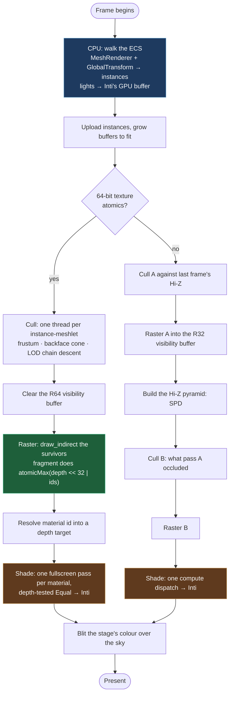

# Render Pipeline

Kóoch renders through a **GPU-driven meshlet pipeline**, Nanite-style: the
CPU uploads a flat array of instances and dispatches, and every decision
about *what to draw* — frustum, backface, occlusion, level of detail — is
taken on the GPU by a compute shader reading that array.

The CPU never walks a scene graph deciding what is visible. That is the
whole point, and it is what "GPU-driven" means here.

> This page describes what the code does today. Where something is
> missing the page says so and links the issue.

## A frame is a list of views

`MeshletRenderStage` owns one geometry pool and a `SlotMap<ViewId,
MeshletView>`. Each view has its own render targets, its own cull state
and its own camera; the pool, the instance buffer and the pipelines are
shared.

That split is deliberate and was not always true. Cull state is per view
**by definition** — what survives a frustum test depends on where the
camera is — and sharing it across views produces an over-cull that only
appears once a second view exists, or once shadow cascades do, where it
reads as "the shadows are wrong" rather than as a shared-state bug.

Two views run today: the editor's **View** panel and its **Game** panel.
Shadow cascades and virtual-shadow-map pages will be views too.

Each view records **and submits** its own command encoder. Several
per-frame buffers are shared across views on exactly that basis: a write
followed by a submit is ordered on the queue, so view B's camera cannot
reach view A's pass.

## The frame, pass by pass

Which path runs depends on one capability: 64-bit texture atomics. The
device either has `TEXTURE_INT64_ATOMIC` + `SHADER_INT64` +
`SHADER_INT64_ATOMIC_MIN_MAX` or it does not.



### Cull

One compute thread per (instance × meshlet). Each thread tests its own
meshlet and, if it survives, appends its `(instance_id, meshlet_id)` to a
`visible_meshlets` buffer with an atomic bump. The draw that follows is
`draw_indirect` off a count the GPU wrote — the CPU never learns how many
meshlets survived, and does not need to.

Tests, in order: **frustum** against the meshlet's AABB, **backface** via
its normal cone, and **LOD chain descent** — a meshlet is drawn when its
own screen-projected error falls under the target and its parent's does
not.

> 🔴 The LOD selector read the projection scale from a single matrix
> element for a long time. That element is `f × (camera up · world up)`,
> so it is correct for a level camera, smaller for a tilted one, and
> **zero at 90° of roll or looking straight down** — which switched the
> selector off entirely. It now takes the norm of the row that produces
> `clip.y`. Any non-level view had been losing detail since continuous
> LOD shipped, degrading smoothly enough to read as "that is how the
> model looks".

### Visibility buffer

Instead of shading during rasterisation, the raster pass writes only
*which triangle covered this pixel*. Shading happens afterwards, once per
pixel, for the triangle that won.

**R64 path.** The fragment shader does one
`textureAtomicMax((depth << 32) | ids)` into an `R64Uint` storage
texture. Depth in the high bits means the atomic max resolves depth and
identity in a single operation — no depth buffer, no z-fighting between
coplanar meshlets, no ordering.

**R32 path.** Without 64-bit atomics the same idea runs in two passes
against a Hi-Z pyramid built with single-pass-downsample: pass A draws
what was visible last frame, the pyramid is rebuilt from that depth, and
pass B recovers whatever pass A wrongly occluded. Metal has no
`atomic_uint64`, so this path is not legacy — it is the Apple path.

### Shading

Both paths reconstruct the surface the same way, through
`surface_reconstruct.wgsl`: perspective-correct barycentrics from the
triangle's three world-space positions, giving world position, normal,
uv, tangent and **analytical uv derivatives** — the automatic ones are
wrong here, because neighbouring fragments in a 2×2 quad may come from
different triangles.

Only the visibility-buffer *read* differs between the paths. That was not
true until #441: the R32 path averaged the triangle's three vertex
normals and never computed a world position at all, which was invisible
while shading was a function of the normal alone and would have lit the
centroid of every triangle the moment a point light needed a distance.

- **R64** shades with one fullscreen fragment pass *per material*,
  depth-testing `Equal` against a target holding each pixel's material
  id. The depth test is the per-material cull, in hardware, with
  early-Z. Each pass binds its own textures.
- **R32** shades with one compute dispatch. **No texture sampling**: a
  compute shader has no implicit derivatives, and `textureSampleGrad` is
  a fragment-stage call. Scalars only.

Then [Inti](./lighting.md) — Cook-Torrance driven by the scene's lights.

### Sky and composite

The sky is a fullscreen pass: procedural gradient plus volumetric clouds
(3D value noise FBM, Beer–Lambert transmittance, Henyey–Greenstein
phase, in-scattering toward the sun). It draws first, and the meshlet
stage's colour is blitted over it — `alpha = 0` is the background
sentinel, so pixels no meshlet covered keep the sky.

> ⚠️ `GpuContext` deliberately selects a **non-sRGB** surface format, on
> the reasoning that "most renderers handle gamma correction in the
> shader". Inti does. **The sky pass does not.** If the two disagree on
> brightness, that is the sky's half of a decision taken long ago and
> never finished.

## Debug views

`MeshletDebugMode` is a `Resource` the editor sets per frame; the shaders
branch on a single `u32`. `Off` is the production path.

| Mode | Shows |
|---|---|
| `MeshletIds` / `InstanceIds` | Cluster boundaries; per-entity coverage |
| `TriangleDensity` | Triangles drawn per pixel — calibrates `target_error_pixels`. Anything brighter than green is sub-pixel triangle territory |
| `Overdraw` | Visibility-buffer atomic writes per pixel |
| `FrustumRejected` / `BackfaceRejected` / `HiZRejected` | What each cull stage discarded |
| `CullPassthrough` | Everything that survived every stage |
| `OnlyLod0` / `OnlyRoots` | The two extremes of the LOD chain, in isolation |
| `Normals` | The world-space normal as colour |
| `ShadowCascades` / `ContactShadows` | What each shadow mechanism saw — see [Inti](./lighting.md) |
| `SingleLight` | The selected light, alone, in grey, with its shadow |

`Normals` deserves a note: until #441 it *was* the shading model. The
renderer computed `normal * 0.5 + 0.5` and multiplied by albedo, which is
why a scene with lights and a scene without them rendered identically.
It survives as a debug view because it is a genuinely useful look at the
geometry — it just stopped being what you get by default.

The atomic-counter modes need `TEXTURE_ATOMIC`; the editor's dropdown
hides what the adapter cannot run rather than offering a mode that
silently falls back.

The Inti-side views — `Normals`, `ShadowCascades`, `ContactShadows`,
`SingleLight` — are **not compiled into the shader a game runs**. They
live in `inti_debug.wgsl`, which only the editor's second pipeline
concatenates; production takes `INTI_DEBUG_STUB` instead and the call
sites fold to `if (false)`. The reasoning, and why an untaken branch is
not free, is in [Inti](./lighting.md#the-debug-views-are-not-in-the-shader-your-game-runs).

## Depth: reversed-Z, and no far plane

The camera's projection is `perspective_infinite_rh_reverse_z`. Near maps
to `ndc.z = 1`; infinity approaches `0` without reaching it. Depth
attachments clear to `0.0` and compare `Greater`.

The property worth knowing, because half the renderer leans on it:

```text
ndc.z == near / distance
```

Exactly. Any shader recovers metres from the depth buffer with one
divide and no extra uniform — which is why the contact-shadow march can
take `thickness` and `length` in world units and have them mean the same
thing in every scene. With a finite far plane it takes two coefficients
plumbed to every consumer, and the first one that forgets ships a
parameter documented in metres that does not measure metres.

Two things follow, and both are load-bearing:

- **The far plane is gone from culling too.** That row of the projection
  degenerates to a zero-length normal; `extract_frustum_planes` returns
  `[0,0,0,0]` for it and the cull shader walks five planes.
- **Unprojecting uses the NEAR plane.** `ndc.z = 0` is infinity now and
  unprojects to `w = 0`. Anything that builds a ray from a cursor takes
  `ndc.z = 1` — same ray through the eye, always finite.

The bounded `perspective_rh_reverse_z` survives for shadow cascades: a
slice of an unbounded frustum is unbounded. Rationale and the full list
of what this touched: [ADR 0002](../../../decisions/0002_infinite_reverse_z.md).

## Limits worth knowing

- 🔴 **65 536 instances.** The visibility buffer packs
  `(instance_id << 16) | meshlet_id`. A chunk of vegetation exhausts
  this. Bevy removed their equivalent limit in 0.17 with BVH culling.
- 🔴 **Six bind groups, six used.** The two-pass shading pipeline uses
  every group `TARGET_MAX_BIND_GROUPS` allows. Shadow maps have to go
  *inside* Inti's group — which is where they belong anyway, since a
  shadow map without its light is not a thing any shader wants. Raising
  the target to 8 would work on desktop and drop a baseline Vulkan only
  guarantees at 4.
- **Skinned meshes cull against their bind pose**
  ([#453](https://github.com/lobinuxsoft/kooch/issues/453)), so an
  animation that reaches outside the rest volume culls a character who
  is on screen.
- **No motion vectors**, which blocks temporal upscaling, TAA and motion
  blur at once ([#732](https://github.com/lobinuxsoft/kooch/issues/732)).
  It is also what leaves the contact-shadow seam visible: the march
  answers hit-or-miss per pixel and only averaging softens that, which
  is what Bevy's TAA does for them.

## Not in the pipeline yet

- **Shadows** — cascades ([#476](https://github.com/lobinuxsoft/kooch/issues/476)),
  contact shadows ([#735](https://github.com/lobinuxsoft/kooch/issues/735)),
  VSM ([#477](https://github.com/lobinuxsoft/kooch/issues/477)).
- **Global illumination** ([#450](https://github.com/lobinuxsoft/kooch/issues/450)) —
  surfel + voxel, not raytraced. Its absence is why punctual light
  defaults are larger than physics says they should be; see
  [Lighting](./lighting.md).
- **Atmosphere** ([#250](https://github.com/lobinuxsoft/kooch/issues/250),
  [#248](https://github.com/lobinuxsoft/kooch/issues/248)) — correct from
  orbit, and tinting the sunlight.
- **Post-processing and auto exposure**
  ([#254](https://github.com/lobinuxsoft/kooch/issues/254)). Inti ships a
  fixed exposure and an ACES approximation as placeholders.
- **Light clustering.** The shader loops over every light for every
  pixel: honest for tens, wrong for thousands.

## Why there is no render graph

There *was* one — `kooch_render::graph`, 497 lines, cycle detection and
topological sort — and **nothing ever instantiated it**. The real
renderer was built beside it.

The decision not to revive it is not laziness. Bevy 0.19 **deleted their
`RenderGraph`** and replaced it with ECS schedules, because the graph ran
as an exclusive system and was single-threaded — the engine that made
the pattern canonical retired it. Kóoch already has the replacement half
written: `kooch_core`'s scheduler batches GPU systems into a shared
encoder. What it needs is `before` / `after` ordering, not a second
scheduler that looks official and is not
([#392](https://github.com/lobinuxsoft/kooch/issues/392)).
