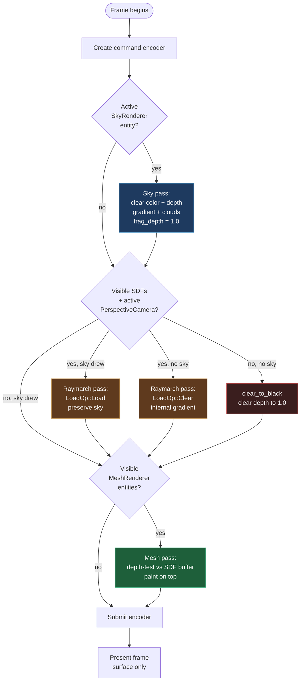

# Render Pipeline

Kóoch has **one rendering model with two orchestration callsites**:

1. **Editor offscreen** — `kooch_editor_core::viewport::render::render_viewport`
   draws into a `ViewportTarget` texture which the egui `View` panel then
   shows as an `egui::Image`. Lets the editor compose the engine's render
   output with its own overlay UI.
2. **Play surface** — `kooch_render::plugin::RenderPlugin` (the
   `Stage::Render` system) draws into the swapchain surface directly. Used
   by the play-mode binary launched via `cargo run --manifest-path` from
   the editor's Play action, or run standalone.

Both callsites use **the same renderers** (`RayMarchRenderer`,
`MeshPassRenderer`, `SkyRenderPass`) as `Resources`. Only the target
differs.

## Frame structure

Three passes share one command encoder per frame. Each pass decides what
to do based on what's in the ECS — no pass is mandatory.

In words: sky paints first if active. Raymarch composites on top using
`Load` if the sky drew, `Clear` otherwise. If neither sky nor SDFs render,
the frame still clears to black so the mesh pass has a valid depth buffer.
Mesh always draws last, depth-tested.

## Pass details

### Pass 1 — Sky

`crates/kooch_render/src/sky/renderer.rs`

Runs only when an ECS entity has an active `SkyRenderer` component. The
shader is a fullscreen triangle with:

- Procedural vertical gradient (top + bottom colors).
- Volumetric clouds: 3D value noise + FBM (4 octaves), Beer–Lambert
  transmittance, Henyey–Greenstein phase function, 3-step in-scattering
  toward the sun, hash jitter.
- Sun disk at the end (`pow(cos_sun, 256) * 4`), naturally attenuated by
  the cloud transmittance multiplier.

Writes `frag_depth = 1.0` so any subsequent pass with `LessEqual` depth
test can still draw. Defaults: 32 primary steps × 500 units, 3 light steps,
transmittance early-out at < 0.05.

Without an active `SkyRenderer`, this pass is skipped entirely.

### Pass 2 — Ray-march (SDFs)

`crates/kooch_render/src/raymarch/renderer.rs`

Sphere-traces visible SDF primitives (`SdfSphere`, `SdfBox`, `SdfCapsule`,
`SdfCylinder`, `SdfTorus`, `SdfPlane`) with optional `SdfBlend`
modifiers. Uses the highest-priority active `(PerspectiveCamera,
GlobalTransform)` pair. `OrthographicCamera` is currently ignored by the
ray-march path.

Compositing rules (settled in PR #237):

| Sky drew first? | Color load | Depth load |
|-----------------|-----------|-----------|
| Yes | `Load` | `Load` |
| No  | `Clear(BLACK)` | `Clear(1.0)` |

Depth comparison: `LessEqual` (so the sky's `frag_depth = 1.0` does not
block raymarch hits at the far plane — the alternative `Less` failed
`1.0 < 1.0` and produced a black viewport). The mesh pipeline below uses
plain `Less` since meshes are never exactly at the far plane.

If no SDF is visible **and** no sky drew, the renderer issues a
`clear_to_black` instead so depth is correctly cleared for the mesh pass.

Step count default `256` (was `128` until PR #227 — bumped as quick fix
for #221 gaps until Segment Tracing lands per #224).

### Pass 3 — Mesh

`crates/kooch_render/src/mesh/renderer.rs`

Rasterized pass for entities with `MeshRenderer + GlobalTransform`. Loads
glTF meshes lazily, caches them in a `HashMap<String, MeshGpu>` owned by
`MeshPassRenderer`. One indexed draw per visible entity, all sharing the
same camera UBO with dynamic offsets per draw (256-byte aligned, see
PR #235).

Depth-tests against the buffer left by the SDF pass, so meshes correctly
occlude / are occluded by SDF surfaces.

Material: vertex normals only for now (PR #129 MVP). PBR is #130.

## Depth target

A single `Depth32Float` texture (`VIEWPORT_DEPTH_FORMAT` constant in
`kooch_render::lib`) is shared by all three passes within a frame. Two
copies exist at any given time:

- Editor: `ViewportTarget` owns both color + depth, recreated on resize.
- Play: `RenderPlugin::GameDepth` owns surface-sized depth, recreated on
  swapchain resize.

Both use the same constant for format, so a future format change is one
line in `lib.rs`. `LessEqual` for the sky pipeline, `Less` for the mesh
pipeline, both clear to `1.0` when starting clean.

## Camera selection

All three renderers query `(PerspectiveCamera, GlobalTransform)` and pick
the highest-priority entity where `active = true`. The editor owns an
`EditorCamera` entity (with `EditorOnly` ephemeral marker, filtered out
of scene serialization) that wins via priority while the editor is in
edit mode. In play mode, the editor camera does not exist, so the scene's
own camera is selected.

> **Note:** Scenes without an active non-ephemeral `PerspectiveCamera`
> render black in play mode. Behavior is correct given the ephemerality
> model — see the [Decisions Log](../reference/decisions-log.md) entry on
> EditorCamera.

## What is NOT in the pipeline yet

Listed because their absence shapes current code and will be filled in
upcoming PRs (see project memory for the roadmap):

- **G-Buffer / deferred lighting** (#132). Today everything is forward.
- **PBR materials** (#130). Today: normal-colored mesh, no albedo/roughness/metallic.
- **Texture loading** (#131). MeshRenderer references mesh paths, no texture sampling yet.
- **Post-process stack** (#254 v1: AgX tone map + bloom + SMAA + CAS + vignette). Today: linear color straight to surface.
- **Shadow maps**. No directional / point / spot shadows.
- **Hardware ray tracing**. wgpu 29 ships `EXPERIMENTAL_RAY_QUERY` but pipelines are blocked upstream (`#8560`); see `docs/research/wgpu-capabilities.md`.

## Why not a render graph?

A render-graph abstraction (Bevy `RenderGraph`, Frostbite-style) is the
right answer when there are 5+ passes with non-trivial inter-dependencies.
Today there are 3. The cost of building / maintaining a graph DSL exceeds
the benefit. The same orchestrator code lives in two places and that's
acceptable.

When a fourth pass (post-process composite, G-Buffer write, shadow map
fill) is added the calculus changes. Re-evaluate then.
