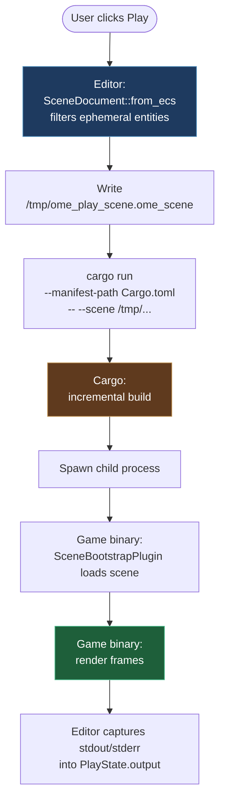

# Getting Started

This page walks you through creating an OME project, running it, and
understanding what the editor's Play button does. Assumes you have a
recent Rust toolchain (edition 2024) and the OME repository cloned at a
known path.

## Creating a project from the editor

1. Build and launch the editor:

   ```bash
   cargo build --package ome_editor --bin ome_editor
   ./target/debug/ome_editor
   ```

2. The launch screen lists recent projects and offers **New Project**.
   Click it, fill in:

   - **Name** — used for the crate name and window title. The editor
     `sanitize_crate_name`s it (lowercase, spaces → `_`, non-alphanumeric
     stripped).
   - **Path** — parent directory. The editor creates a sub-folder named
     after the sanitized crate name.

3. The editor scaffolds:

   ```text
   <path>/<crate_name>/
       Cargo.toml
       src/main.rs
       project.toml
       scenes/default.ome_scene
   ```

4. The new project opens in-process. Title bar shows
   `<name> — Oh My Engine`. The default scene contains one `Camera` and
   one `Sky` entity ready to render something.

## What the template generates

`Cargo.toml`:

```toml
[package]
name = "<crate_name>"
version = "0.1.0"
edition = "2024"

[workspace]

[dependencies]
oh_my_engine = { path = "<engine_path>" }
# Direct dep needed until `Reflect` proc-macro resolves through the facade.
ome_ecs = { path = "<engine_path>/crates/ome_ecs" }
```

`src/main.rs`:

```rust,ignore
use oh_my_engine::ome_ecs::Reflect;
use oh_my_engine::ome_ecs::component::{Component, ComponentRegistry};
use oh_my_engine::prelude::*;

// -- Define your components here --
// #[derive(Default, Reflect)]
// struct Health { pub hp: u32, pub max_hp: u32 }
// impl Component for Health {}

/// Registers custom components for scene serialization.
/// Built-in components (Transform, Name) are registered by `EcsPlugin`.
fn register_components(resources: &mut Resources) {
    if let Some(_registry) = resources.get_mut::<ComponentRegistry>() {
        // registry.register_cpu_reflected::<Health>();
    }
}

fn main() {
    oh_my_engine::ome_core::init_tracing();
    let mut app = App::new();
    app.add_plugins(DefaultPlugins);
    app.add_system(Stage::Startup, register_components);
    app.run();
}
```

That's the whole binary. `DefaultPlugins` is a Bevy-style `PluginGroup`
defined in the `oh_my_engine` facade — it bundles:

| Plugin | Role |
|--------|------|
| `CorePlugin` | `Time`, `AppExit` event. |
| `EcsPlugin` | ECS storage, `SceneManager`, built-in components, transform propagation. |
| `WindowPlugin::default()` | Winit window + GPU surface. |
| `RenderPlugin` | Sky + raymarch + mesh pipeline (see [Render Pipeline](../architecture/render-pipeline.md)). |
| `SceneBootstrapPlugin::default()` | Loads a scene at startup (see below). |

## Running standalone

```bash
cd <path>/<crate_name>
cargo run
```

The binary reads CLI args:

| Arg | Meaning |
|-----|---------|
| `--scene <path>` | Load the given `.ome_scene` file at startup. Path may be absolute or relative to cwd. |
| (none) | Fall back to `scenes/default.ome_scene` relative to cwd. |

So `cargo run` from the project root just works: cwd is the project
directory, default scene path resolves correctly.

`cargo run -- --scene scenes/Level1.ome_scene` loads a different scene
file.

## Running via the editor (Play action)

Click **Play** in the editor toolbar (or `Ctrl+P` if you've bound it).
What happens:



Click **Stop** (or close the play window) to kill the child process.

Two things to know:

- **The play binary uses your project's own `main.rs`** — not a generic
  runner. If you customize `main.rs` (add custom plugins, register
  components), Play picks those up.
- **The scene the editor sends is a snapshot of your live ECS**, not the
  file on disk. Your unsaved edits go into Play. Save first if you want
  the scene file to match.

## Adding a custom component

Most game logic ends up here. A component is a Rust struct with two
derives plus an empty `Component` impl:

```rust,ignore
use oh_my_engine::ome_ecs::Reflect;
use oh_my_engine::ome_ecs::component::Component;

#[derive(Default, Reflect)]
struct Velocity {
    pub linear: glam::Vec3,
    pub angular: glam::Vec3,
}

impl Component for Velocity {}
```

Then register it in `register_components` so the scene serializer can
round-trip it:

```rust,ignore
fn register_components(resources: &mut Resources) {
    if let Some(registry) = resources.get_mut::<ComponentRegistry>() {
        registry.register_cpu_reflected::<Velocity>();
    }
}
```

After registering, you can `App::add_system(Stage::Update, my_system)`
where `my_system` queries `Velocity` and updates entities each frame.

> **Why `register_components` runs at `Stage::Startup`:** the
> `SceneBootstrapPlugin` runs at `Stage::First`, which fires *after* all
> `Stage::Startup` systems complete on the first frame. So the registry
> is fully populated by the time the boot scene gets deserialized. If
> you flip the order, you'll see `unknown component type: Velocity` and
> the scene won't load.

## When things render black

A scene without an active non-ephemeral `PerspectiveCamera` renders to
the clear-to-black fallback. The editor camera (used while editing) is
filtered out of the saved scene — so the scene needs to spawn its own
camera entity. The default scene template includes one. If you build a
scene from scratch with no camera, expect black.

This is intentional, not a bug. A future feature may inject the editor
camera as a temporary play camera (Unity / Unreal style); see the
[Decisions Log](../reference/decisions-log.md) for context.

## Where to go next

- [Crate Graph](../architecture/crate-graph.md) — how the engine is laid out.
- [Render Pipeline](../architecture/render-pipeline.md) — what happens each frame.
- [Decisions Log](../reference/decisions-log.md) — why things are the way they are.
