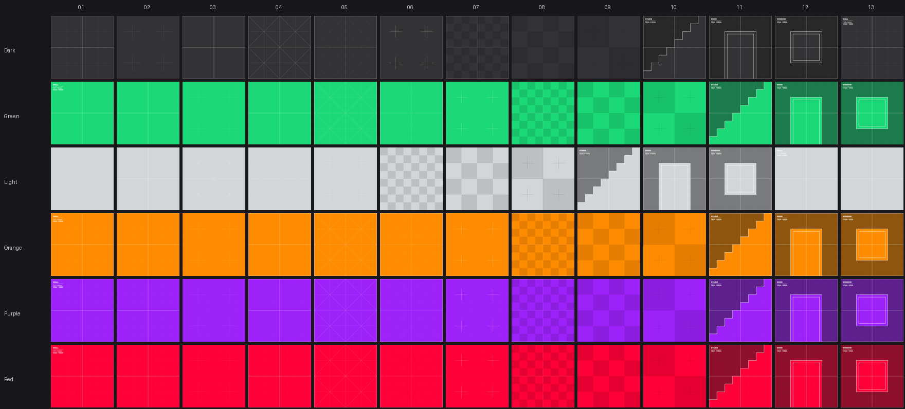

# Textures

A texture reaches the GPU through three files: the image itself, the
`.meta` sidecar beside it, and the material that names its GUID. This
page is about the middle one.

## Import settings

The sidecar carries the asset's identity and how it is imported:

```toml
guid = "7b17f815-fcd2-4ede-867a-25d9ec31c792"
asset_type = "kooch_render::texture::asset::Image"

[import]
mipmaps = false
```

Select the texture in the Asset Browser and the Inspector edits the same
table — the checkbox writes this file. An absent `[import]` table means
**the engine's defaults**, not "everything off", so a texture imported
before the setting existed keeps behaving the way it did.

A malformed table logs a warning and falls back to the defaults. A
settings file is never allowed to be the reason an asset does not
appear.

### `mipmaps` — default on

Pre-filtered half-size copies, all the way down to 1×1, sampled as a
surface tilts away from the camera. Without them a 1024-pixel grid on a
floor picks a different texel every frame and boils; the effect gets
worse in exact proportion to `render_scale`, because a smaller frame
covers the same texture with fewer samples.

Turn it **off** for textures read at their own scale, where the smaller
copies are memory spent to make a 1:1 sample blurrier at glancing
angles:

- a UI atlas drawn pixel-for-pixel,
- a lookup table whose neighbouring texels are unrelated values — an
  average of two of them is not a value the table has,
- a gradient ramp read by index.

Everything seen in perspective wants them on, which is why on is the
default and off is the thing you say out loud.

> 🔴 The chain is built **in linear light**, not by averaging the bytes.
> Half black and half white is 0.5 of the light, which is 188 written
> back as sRGB — not 128. The engine gets this right by making the
> downsample a render pass, so the hardware's sRGB decode and encode do
> the transfer function. It matters: averaging encoded bytes makes every
> distant surface darker than the one beside it, and the seam moves with
> the camera, so it reads as a lighting bug.

Changing the setting re-imports the texture immediately. That is not
free plumbing: a mip chain is levels allocated when the texture is
created and no API adds one afterwards, so the editor has to evict the
uploaded copy and let the next frame put it back.

## Tiling

How densely a texture sits on a surface is the **material's** decision,
not the mesh's: `Tiling` in the Inspector, `uv_scale` in the `.ron`. A
floor twenty units across wants `20, 20` from a grid whose square is
meant to read as one unit. `Offset` slides the texture; on a tiling
texture whole numbers change nothing, which is the point.

Scaling the mesh's UVs is not the same thing — the mesh is shared, so it
would change every object using it.

> 🔴 Tiling makes the uv move faster between neighbouring pixels, and
> the mip is selected from exactly that. The engine scales the
> derivatives with the coordinate; if it did not, a texture tiled 20×
> would sample about four levels too sharp and alias — the thing the
> chain exists to prevent, on the surfaces that asked for tiling.

## Sharpness: bias and anisotropy

Two settings decide how sharp a texture reads, and they fix different
problems.

### Mip bias — automatic, and only with a temporal technique

A frame rendered at `render_scale` 50 % samples every texture for half
the pixels, so the detail the upscaler exists to reconstruct was never
rasterised. The engine compensates with the bias FSR documents:

```text
mipBias = log2(render / display) - 1.0
```

The `log2` term buys back the resolution the frame does not have; the
extra `-1` is there because the **jitter resolves sub-pixel detail** —
with a history to accumulate into, a sharper level comes out correct
instead of shimmering.

🔴 Which is why it only applies when a temporal technique is on. With
`upscale: None` there is no history, and a sharper mip would be aliasing
on purpose. Nothing to configure: it follows the scale and the
technique.

Measured through the mip debug view: at half scale a surface samples
**one level sharper than native**, because the reduced resolution costs
a level on its own and the bias pays it back and spends one more.

### Anisotropy — a setting, and the one that fixes floors

`anisotropy` in `.rendersettings`, 1 (off) to 16.

A surface at a grazing angle covers a footprint that is long and thin,
and an ordinary filter has a single level for it: it takes the **long**
axis, picks a level that would not alias there, and blurs the short axis
by the same amount. That is why a tiled floor softens towards the
horizon while a wall facing the camera stays sharp — and no amount of
mip bias fixes it, because the level is right for one axis and wrong for
the other.

Anisotropic filtering takes several samples along the long axis instead
of one coarse one. On a grazing floor with a tiled checker, 16× kept
**1.8× the detail** of no anisotropy.

> ⚠️ It costs bandwidth, not arithmetic: more fetches on exactly the
> surfaces that already cover the most pixels. On a handheld measured as
> bandwidth-bound that is the expensive kind, which is why the default is
> off and the number is chosen by looking at a floor *and* at a capture.

## The prototype textures

The engine ships Kenney's *Prototype Textures* (CC0) under
`assets/textures/prototype/`, six colours of grid, checker and labelled
reference geometry, with a material beside each one.



⚠️ **The index is not the same pattern across colours.** `dark_texture_01`
and `green_texture_01` are different images — the pack numbers each
colour independently. Pick from the sheet above, not from the number.

They are worth reaching for beyond blocking out a level: a scene of
untextured surfaces has no high-frequency detail, and a mip chain, a LOD
bias and a sharpening pass all act on exactly that. A renderer feature
judged in a white room is a feature judged against nothing.
