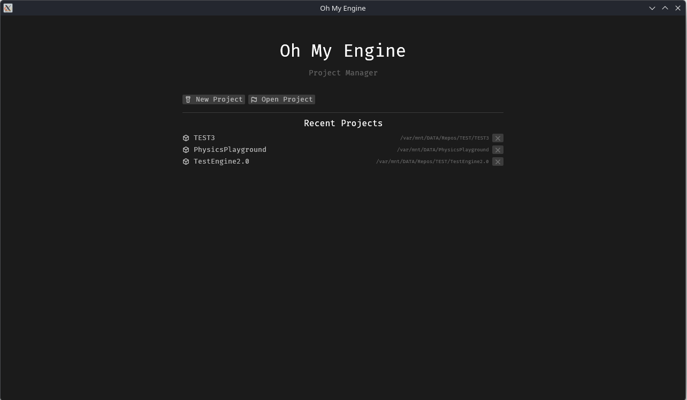

# Your First Project

<!-- toc -->

A complete pass through the loop: create a project, write a component and a system, and watch
them run. Roughly fifteen minutes, most of it the first compile.

## 1. Open the Hub

```bash
cargo run -p kooch_editor
```



Create a project, or open one you have. The first build of a new project compiles the engine
too — several minutes, once.

> A project made with an older editor is migrated on open. You do not have to do anything, but
> that first build will also be a full one.

## 2. Write a component

New Component from the editor, named `Spinner`, then open `src/spinner.rs` and fill it in:

```rust
use kooch::kooch_ecs::Reflect;
use kooch::kooch_ecs::component::Component;

/// Makes an entity rotate. Attach it and set the speed in the Inspector.
#[derive(Default, Reflect)]
#[reflect(category = "Gameplay")]
pub struct Spinner {
    /// Degrees per second around the Y axis.
    pub speed: f32,
}

impl Component for Spinner {}
```

`speed` is public, so the Inspector will draw a drag value for it. Nothing else is needed —
see [Writing a Component](./components.md) for the attributes that change how it is drawn.

## 3. Write a system

This one touches `Transform`, whose fields are `glam` types. The prelude re-exports them, so
there is nothing to add to `Cargo.toml`:

> `Vec2`, `Vec3`, `Vec4`, `Quat`, `Mat3` and `Mat4` come through `kooch::prelude`, and the
> whole `glam` crate is reachable as `kooch::glam`. Adding your own `glam` dependency is the
> one thing to avoid: a `Quat` from a different version is a *different type*, and the
> compiler error names two types spelled identically.

New System, named `spin`, then open `src/spin.rs`:

```rust
use kooch::kooch_ecs::Query;
use kooch::kooch_ecs::transform::Transform;
use kooch::prelude::*;

use crate::spinner::Spinner;

/// Rotates every entity that has a `Spinner`.
pub fn spin(resources: &mut Resources) {
    let dt = resources
        .get::<Time>()
        .map(|t| t.delta_secs())
        .unwrap_or(1.0 / 60.0);

    let query = Query::<(&Spinner, &mut Transform)>::new(resources);
    query.for_each(|(spinner, transform)| {
        transform.rotation *= Quat::from_rotation_y(spinner.speed.to_radians() * dt);
    });
}
```

The query matches only entities that have **both** components, so a `Spinner` on an entity
with no `Transform` is simply skipped rather than being an error.

## 4. Build

Registration already happened. The editor polls `src/`, found `impl Component for Spinner` and
`pub fn spin(_: &mut Resources)`, and rewrote `registrations.rs` with both — within a second of
you saving, from whichever editor you saved in. The toolbar's Resync button forces it, and
pulses when the generated file has moved ahead of your last build.

Then build. Today that means a terminal:

```bash
cargo build
```

and **reopening the editor**, because the project's library is loaded once when the project
opens. A build button and a live reload are
[#158](https://github.com/lobinuxsoft/kooch/issues/158) and
[#648](https://github.com/lobinuxsoft/kooch/issues/648); until they land, this step is
manual and it is the slow part of the loop.

## 5. Use it

With the project reopened:

1. Select an entity in **World** (or spawn one).
2. **Add Component** → *Gameplay* → `Spinner`.
3. Set `speed` in the **Inspector** — try `90`.
4. Press **Play**.

It spins. Press **Stop** and the world returns exactly as you authored it — Play snapshots
before it starts and restores on stop, so testing never costs you your scene.

## What to read next

- [Writing a Component](./components.md) — every field type the Inspector can draw, and the
  attributes that control it
- [Writing a System](./systems.md) — queries, stages, spawning
- [Creating a Project](./creating-a-project.md) — what each generated file is for
- [The Editor](../editor/overview.md) — the panels, and what is not built yet

## If something did not work

| Symptom | Cause |
|---|---|
| The component is not in the Add Component menu | The project has not been rebuilt and reopened since it was written — registering is not compiling |
| A field is not in the Inspector | It is private, has `#[reflect(skip)]`, or is a type reflection does not support yet ([#649](https://github.com/lobinuxsoft/kooch/issues/649)) |
| The derive does not compile | A field's type is not supported — `Vec<T>`, `HashMap`, your own enums. Mark it `#[reflect(skip)]` |
| The system never runs | It is in `Update` behind the `Playing` gate; press Play. Or its signature does not match `pub fn f(_: &mut Resources)` exactly — on one line — so the scanner missed it |
| The system runs in the wrong stage | Say which with `#[system(PreUpdate)]`; without it, every system lands in `Update`. See [Writing a System](./systems.md) |
| A child object or shadow lags one frame behind | The system writes a `Transform` in `PostUpdate` or later, after the engine already resolved `GlobalTransform`. Move it to `Update` |
| Play opens a second window and takes minutes | The old local-Play path ([#633](https://github.com/lobinuxsoft/kooch/issues/633)) |
