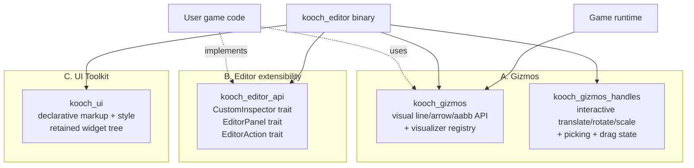

# Editor Three-System Architecture

**Issue:** [#276](https://github.com/lobinuxsoft/kooch/issues/276)
**Status:** Research conclusion — implementation deferred to follow-up epics.
**Date:** 2026-04-25

## Executive summary

The editor evolves into **three separated, pure-Rust subsystems**, each
with its own crate, public API, and lifecycle. No external libraries
(no `transform-gizmo`, no Dioxus, no Slint) — everything custom-built.
No C / C++ / FFI dependencies at any layer.

| Subsystem | Crate(s) | Usable by | First epic |
|-----------|----------|-----------|------------|
| **Gizmos** (visual + interactive) | `kooch_gizmos` (visual), `kooch_gizmos_handles` (interactive) | engine, editor, user code | follows §A |
| **Editor extensibility** (scripts, custom inspectors, custom panels) | `kooch_editor_api` | user code | follows §B |
| **UI Toolkit** (HTML-like declarative UI for the editor) | `kooch_ui` | editor, eventually user runtime UI | follows §C |

The split is **Unity-style, not Godot-style**. Godot bundles the editor
into one self-hosted codebase; Unity separates Gizmos / Handles /
Editor scripts / UI Toolkit so each evolves independently. We follow
Unity's separation but reject its proprietary tools — we build pure
Rust analogs from scratch.



## Why three separate subsystems

Three reasons, in order of weight:

1. **Independent evolution.** A change to UI Toolkit doesn't ripple
   through the gizmo math. A change to gizmo picking doesn't touch
   the inspector loading mechanism. Crate boundaries enforce this at
   the compile level.
2. **Optional consumption.** A headless build can use `kooch_gizmos`
   for in-game debug visualization without pulling the editor or UI
   toolkit. A custom editor host can use `kooch_ui` without gizmos.
3. **User-facing clarity.** When a user wants "draw a line in 3D",
   they reach for `kooch_gizmos`. When they want "add a button to the
   editor toolbar", they reach for `kooch_editor_api`. When they want
   "build a custom inspector panel with a layout", they reach for
   `kooch_ui`. One concept per crate.

The Godot self-hosted approach is elegant when the editor IS the
runtime, but couples concerns. Our editor runs as its own binary; the
runtime is whatever the user's `main.rs` chooses to assemble. That
asymmetry already exists, the three-system split makes it explicit.

## Cross-cutting principles

- **Pure Rust.** No FFI to C/C++. No `transform-gizmo`, no Dioxus, no
  Slint, no `egui-extras`-from-NPM. The existing `wgpu` + `winit` +
  `egui` stack stays for now (egui will eventually be supplemented or
  partially replaced by `kooch_ui` for declarative UI).
- **Custom-built.** External crates are referenced as design
  precedents in this document, never adopted as runtime dependencies.
  We learn from them, we don't bind to them.
- **User extensibility is a first-class goal.** Every subsystem must
  provide a stable extension API (trait + registry) for user code to
  plug into. "Built-in" is a default registration; nothing is
  unreachable from user code.
- **Editor-only ≠ unreachable.** A user's `editor/` crate (loaded by
  the editor binary) has the same API surface as our built-in editor
  code. There is no privileged path.
- **Reflection minimums.** Visualizers, custom inspectors, and editor
  scripts use the existing `Reflect` trait + `TypeId` lookup —
  nothing more exotic. We do not introduce a parallel reflection
  system.

---

## A. Gizmo system

### A.1 Audiences and use cases

Three audiences, three use cases:

| Audience | Use case | Visibility |
|----------|----------|-----------|
| **Engine internals** | Selection bbox, axis arrows in editor viewport | always-on when editor renders |
| **User game code** | Debug visualization at runtime (collision shapes, AI vision cones, navigation paths) | gated by `--debug-gizmos` flag or `KOOCH_DEBUG_GIZMOS=1` |
| **User editor code** | Custom visualizer for a custom component (Health bar, AI sight range, spawn radius) | rendered when component is expanded in Inspector + entity is selected |

The same `kooch_gizmos` API serves all three. The editor wraps it with
selection-aware logic; runtime gates it behind a flag; user editor
code plugs into the visualizer registry.

### A.2 Visual vs interactive split

Like Unity's `Gizmos` / `Handles` divide:

| | `kooch_gizmos` (visual) | `kooch_gizmos_handles` (interactive) |
|---|---|---|
| Operations | line, arrow, aabb, sphere, frustum, circle, cone, polyline | translate handle, rotate handle, scale handle, custom handle |
| State | stateless per call | drag state machine, hover, picked entity |
| Used by | engine + editor + runtime + user code | editor only (and user editor code via `kooch_editor_api`) |
| Render | always-on-top wgpu line pass (already built in PR #277) | same render path + egui::Painter overlay for hover hints |
| Picking | none | ray-vs-AABB per handle |
| Crate dep | `kooch_core`, `kooch_ecs` | `kooch_gizmos`, `kooch_core`, `kooch_ecs` |

The split mirrors how the user thinks: "I want to *show* something"
vs "I want the user to *manipulate* something". Conflating them
into one API forces every visual call to carry interaction baggage.

### A.3 Visualizer registry — user extensibility

Pattern: same as `ComponentRegistry` but the registered function
draws gizmos instead of describing fields.

```rust,ignore
// Trait users implement
pub trait Visualizer<C: Component>: Send + Sync + 'static {
    /// Draws gizmos for one entity instance of `C`. Called once per
    /// frame per entity that the editor / runtime decides to visualize.
    fn draw(
        &self,
        component: &C,
        transform: &GlobalTransform,
        gizmos: &mut Gizmos<'_>,
    );
}

// Registry inserted as a Resource
pub struct VisualizerRegistry { /* ... */ }

impl VisualizerRegistry {
    pub fn register<C: Component, V: Visualizer<C> + Default>(&mut self) { /* ... */ }
}

// User code in their game crate
struct HealthBarVisualizer;
impl Visualizer<Health> for HealthBarVisualizer {
    fn draw(&self, h: &Health, t: &GlobalTransform, g: &mut Gizmos<'_>) {
        let pos = t.translation() + Vec3::Y * 2.0;
        let pct = h.current as f32 / h.max as f32;
        g.line(pos, pos + Vec3::X * pct, Color::GREEN);
    }
}

fn register_visualizers(resources: &mut Resources) {
    if let Some(reg) = resources.get_mut::<VisualizerRegistry>() {
        reg.register::<Health, HealthBarVisualizer>();
    }
}
```

**Why a trait + struct instead of a function pointer:** zero-sized
struct types can carry configuration (a `HealthBarVisualizer { color:
Color::GREEN, height: 2.0 }`), and `register::<C, V>` becomes a single
generic call. Future iteration: add `fn config_ui(&mut self, ui: &mut
Ui)` for editable visualizer settings (deferred to a follow-up).

The visualizer system iterates over `(Entity, components)` pairs
the editor cares about (selected + component-expanded for editor;
all-entities-with-component for runtime debug). For each, it looks up
the registered visualizer by `TypeId` and dispatches.

### A.4 Gizmos struct — the user-facing API

Mirror of Unity's `Gizmos` static class but instance-based and
borrow-checked:

```rust,ignore
pub struct Gizmos<'a> {
    batch: &'a mut GizmoBatch,
}

impl Gizmos<'_> {
    // Primitives
    pub fn line(&mut self, start: Vec3, end: Vec3, color: Color);
    pub fn arrow(&mut self, base: Vec3, tip: Vec3, color: Color);
    pub fn aabb(&mut self, min: Vec3, max: Vec3, color: Color);
    pub fn obb(&mut self, transform: Mat4, half_extents: Vec3, color: Color);

    // Spherical / circular
    pub fn sphere(&mut self, center: Vec3, radius: f32, color: Color);
    pub fn circle(&mut self, center: Vec3, normal: Vec3, radius: f32, color: Color);

    // Specialty
    pub fn frustum(&mut self, view_proj: Mat4, color: Color);
    pub fn cone(&mut self, apex: Vec3, dir: Vec3, half_angle: f32, length: f32, color: Color);
    pub fn polyline(&mut self, points: &[Vec3], color: Color);

    // Composite (built-in helpers used by editor visualizers)
    pub fn axis_arrows(&mut self, origin: Vec3, length: f32);
    pub fn transform_handle_visual(&mut self, transform: &GlobalTransform, mode: HandleMode);
}
```

Each method translates to one or more `LineSegment` pushes into the
`GizmoBatch`. No tessellation magic — circles and spheres are
approximated as N-segment polylines; cones and frustums as line
edges. Higher fidelity (filled triangles, alpha blending) is a
future enhancement, not v1.

### A.5 Runtime gizmos — when game code wants to draw

Runtime-time visualization is gated behind a flag so release builds
don't pay the cost. Pattern:

```rust,ignore
// User game system
fn draw_ai_paths(query: Query<&AiAgent>, mut gizmos: ResMut<Gizmos>) {
    if !gizmos.runtime_enabled() { return; }
    query.for_each(|agent| {
        gizmos.polyline(&agent.path, Color::CYAN);
    });
}
```

`gizmos.runtime_enabled()` checks the `KOOCH_DEBUG_GIZMOS` env var or
a CLI flag (`--debug-gizmos`) parsed by `SceneBootstrapPlugin`. In the
editor, runtime-enabled is forced to `true` while in play mode; in
edit mode it's irrelevant (editor uses its own gizmo path).

### A.6 Interactive handles — the `kooch_gizmos_handles` API

```rust,ignore
pub trait Handle: Send + Sync {
    /// Renders the handle's visual using the standard Gizmos API.
    fn draw(&self, gizmos: &mut Gizmos<'_>, state: HandleState);

    /// Returns `Some(distance_along_ray)` if the handle is hit by the
    /// ray. The smallest distance wins when multiple handles overlap.
    fn pick(&self, ray: Ray) -> Option<f32>;

    /// Called every frame while the handle is being dragged. Returns
    /// the world-space delta to apply to the entity transform.
    fn drag(&mut self, drag: DragInfo) -> Option<TransformDelta>;
}

// Built-in handles (one per gizmo mode)
pub struct TranslateHandle { axis: Vec3, /* ... */ }
pub struct RotateHandle { axis: Vec3, /* ... */ }
pub struct ScaleHandle { axis: Vec3, uniform: bool, /* ... */ }

// Coordinator: picks the active handle, manages drag state, dispatches
pub struct HandleSet {
    handles: Vec<Box<dyn Handle>>,
    state: HandleState, // Idle | Hover(idx) | Drag(idx, accumulated_delta)
}
```

`HandleSet` is the editor-side controller that lives in
`kooch_editor_core`. It owns the three modes (Translate / Rotate /
Scale), switches between them on W/E/R, and on each frame:

1. Calls `draw` on every handle to populate the gizmo batch.
2. If mouse is over the viewport, casts a ray, picks the closest
   handle, sets `Hover(idx)`.
3. On click → transitions to `Drag(idx, ...)`.
4. While dragging → calls `drag(...)` and applies the returned
   `TransformDelta` to the selected entities.
5. On release → emits an `EditorCommand` with the accumulated delta
   for undo.

User editor code can `register_handle(Box::new(MyCustomHandle))` if
they want a non-standard handle for a custom workflow. Out of scope
for v1; documented as a future extension point.

### A.7 Crate layout

```text
crates/
├── kooch_gizmos/                    # Visual API + render. NEW.
│   ├── src/
│   │   ├── lib.rs                 # GizmoBatch, GizmoRenderer, Gizmos, Color, ...
│   │   ├── primitives.rs          # line, arrow, aabb, sphere, circle, ...
│   │   ├── visualizer.rs          # Visualizer trait + VisualizerRegistry
│   │   └── runtime.rs             # KOOCH_DEBUG_GIZMOS gate
│   └── shaders/
│       └── gizmo_main.wgsl        # moved from kooch_render/shaders
└── kooch_gizmos_handles/            # Interactive handles. NEW.
    ├── src/
    │   ├── lib.rs                 # Handle trait, HandleSet, HandleState, DragInfo
    │   ├── translate.rs
    │   ├── rotate.rs
    │   └── scale.rs
    └── (no shaders — uses kooch_gizmos primitives)
```

The render-pass infrastructure currently in `kooch_render::gizmos` (PR
#277) **moves into `kooch_gizmos`**. `kooch_render` no longer knows about
gizmos; it's pure 3D scene rendering.

Editor wires `HandleSet` in `kooch_editor_core` and consumes both
`kooch_gizmos` (for visuals) and `kooch_gizmos_handles` (for interaction).
User game code consumes only `kooch_gizmos`.

### A.8 Migration from PR #277 foundation

| Today (PR #277) | After §A implementation |
|---|---|
| `kooch_render::gizmos::GizmoBatch` | `kooch_gizmos::GizmoBatch` |
| `kooch_render::gizmos::GizmoRenderer` | `kooch_gizmos::GizmoRenderer` |
| `kooch_editor_core::gizmos::build_gizmo_batch_system` | Same module, but builds via `Gizmos<'_>` API + visualizer dispatch |
| `axis_arrows`, `aabb` helpers | Same names, in `kooch_gizmos::Gizmos` |
| Fixed unit-cube selection bbox | Real component-aware bbox via visualizer registry (Transform's visualizer draws axis arrows; user-registered visualizers draw their own bbox shape) |

Migration is a refactor, not a rewrite. The shaders, the line-pass
pipeline, the depth-always state — all carry over. What changes is
the package structure and the addition of the `Visualizer` trait +
registry.

---

## B. Editor extensibility

### B.1 Audiences and use cases

One audience (user game code), three use cases:

| Use case | Example |
|---|---|
| **Custom inspector** | A `Health` component shows a colored bar instead of two integer fields. |
| **Custom panel** | An "Asset Browser" tab in the dock that lists files in `assets/`. |
| **Custom action / tool** | A "Bake Lighting" toolbar button that runs a long-running process. |

In all three cases, user code lives in **a separate crate** that the
editor binary discovers and loads.

### B.2 Loading model — static vs dynamic

Two choices:

| | Static (Cargo feature) | Dynamic (libloading) |
|---|---|---|
| Build | Recompile editor when user editor code changes | Reload `.so` at runtime |
| Iteration | Slow (full rebuild) | Fast (drop-in) |
| Type safety | Full (one process, one type system) | Partial (stable ABI required) |
| Versioning | Implicit (compile fails if mismatch) | Explicit (we maintain ABI compat) |
| Existing infra | None — would need `editor` feature on engine | `kooch_plugin_api` (stabby + libloading) |

**Recommendation: start static, defer dynamic to v2.**

Reason: editor extensions are *content authoring* tools, not
*shipped game features*. The user iterates on them while building
their game; they do not ship them to players. Recompile cost is
acceptable for this audience. The dynamic plugin path
(`kooch_plugin_api`) stays for **runtime** plugins (ship a `.so` with
your game for modding); we will not conflate it with editor scripts.

The static loading model:

1. User project's `Cargo.toml` declares an `editor` feature on the
   user crate (or a sibling `editor` crate).
2. Editor binary takes a CLI arg `--editor-crate <path>` and
   `cargo build`s it with the `editor` feature, dynamically loading
   the resulting `.so` once.
3. On user change → user reruns the editor; cargo handles incremental
   compile.

Wait — that's still dynamic. Let me clarify: **truly static** means
the user editor code is compiled INTO the editor binary. That
requires the user to have their own forked editor binary, which is
ugly. So actually we end up at:

- **v1: scripts as a separate crate, loaded via libloading** with a
  thin stable-ABI surface (use existing `kooch_plugin_api`
  infrastructure: `stabby` + `libloading`). Same mechanism as runtime
  plugins, different registration interface.
- **v2: hot reload** within an editor session (no restart needed).

This re-uses the existing plugin infrastructure rather than building
a parallel one. The "static" framing was a red herring.

### B.3 Custom inspectors

```rust,ignore
// Trait users implement
pub trait CustomInspector<C: Component>: Send + Sync + 'static {
    /// Renders the inspector body for one component instance. The
    /// editor wraps this in the standard CollapsingHeader.
    fn draw(&mut self, ui: &mut Ui, component: &mut C, ctx: InspectorCtx<'_>);
}

// Registry
pub struct InspectorRegistry { /* ... */ }

impl InspectorRegistry {
    pub fn register<C: Component, I: CustomInspector<C> + Default>(&mut self) { /* ... */ }
}

// User code
struct HealthInspector;
impl CustomInspector<Health> for HealthInspector {
    fn draw(&mut self, ui: &mut Ui, h: &mut Health, _ctx: InspectorCtx<'_>) {
        let pct = h.current as f32 / h.max as f32;
        ui.horizontal(|ui| {
            ui.label("HP:");
            ui.add(egui::ProgressBar::new(pct).show_percentage());
        });
        ui.add(egui::DragValue::new(&mut h.max).prefix("Max: "));
    }
}
```

The `InspectorRegistry` is consulted before the default reflection-
driven inspector. If a registered inspector exists for the component
type, it's used; otherwise the default field-by-field inspector
(driven by `Reflect`) renders.

`InspectorCtx<'_>` exposes selection state, undo stack push, and
read access to other components on the same entity (so e.g. a
`Velocity` inspector can read the entity's `Mass` to display kinetic
energy).

### B.4 Custom panels

```rust,ignore
pub trait EditorPanel: Send + Sync + 'static {
    /// Display name shown in the Window menu and the dock tab.
    fn name(&self) -> &str;

    /// Stable identifier for dock layout serialization.
    fn id(&self) -> &str;

    /// Renders the panel body inside its dock tab.
    fn draw(&mut self, ui: &mut Ui, ctx: PanelCtx<'_>);
}

pub struct PanelRegistry { /* ... */ }

// User code
struct AssetBrowserPanel { selected: Option<PathBuf> }

impl EditorPanel for AssetBrowserPanel {
    fn name(&self) -> &str { "Assets" }
    fn id(&self) -> &str { "user.asset_browser" }
    fn draw(&mut self, ui: &mut Ui, ctx: PanelCtx<'_>) {
        // ... walk fs, show tree, on click set self.selected ...
    }
}
```

The editor's `EditorTab` enum currently has hard-coded variants. We
extend it: built-in tabs stay enum variants, user tabs live as a
`UserTab(String)` variant carrying the panel id. Dock layout
persistence already serializes by string anyway (per `egui_dock`
conventions), so this is straightforward.

`PanelCtx<'_>` exposes shared editor state: current selection, scene
manager, project state, gizmo batch (for panels that want to
visualize their hover state in the viewport), and the `UndoStack`.

### B.5 Custom actions / tools

```rust,ignore
pub trait EditorAction: Send + Sync + 'static {
    fn label(&self) -> &str;
    fn shortcut(&self) -> Option<egui::KeyboardShortcut>;
    fn menu_path(&self) -> &[&str]; // ["Tools", "Lighting", "Bake Lightmaps"]
    fn icon(&self) -> Option<&str>;
    fn run(&mut self, ctx: ActionCtx<'_>);
}
```

Registered actions appear in the menu bar at the path returned by
`menu_path`. Shortcuts are wired into the editor's input handling.
Long-running actions (`run`) can spawn a task and check status from
`ActionCtx::task_status()` to show progress in the status bar.

### B.6 User project layout

The convention:

```text
my_game/
├── Cargo.toml                # main user game crate
├── src/main.rs               # play binary entry
├── editor/                   # user editor extensions (optional)
│   ├── Cargo.toml            # depends on `kooch` + `kooch_editor_api`
│   └── src/lib.rs            # registers inspectors, panels, actions
├── scenes/                   # *.kooch_scene files
└── project.toml              # references editor crate for editor binary to load
```

`project.toml` gets a new optional field:

```toml
[editor]
# Path relative to the project root; editor binary cargo-builds this
# crate with `--release` (or `--debug` if `KOOCH_EDITOR_DEBUG=1`).
extension_crate = "editor"
```

When the editor opens this project, it reads `extension_crate`,
runs `cargo build --release --manifest-path editor/Cargo.toml --crate-type cdylib`,
loads the resulting `.so` via `libloading`, calls a stable-ABI
`fn kooch_editor_register(registry: &mut EditorRegistry)` exported by
the user crate, and the user's inspectors / panels / actions land in
the editor.

User changes editor code → reruns the editor (or hits a Reload Editor
Extensions menu item that rebuilds + reloads). Iteration cost: one
cargo build.

### B.7 Crate layout

```text
crates/
└── kooch_editor_api/            # NEW
    └── src/
        ├── lib.rs             # EditorRegistry, registration prelude
        ├── inspector.rs       # CustomInspector trait + InspectorRegistry
        ├── panel.rs           # EditorPanel trait + PanelRegistry
        └── action.rs          # EditorAction trait + ActionRegistry
```

`kooch_editor_core` consumes `kooch_editor_api` and owns the loaders +
dispatchers. User editor crates depend on `kooch_editor_api` (stable
ABI surface) but **not** on `kooch_editor_core` (which has internal
APIs that change frequently). The split mirrors what Unity does
with `UnityEditor` (engine-internal) vs `UnityEditor.Build` (user-
facing API).

---

## C. UI Toolkit (HTML-like, pure Rust)

### C.1 Why HTML-like and why custom

The user's stated goal: declarative UI with separation of structure,
style, and behavior. The HTML / CSS / JS triad is the most
recognizable form of that pattern. Unity's UI Toolkit (UXML / USS /
C#) is a direct mapping of this idea into a game engine editor.

The constraint says **no external libraries**, including pure-Rust
ones (Slint, Dioxus, etc.). This is a multi-quarter project on its
own — building a real declarative UI toolkit is a substantial
investment. We commit to it here and scope it ruthlessly.

### C.2 Survey of pure-Rust precedents (for inspiration only)

| Library | Markup | Style | Reactivity | Notes |
|---|---|---|---|---|
| **Slint** | `.slint` external files (QML-like DSL) | Inline / theme resources | Property bindings | Closest precedent to Unity UI Toolkit; compiles markup to Rust at build time. Has a design tool. |
| **Dioxus** | RSX macro (JSX-like, inline in Rust) | CSS strings or `tailwind_fuse` | Virtual DOM + hooks | Closest to React. Cross-platform (web/desktop/mobile). Strong ecosystem. |
| **Iced** | Programmatic builder | Programmatic theme | Elm-style messages | No DSL; widget-tree built each frame from messages. Pure retained-mode. |
| **Floem** | Programmatic builder | Programmatic | Fine-grained signals | Newer; signals make reactivity local without virtual DOM. |
| **Cushy** | Programmatic builder | Theme structs | Reactive fields | Less mature; focused on simple desktop apps. |
| **Leptos** | RSX macro (JSX-like) | CSS | Fine-grained signals | Web-focused; desktop usable but not the primary target. |
| **egui** (current) | Immediate-mode procedural | Theme struct | None (re-runs every frame) | What the editor uses today. Excellent for tools, less suited to declarative content-heavy panels. |

**Closest-to-Unity-UI-Toolkit precedent:** Slint. External `.slint`
files (analogous to UXML), separate style (analogous to USS), Rust
behavior bindings.

**Closest-to-React precedent:** Dioxus. RSX inline, virtual DOM,
hooks.

We learn from both. The proposed design borrows Slint's separation
(external files for markup, separate style files) and Dioxus's
ergonomics (Rust-first behavior, no FFI).

### C.3 The proposed design

Three file types per UI:

```text
my_panel.kooch_ui           # markup (XML-like, our format)
my_panel.kooch_style        # style (CSS subset)
my_panel.rs               # behavior (Rust; trait impl)
```

**Markup (`.kooch_ui`)** — XML-ish, inspired by UXML:

```xml
<panel id="health-bar">
    <horizontal>
        <label class="caption">HP:</label>
        <progress-bar bind:value="health.percent" class="hp-bar"/>
        <button on:click="reset_hp">Reset</button>
    </horizontal>
</panel>
```

**Style (`.kooch_style`)** — CSS subset:

```css
.caption {
    font-size: 14;
    color: #ccc;
}

.hp-bar {
    fill-color: linear-gradient(#f00 0%, #0f0 100%);
    height: 16;
    border-radius: 4;
}

panel#health-bar {
    padding: 8;
    background: #2a2a2a;
}
```

**Behavior (`.rs`)** — Rust trait impl:

```rust,ignore
pub struct HealthPanel { health: Health }

impl Panel for HealthPanel {
    fn markup(&self) -> &'static str { include_str!("health.kooch_ui") }
    fn style(&self) -> &'static str { include_str!("health.kooch_style") }

    fn data(&self) -> PanelData {
        let mut data = PanelData::new();
        data.bind("health.percent", self.health.percent());
        data.action("reset_hp", || self.reset());
        data
    }
}
```

The toolkit parses markup at compile time (proc-macro on `include_str!`)
into a typed widget tree; style is parsed at startup and compiled to
a flat per-widget property table; behavior provides data bindings
and action handlers.

Rendering is **retained-mode** — the widget tree exists between
frames. Reactivity is **fine-grained signals** (Floem/Leptos style):
a binding to `health.percent` updates only the bound widget when
the value changes, no virtual DOM diff.

### C.4 Crate layout

```text
crates/
└── kooch_ui/                     # NEW
    └── src/
        ├── lib.rs              # public API: Panel trait, PanelData, ...
        ├── markup/
        │   ├── parser.rs       # .kooch_ui parser
        │   ├── ast.rs          # widget tree AST
        │   └── macro.rs        # proc-macro for compile-time parsing
        ├── style/
        │   ├── parser.rs       # .kooch_style parser (CSS subset)
        │   └── apply.rs        # style → widget property table
        ├── widgets/
        │   ├── label.rs
        │   ├── button.rs
        │   ├── progress_bar.rs
        │   ├── horizontal.rs
        │   └── ... (~15 builtin widgets v1)
        ├── render/
        │   ├── wgpu.rs         # widget tree → wgpu draw calls
        │   └── layout.rs       # flexbox-ish layout engine
        └── reactive/
            └── signal.rs       # fine-grained reactivity primitives
```

This is a **multi-month** crate. v1 scope: ~15 builtin widgets, basic
flexbox-like layout, CSS subset (color, font-size, padding, margin,
border, background, layout-direction), data bindings, action handlers.
v2 onward: animations, transitions, custom widget plugins, theme
inheritance, hot reload.

### C.5 egui coexistence

`kooch_ui` does not replace `egui` — they coexist:

| Concern | Tool |
|---|---|
| Toolbars, menu bars, contextual menus, file dialogs | `egui` (immediate-mode is right for these) |
| Inspector content (per-component) | `egui` for built-in inspectors; `kooch_ui` for user `CustomInspector` impls (optional) |
| Custom panels with complex layout (asset browser, animation timeline, node graph) | `kooch_ui` |
| In-game UI (HUD, menus) | `kooch_ui` (eventually; v1 editor-only) |

The two render through `wgpu` independently. Egui keeps its
immediate-mode loop; `kooch_ui` keeps its retained tree. They share
the surface and depth target via the editor's existing render
orchestration.

### C.6 Hot reload

A killer feature for the user's daily iteration: edit `.kooch_ui`,
save, see the change without restarting the editor. Implementation
sketch:

- Watch the `.kooch_ui` and `.kooch_style` files via `notify` crate.
- On change → re-parse → diff against current widget tree → apply
  minimal patch (insert / remove / update nodes).
- Behavior code (Rust) does NOT hot reload (would require dynamic
  loading, scope creep). Markup + style do.

This is a v2 feature. v1 ships without it; markup compiles in.

---

## Cross-cutting concerns

### Reflection requirements

- Gizmo visualizers: `Component` trait + `TypeId`. No new Reflect.
- Custom inspectors: same.
- Custom panels: nothing reflection-specific; a panel is just a
  `Box<dyn EditorPanel>`.
- Custom actions: same.

The existing `Reflect` machinery covers everything. We don't need a
parallel reflection system.

### Versioning and stability

Pre-1.0:
- `kooch_gizmos` API: breaking changes welcomed during early dev.
- `kooch_editor_api` API: stable-ABI via `stabby`, breaking changes
  bump major version of the crate.
- `kooch_ui` API: pre-stable, no commitments.

Post-1.0 (when the engine has external users):
- Same SemVer rules as the rest of the workspace.
- `kooch_editor_api` becomes the most stability-sensitive — user
  editor extensions break loudly when ABI changes.

### User project layout convention

Recommended:

```text
my_game/
├── src/                   # game code
├── editor/                # editor extension code (optional)
├── ui/                    # .kooch_ui + .kooch_style files (optional)
├── scenes/                # *.kooch_scene files
├── assets/                # meshes, textures, audio
├── Cargo.toml
└── project.toml
```

`project.toml` references `editor/` and `ui/` directories so the
editor knows where to look. Folder names are configurable but
conventional defaults reduce friction.

---

## Migration plan

The current state (after PR #277):
- `kooch_render::gizmos` module (visual line API + render pass).
- `kooch_editor_core::gizmos` module (selection-driven batch builder).
- No visualizer registry, no handles, no editor API, no UI toolkit.

Migration to the proposed architecture:

| Phase | Scope | Deliverable |
|---|---|---|
| 1 | Move gizmo render to dedicated crate + add visualizer registry | `kooch_gizmos` crate, `kooch_render::gizmos` deprecated and removed |
| 2 | Build `kooch_gizmos_handles` with translate/rotate/scale | First interactive gizmos in editor |
| 3 | Camera frustum + light visualizers + first user-extensible visualizer test | Visualizer registry validated end-to-end |
| 4 | `kooch_editor_api` crate: CustomInspector + EditorPanel + EditorAction | Editor can load user extensions (libloading) |
| 5 | `kooch_ui` crate scaffolding: markup parser + 5 builtin widgets + basic style | First panel rendered through `kooch_ui` |
| 6 | `kooch_ui` widget set expansion + hot reload | Production-ready UI Toolkit v1 |

Phase 1 is the most urgent (unblocks everything that depends on the
visualizer registry). Phase 5-6 are multi-month and can run in
parallel with the others.

---

## Implementation epics

This research closes by spawning three top-level epics, one per
subsystem. Each epic has its own sub-issues for granular tracking.

| # | Epic | Phases covered |
|---|------|----------------|
| [#278](https://github.com/lobinuxsoft/kooch/issues/278) | `epic(gizmos): three-system foundation — visualizer registry + handles + crate split` | 1–3 |
| [#279](https://github.com/lobinuxsoft/kooch/issues/279) | `epic(editor): user extension API — inspectors, panels, actions` | 4 |
| [#280](https://github.com/lobinuxsoft/kooch/issues/280) | `epic(ui): pure-Rust UI Toolkit — markup + style + retained widgets` | 5–6 |

Existing epic #198 (viewport gizmos) **becomes a sub-epic of
epic-A** — its sub-issues #270 (done), #271, #272, #273, #274, #275
re-home under epic-A as part of phases 2–3.

Numbers will be assigned when the epics are opened.

---

## Open questions (deferred)

- **Hot reload of editor extensions** (B.6) — desirable but requires
  redesigning the libloading boundary. v2 work.
- **Animation curves** in `kooch_ui` — out of v1 scope.
- **Theme inheritance** in `kooch_ui` styles — out of v1; flat themes
  only.
- **Mobile / web targets** — out of scope; engine targets desktop
  only for the foreseeable future.
- **Custom interactive handles by user code** — possible via
  `Handle` trait, but UI for registering them needs design (where
  does a "Drag Slider Handle" go in the user's editor menu?).
- **In-game UI through `kooch_ui`** — listed as eventual goal; v1
  ships editor-only to keep scope contained.

---

## Decision summary

1. **Three separated subsystems**, not a Godot-style monolith.
2. **Pure Rust, custom-built.** No external libraries even when
   pure-Rust options exist.
3. **`kooch_gizmos` + `kooch_gizmos_handles`** for visual / interactive
   gizmos respectively, with user-extensible visualizer registry.
4. **`kooch_editor_api`** for inspector / panel / action extensions,
   loaded via `libloading` from a user `editor/` crate.
5. **`kooch_ui`** for declarative HTML-like UI (markup `.kooch_ui` +
   style `.kooch_style` + Rust behavior), retained-mode with
   fine-grained signals. Coexists with `egui` rather than replacing.
6. **Migration in 6 phases**, with phase 1 (gizmo crate split +
   visualizer registry) being the immediate next session.
